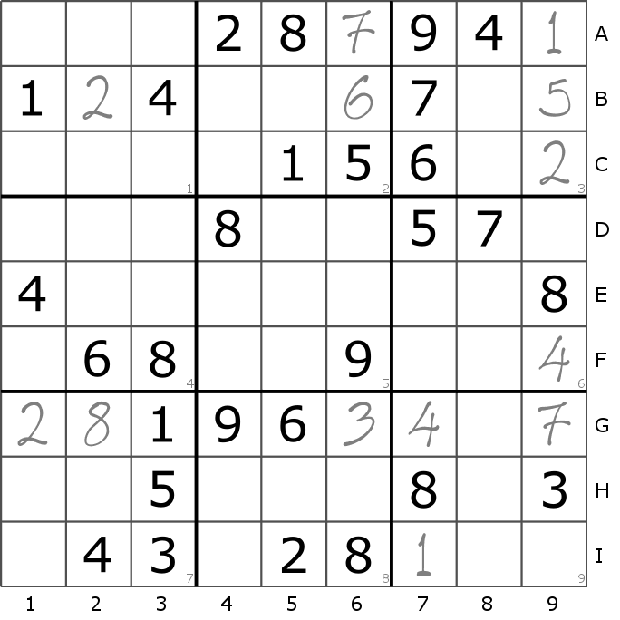
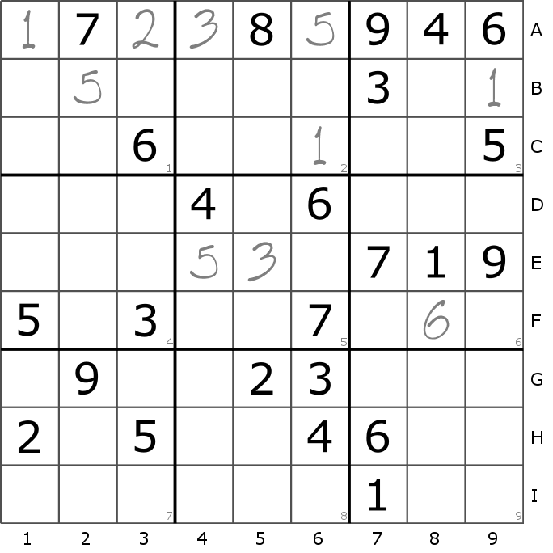
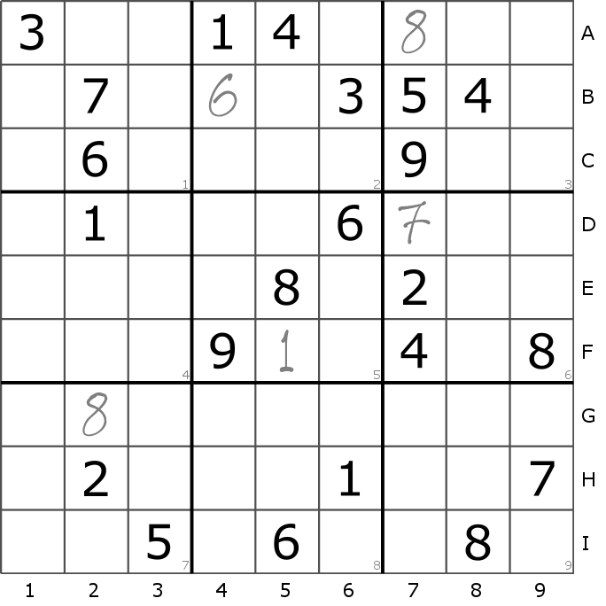

# Dial "S" for Sudoku

*In which our intrepid Heroine solves a few Puzzles, before Continuing with her Day.*

A NaNoGenMo 2017 entry.

Written by the open-source "Sudoku" software (https://github.com/greg-kennedy/Sudoku), by **Greg Kennedy** (<kennedy.greg@gmail.com>).

Generated on Fri Nov 24 12:17:55 2017.

## Contents

* [Introduction](#introduction)
* [Puzzle #1](#puzzle-1)
* [Nightmare #1](#nightmare-1)
* [Puzzle #2](#puzzle-2)
* [Nightmare #2](#nightmare-2)
* [Puzzle #3](#puzzle-3)
* [Nightmare #3](#nightmare-3)
* [Puzzle #4](#puzzle-4)
* [Nightmare #4](#nightmare-4)
* [Puzzle #5](#puzzle-5)
* [Nightmare #5](#nightmare-5)
* [Puzzle #6](#puzzle-6)
* [Nightmare #6](#nightmare-6)
* [Puzzle #7](#puzzle-7)
* [Nightmare #7](#nightmare-7)
* [Puzzle #8](#puzzle-8)
* [Conclusion](#conclusion)

## Introduction

*Mon Aug 28 06:34:28 2017*

Bob had gone off to work, and the children were at school. Alice was alone in the house, with her cat and her thoughts.

Alice sat down at the kitchen table. She placed a full coffee cup nearby, and her Sudoku puzzle book in the space before her.

Alice was not a very good Sudoku player. She knew a few tricks, but they worked only for the easiest puzzles. Usually when Alice got stuck, she would copy the position, and take a guess. It was often frustrating. Alice was tenacious though; besides, the repetition helped take her mind off things.

She took up a sharpened pencil, then opened the puzzle book to the next unsolved problem.

## Puzzle #1
*Mon Aug 28 06:35:20 2017*

Alice began looking for squares to fill on her puzzle. 
Box 3 had a cell B8 which, she reasoned, could only be a 1. So she pencilled one there. 
She found that cell B1 could only contain a 4: all other digits were blocked somehow. 
So she inserted one there. 
This left cell B5 with only one option: a 8. 
So she inserted one there. 
Alice found that cell B4 could only contain a 5: all other digits were blocked somehow. 
She pencilled a 5 in B4. 

Once again Alice checked for a move.
Alice found that cell B7 could only contain a 7: all other digits were blocked somehow. 
So she inserted it there. 
Alice found that cell H5 could only contain a 4: all other digits were blocked somehow. 
She quickly inserted in a 4 in H5. 
Her puzzle now looked like this.

Alice took a deep breath. She brushed the hair away from her eyes.

Alice started to reminisce. 
Thinking about Bob usually soothed her, but... She couldn't help playing out some scenarios involving her children. She was troubled about writing. Some of her visions were mixing with the numbers on her page.

Alice refocused her attention on her puzzle.
Most of the puzzle was still unsolved.
She found that cell E5 could only contain a 3: all other digits were blocked somehow. 
She sketched in a 3 at E5. 
There was obviously only one choice for a 3 on row F: cell F7. So she sketched it there. 

Again Alice checked for a move.
Row E had a cell E1 which, Alice realized, could only hold a 5. So she put it there. 
There was only one choice for a 6 on row E, and that was cell E6. So she added one there. 

Alice checked the puzzle carefully.
There was only one choice for a 6 on row I, and that was cell I3. She carefully pencilled in a 6 at I3. 
Alice found that cell B3 could only contain a 9: all other digits were blocked somehow. 
So she added it there. 
Her puzzle now looked like this.

Alice wiped off her glasses with a cloth. She studied the puzzle intently.

Alice let her thoughts drift. 
She couldn't help playing out some scenarios involving the news. People often told her not to focus on negative things, but it was difficult. Something about writing was making her uncomfortable. She thought idly of the party.

Alice refocused her attention on her puzzle.
Most of the puzzle was still unsolved.

Again she checked for a move.
This left cell B2 with only one option: a 6. 
She quickly etched in a 6. 
A careful check of row I showed that cell I9 was a 1. She carefully sketched a 1 at I9. 
Alice found that cell H9 could only contain a 8: all other digits were blocked somehow. 
She carefully put a 8 at H9. 
Column 3 included a cell G3 which, Alice reasoned, could only be a 4. She wrote a 4 in G3. 

Alice reviewed the puzzle again.
This left cell G9 with only one option: a 7. 
So she wrote one there. 
Her puzzle now looked like this.

Alice sighed softly. She sharpened her pencil to a point.

Alice began to daydream. 
Drab colors filled her mind. Something about the news was making her uncomfortable. People often told her not to focus on negative things, but it was difficult. Thinking about writing usually soothed her, but...

Alice returned her attention on her puzzle.
Most of the puzzle was still unsolved.
Alice found that cell E9 could only contain a 4: all other digits were blocked somehow. 
So she wrote it there. 
Alice found that cell I8 could only contain a 4: all other digits were blocked somehow. 
So she placed it there. 
She found that cell I7 could only contain a 5: all other digits were blocked somehow. 
So she inserted it there. 
This left cell I6 with only one option: a 7. 
So she drew one there. 
Alice found that cell D6 could only contain a 8: all other digits were blocked somehow. 
So she placed one there. 
Her puzzle now looked like this.

Alice took a deep breath. She sharpened her pencil to a point.

Alice let her thoughts drift. 
Something about the party was making her uncomfortable. She thought idly of writing. She had a recollection about her children. What was it they'd said?

Alice refocused her attention on her puzzle.
Many of the cells remained unfilled.
This left cell G6 with only one option: a 2. 
So she put one there. 

Alice looked for the best move.
Alice found that cell G4 could only contain a 8: all other digits were blocked somehow. 
She put a 8 at G4. 
She found that cell G8 could only contain a 3: all other digits were blocked somehow. 
She carefully placed a 3. 
Alice found that cell H6 could only contain a 5: all other digits were blocked somehow. 
She carefully drew a 5 in H6. 

Again she checked for a move.
She found that cell H8 could only contain a 2: all other digits were blocked somehow. 
So she etched it there. 

Once again she checked for a move.
She found that cell D8 could only contain a 7: all other digits were blocked somehow. 
So she put it there. 
She found that cell D3 could only contain a 2: all other digits were blocked somehow. 
So she inserted it there. 
This left cell D4 with only one option: a 9. 
So she wrote it there. 
Alice found that cell E8 could only contain a 8: all other digits were blocked somehow. 
She carefully pencilled a 8 at E8. 
Her puzzle now looked like this.

Alice took a deep breath. She checked her phone for notices.

Alice allowed her mind to wander. 
Muted colors filled her mind. Something about writing was making her uncomfortable. Thoughts of the news nagged at the edge of her consciousness. What was it they'd said?

Alice returned her attention on her puzzle.
Many of the cells remained unfilled.
She found that cell E7 could only contain a 2: all other digits were blocked somehow. 
She lightly put in a 2 in E7. 
This left cell H7 with only one option: a 9. 
She quickly placed in a 9. 
A quick scan of row C uncovered that cell C2 HAD to be a 7. She quickly pencilled in a 7 in C2. 

She scanned for the best move.
She found that cell F2 could only contain a 1: all other digits were blocked somehow. 
So she etched one there. 
Alice found that cell E2 could only contain a 9: all other digits were blocked somehow. 
She quickly added in a 9 in E2. 
This left cell E3 with only one option: a 7. 
She lightly sketched in a 7 at E3. 

She checked the puzzle again.
This left cell E4 with only one option: a 1. 
She quickly drew in a 1 at E4. 
She found that cell F6 could only contain a 4: all other digits were blocked somehow. 
So she inserted one there. 
Her puzzle now looked like this.

Alice sighed softly. She wiped off her glasses with a cloth.

Alice started to reminisce. 
Thoughts of computers nagged at the edge of her consciousness. Dreary colors filled her mind. She had a recollection about Hannah. People often told her not to focus on negative things, but it was difficult.

Alice returned her attention on her puzzle.
She felt she was making good headway, but still had some work to do.
This left cell C6 with only one option: a 1. 
She lightly put a 1. 

She looked over the puzzle again.
Alice found that cell C1 could only contain a 2: all other digits were blocked somehow. 
So she inserted one there. 

Again she checked for a move.
This left cell A1 with only one option: a 1. 
So she put it there. 
Alice found that cell A3 could only contain a 3: all other digits were blocked somehow. 
So she inserted one there. 
Alice found that cell A2 could only contain a 8: all other digits were blocked somehow. 
So she wrote one there. 

Once again Alice checked for a cell.
This left cell A7 with only one option: a 4. 
She carefully drew in a 4 in A7. 
She found that cell A4 could only contain a 2: all other digits were blocked somehow. 
She carefully etched a 2 in A4. 

Once again Alice checked for a move.
She found that cell C4 could only contain a 4: all other digits were blocked somehow. 
She carefully drew in a 4 at C4. 
This left cell C7 with only one option: a 8. 
She lightly etched in a 8 at C7. 
Her puzzle now looked like this.

Alice took a deep breath. She sharpened her pencil to a point.

Alice started to reminisce. 
Some of her visions were mixing with the numbers on her page. She couldn't help playing out some scenarios involving writing. She thought idly of the party. Her mind called up images of her children.

Alice returned her attention on her puzzle.
She was getting quite close to a solution!
This left cell F4 with only one option: a 7. 
So she sketched one there. 

Alice scanned the puzzle again.
This left cell H2 with only one option: a 3. 
She quickly pencilled a 3. 
This left cell H3 with only one option: a 1. 
So she inserted it there. 
Alice stopped. The puzzle was completely filled.

### Solution

Alice paused to reflect on the problem she had just solved. 
This Sudoku was very straightforward, and she felt it was not difficult at all. 
She hoped the next problem would provide more of a challenge. Easy puzzles could be boring sometimes.

Alice checked the time again, wondering if there was time for another puzzle.

## Nightmare #1
*Fri Jun  9 03:48:39 2017*

Alice and her mother travelled to the Food Court on a train.
Powerful feelings of worry washed over her.
Intense emotions of fright washed over her.
They were being pursued by a wild monster.
Things were odd.
They were being pursued by a shadowy figure.
The directions was broken.
They were being chased by a fierce ghost.
The route was clouded.
They were being attacked by a frightening ghost.
She needed to attain a dark carton of ice cream.
Alice and her mother continued on to the Food Court.
There was a cookie jar she found intriguing.
They were being hunted by a shadowy animal.
The directions was confounding.
She could not feel the way forward.
There was a sponge she wanted.
She could escape her situation.
The way forward was broken.
They were being attacked by a frightening spirit.
Things were out of place.
She needed to hide a dark bowl.
They were being pursued by a fierce animal.
They arrived at the Food Court.

Alice wondered what it all meant.

## Puzzle #2
*Mon Aug 28 06:46:00 2017*

Alice started looking for squares to fill on her puzzle. 
Alice found that cell C9 could only contain a 2: all other digits were blocked somehow. 
So she inserted one there. 

She scanned for the next move.
She found that cell B9 could only contain a 5: all other digits were blocked somehow. 
She carefully placed in a 5 in B9. 
Alice found that cell A9 could only contain a 1: all other digits were blocked somehow. 
She carefully etched a 1 in A9. 
This left cell F9 with only one option: a 4. 
She carefully etched a 4 at F9. 
She found that cell G9 could only contain a 7: all other digits were blocked somehow. 
She lightly wrote in a 7. 

She scanned for the next move.
This left cell I7 with only one option: a 1. 
So she put one there. 
Her puzzle now looked like this.

Alice sharpened her pencil to a point. She took a deep breath.

Alice allowed her mind to wander. 
She thought idly of the party. Faded colors filled her mind. Some of her visions were mixing with the numbers on her page. Something about Hannah was making her uncomfortable.

Alice returned her attention on her puzzle.
Most of the puzzle was still unsolved.
Row B had a cell B2 which, she discovered, could only be a 2. So she inserted it there. 
She found that cell G2 could only contain a 8: all other digits were blocked somehow. 
So she put it there. 
This left cell G1 with only one option: a 2. 
So she etched one there. 
She found that cell G7 could only contain a 4: all other digits were blocked somehow. 
She lightly placed a 4. 
This left cell G6 with only one option: a 3. 
So she put it there. 
This left cell B6 with only one option: a 6. 
So she etched it there. 
This left cell A6 with only one option: a 7. 
She carefully inserted a 7 at A6. 
Her puzzle now looked like this.

Alice wiped off her glasses with a cloth. She brushed the hair away from her eyes.

Alice started to reminisce. 
She thought idly of her children. She had a recollection about computers. Thinking about her children usually soothed her, but... She couldn't help playing out some scenarios involving work.

Alice returned her attention on her puzzle.
Most of the puzzle was still unsolved.
This left cell A3 with only one option: a 6. 
So she pencilled one there. 
This left cell B4 with only one option: a 3. 
She added in a 3 at B4. 
Alice found that cell B5 could only contain a 9: all other digits were blocked somehow. 
She carefully placed a 9. 
She found that cell B8 could only contain a 8: all other digits were blocked somehow. 
So she pencilled it there. 
Her puzzle now looked like this.

Alice took a deep breath. She sharpened her pencil to a point.

Alice allowed her mind to wander. 
She couldn't help playing out some scenarios involving computers. Something about work was making her uncomfortable. She was troubled about Hannah. Thinking about her children usually soothed her, but...

Alice refocused her attention on her puzzle.
Most of the puzzle was still unsolved.
Alice found that cell C4 could only contain a 4: all other digits were blocked somehow. 
She lightly sketched in a 4 in C4. 
This left cell C8 with only one option: a 3. 
So she inserted one there. 
Alice found that cell G8 could only contain a 5: all other digits were blocked somehow. 
So she pencilled one there. 
There was clearly only one cell for a 2 on row H, and that was cell H8. She lightly wrote in a 2 in H8. 
She found that cell F8 could only contain a 1: all other digits were blocked somehow. 
So she added one there. 
There was only one home for a 2 on row F: cell F7. So she added one there. 
She found that cell E7 could only contain a 3: all other digits were blocked somehow. 
She quickly inserted in a 3. 
Row I had a cell I4 which, Alice determined, could only contain a 5. So she drew it there. 
Her puzzle now looked like this.

Alice brushed the hair away from her eyes. She checked her phone for notices.

Alice let her thoughts drift. 
She couldn't help playing out some scenarios involving Bob. Something about Bob was making her uncomfortable. Thoughts of the news nagged at the edge of her consciousness. Dreary colors filled her mind.

Alice refocused her attention on her puzzle.
Many of the cells remained unfilled.
This left cell F4 with only one option: a 7. 
She added in a 7. 
This left cell E5 with only one option: a 5. 
She carefully put a 5. 
This left cell F5 with only one option: a 3. 
She carefully inserted a 3. 
Alice found that cell D5 could only contain a 4: all other digits were blocked somehow. 
She sketched a 4 in D5. 
Alice found that cell F1 could only contain a 5: all other digits were blocked somehow. 
She lightly pencilled in a 5. 

Once again Alice checked for a move.
She found that cell A1 could only contain a 3: all other digits were blocked somehow. 
She placed a 3 at A1. 

She looked for the best move.
This left cell A2 with only one option: a 5. 
So she sketched one there. 
Her puzzle now looked like this.

Alice brushed the hair away from her eyes. She sighed softly.

Alice let her thoughts drift. 
What was it they'd said? Thoughts of her children nagged at the edge of her consciousness. She had a recollection about writing. Something about computers was making her uncomfortable.

Alice returned her attention on her puzzle.
Many of the cells remained unfilled.
This left cell D1 with only one option: a 9. 
So she put one there. 
She found that cell D3 could only contain a 2: all other digits were blocked somehow. 
She lightly etched a 2 in D3. 
This left cell D6 with only one option: a 1. 
So she wrote it there. 

Alice scanned the puzzle carefully.
She found that cell D2 could only contain a 3: all other digits were blocked somehow. 
So she etched one there. 
This left cell D9 with only one option: a 6. 
She lightly put in a 6. 
She found that cell E3 could only contain a 7: all other digits were blocked somehow. 
She added a 7 at E3. 
Alice found that cell C3 could only contain a 9: all other digits were blocked somehow. 
She lightly sketched in a 9 at C3. 
This left cell C2 with only one option: a 7. 
So she wrote one there. 
Her puzzle now looked like this.

Alice took a sip of her coffee. She wiped off her glasses with a cloth.

Alice began to daydream. 
She had a recollection about writing. She was troubled about computers. Her mind called up images of Bob. Something about work was making her uncomfortable.

Alice returned her attention on her puzzle.
She felt she was making good headway, but still had some work to do.
Alice found that cell C1 could only contain a 8: all other digits were blocked somehow. 
So she drew it there. 
Alice found that cell E2 could only contain a 1: all other digits were blocked somehow. 
So she placed one there. 
Alice found that cell E4 could only contain a 6: all other digits were blocked somehow. 
She added a 6 in E4. 

She looked over the puzzle carefully.
This left cell E6 with only one option: a 2. 
She lightly inserted in a 2. 
This left cell E8 with only one option: a 9. 
So she etched one there. 
This left cell H2 with only one option: a 9. 
She quickly inserted a 9 at H2. 
Alice found that cell H4 could only contain a 1: all other digits were blocked somehow. 
She inserted in a 1 at H4. 
Her puzzle now looked like this.

Alice wiped off her glasses with a cloth. She sharpened her pencil to a point.

Alice began to daydream. 
Thoughts of computers nagged at the edge of her consciousness. Drab colors filled her mind. Thinking about her children usually soothed her, but... People often told her not to focus on negative things, but it was difficult.

Alice refocused her attention on her puzzle.
She was getting quite close to a solution!
This left cell H5 with only one option: a 7. 
She lightly added a 7. 
This left cell H1 with only one option: a 6. 
She quickly wrote a 6 in H1. 

She checked the puzzle again.
This left cell H6 with only one option: a 4. 
So she inserted it there. 
Alice found that cell I1 could only contain a 7: all other digits were blocked somehow. 
So she etched one there. 

She reviewed the puzzle carefully.
She found that cell I8 could only contain a 6: all other digits were blocked somehow. 
So she wrote it there. 
Alice found that cell I9 could only contain a 9: all other digits were blocked somehow. 
She added in a 9 at I9. 
Alice stopped. The puzzle was completely filled.

### Solution

Alice paused to reflect on the problem she had just finished. 
This Sudoku was very straightforward, and she felt it was very easy. 
She hoped the next problem would provide more of a challenge. Easy puzzles could be boring sometimes.

Alice checked the time again, wondering if there was time for another puzzle.

## Nightmare #2
*Mon Aug 28 00:45:03 2017*

Alice and Hannah approached the Frozen Yogurt Restaurant on a train.
There was a twister she disliked.
The directions was unclear.
The path was dangerous.
She could escape her situation.
Alice and Hannah approached the Parking on horseback.
Strong emotions of worry overwhelmed her.
There was a boom box she found intriguing.
She needed to acquire a unique jar of peanut butter.
She needed to find a golden garden spade.
There was a roll of stickers she found intriguing.
Things were out of place.
Alice and her mother wanted to go to the Tibetan Restaurant by car.
Strong feelings of danger gnawed at her.
There was a thimble she found intriguing.
Intense emotions of danger overwhelmed her.
There was a spool of ribbon she feared.
Things were odd.
They were being hunted by a wild spirit.
Alice and an actor wanted to go to the Convenience Stores by car.
They were being hunted by a fierce monster.
She could escape the way forward.
The route was broken.
She needed to attain a powerful bottle of syrup.
Intense feelings of worry washed over her.
Alice and a coworker approached the Café Restaurant on horseback.
There was a spool of thread she wanted.
There was a toy plane she feared.
She could not escape the environment.
Things were out of place.
The route was unclear.
Things were out of place.
The way forward was confounding.
There was a hand fan she feared.
Things were weird.
There was a candy wrapper she found intriguing.
She could hear the way forward.
She needed to hide a rare toothbrush.
She could not see anything.
They returned to their travel on horseback.
There was a water bottle she disliked.
Strong sensations of fear overcame her.
She could not hear anything.
She could hear the way forward.
She needed to take a rare box.
Things were strange.
Alice and a celebrity travelled to the Tech Startup on horseback.
Intense sensations of anxiety overwhelmed her.
She needed to acquire a rare hand fan.
There was a snowglobe she disliked.
She could not feel her companion.
They were being hunted by a frightening serpent.
Strong feelings of anxiety washed over her.
She needed to seek a dark hair tie.
They were being attacked by a shadowy animal.
They were being hunted by a frightening monster.
Alice and a celebrity continued on to the Tech Startup.
The route was clouded.
Intense emotions of fright washed over her.
She could feel the way forward.
Strong feelings of worry washed over her.
Alice and a coworker wanted to go to the French Restaurant on a train.
Things were weird.
The directions was clouded.
There was a flashlight she feared.
The route was confounding.
Intense sensations of fear overwhelmed her.
She needed to take a unique pair of handcuffs.
Things were weird.
There was a grocery list she found intriguing.
They were being hunted by a wild ghost.
She could run her way out.
She could see her way out.
They returned to their travel on a train.
The directions was dangerous.
Things were weird.
There was a table she feared.
She could not hear the environment.
Alice and the children approached the Rest Areas by car.
Things were strange.
Things were odd.
The path was unclear.
Things were weird.
Alice and an actor travelled to the Pool on a train.
She needed to seek a unique feather.
Strong emotions of dread washed over her.
She needed to acquire a dark martini glass.
Intense ideas of fright overcame her.
There was a ice cream stick she wanted.
She needed to seek a golden pillow.
She needed to find a rare credit card.
The directions was broken.
She needed to hide a rare ocarina.
Powerful ideas of fright washed over her.
They returned to their travel on a train.
They were being attacked by a fierce monster.
Things were weird.
She needed to take a unique fishing hook.
She could not feel her situation.
Intense emotions of danger washed over her.
Alice and a stranger travelled to the Latin American on foot.
They were being attacked by a shadowy figure.
She could escape her companion.
Intense emotions of fear overcame her.
There was a purse she found intriguing.
Intense emotions of worry overcame her.
Strong sensations of worry gnawed at her.
She needed to seek a powerful bouquet of flowers.
Things were odd.
The directions was unclear.
Things were weird.
Things were weird.
She needed to take a powerful plush rabbit.
Things were out of place.
She could not run the way forward.
They returned to their travel on foot.
She could escape the way forward.
They were being chased by a frightening ghost.
They were being pursued by a frightening ghost.
There was a rusty nail she disliked.
She could see her companion.
The route was confounding.
They were being chased by a shadowy figure.
She could not run her companion.
Things were weird.
There was a novel she wanted.
Strong emotions of danger washed over her.
Things were weird.
They arrived at the Latin American.

They were being hunted by a frightening spirit.
She needed to acquire a powerful blowdryer.
She could see anything.
The way forward was clouded.
She needed to attain a powerful quilt.
She could not see her situation.
The way forward was confusing.
They arrived at the Pool.

Intense emotions of worry washed over her.
There was a basketball she wanted.
She needed to attain a rare cat.
She needed to take a powerful roll of stickers.
The directions was unclear.
She could not see her companion.
They returned to their travel by car.
They were being pursued by a wild ghost.
Things were weird.
They were being pursued by a shadowy spirit.
Strong sensations of dread washed over her.
She needed to take a golden lighter.
They were being pursued by a wild serpent.
They were being hunted by a fierce monster.
They were being attacked by a fierce serpent.
Intense feelings of danger gnawed at her.
She needed to take a powerful spring.
But they never made it to the Rest Areas.

There was a empty jar she found intriguing.
She could hear her way out.
Things were odd.
She could not escape her companion.
They were being chased by a shadowy monster.
They were being hunted by a shadowy ghost.
Intense emotions of fright gnawed at her.
They arrived at the French Restaurant.

Things were odd.
They were being pursued by a wild figure.
She needed to take a unique video game.
Powerful sensations of dread overcame her.
She could run the way forward.
But they never made it to the Tech Startup.

She could escape her situation.
Powerful feelings of fear overwhelmed her.
They were being pursued by a fierce serpent.
The route was unclear.
But they never made it to the Café Restaurant.

She could not run the environment.
She could not escape the environment.
They were being chased by a fierce figure.
They were being pursued by a wild serpent.
She needed to attain a golden bracelet.
She needed to find a powerful cow.
Alice and an actor continued on to the Convenience Stores.
The route was broken.
She could feel her situation.
They were being chased by a frightening serpent.
She could not hear her companion.
She needed to seek a dark beaded bracelet.
She could run her way out.
The way forward was confusing.
She needed to seek a rare toe ring.
Things were odd.
The path was broken.
Things were odd.
The way forward was clouded.
They were being attacked by a shadowy monster.
She needed to hide a golden lamp shade.
But they never made it to the Convenience Stores.

The directions was clouded.
Things were out of place.
There was a purse she feared.
She needed to seek a rare cup.
Things were weird.
Things were out of place.
Strong emotions of fright overwhelmed her.
They returned to their travel by car.
She needed to hide a dark needle.
The path was unclear.
They were being hunted by a fierce monster.
Intense ideas of worry overwhelmed her.
She needed to hide a unique screwdriver.
She needed to attain a powerful nail.
The route was confounding.
Alice and the children approached the South American Restaurant by car.
There was a jar of pickles she feared.
She needed to seek a powerful candle.
Things were weird.
There was a stop sign she feared.
The directions was unclear.
They were being chased by a wild spirit.
There was a bar of soap she disliked.
They were being chased by a frightening figure.
She could run her situation.
There was a necktie she feared.
They were being pursued by a fierce figure.
Alice and the children continued on to the South American Restaurant.
Powerful emotions of dread washed over her.
The way forward was confounding.
They were being attacked by a wild figure.
There was a hair pin she found intriguing.
She needed to attain a golden spool of wire.
There was a word search she found intriguing.
Things were weird.
There was a rhino she disliked.
There was a rat she feared.
She needed to acquire a rare drawer.
There was a locket she found intriguing.
The route was confusing.
They were being chased by a wild figure.
She could escape her situation.
But they never made it to the South American Restaurant.

She needed to attain a rare mp3 player.
She needed to acquire a powerful shoe lace.
The way forward was unclear.
They were being pursued by a frightening monster.
They were being hunted by a fierce figure.
Things were weird.
The directions was clouded.
But they never made it to the Tibetan Restaurant.

Things were out of place.
Things were out of place.
Things were strange.
She needed to take a golden toothpick.
She could feel her situation.
She needed to attain a powerful paperclip.
Things were strange.
They returned to their travel on horseback.
The route was confounding.
Powerful ideas of danger overwhelmed her.
They were being hunted by a shadowy figure.
Powerful feelings of danger overcame her.
She could not feel the way forward.
Powerful feelings of fright overcame her.
The path was confounding.
She needed to take a unique lamp.
She could not hear her situation.
Things were out of place.
She could run her situation.
There was a rhino she disliked.
She could run the way forward.
They arrived at the Parking.

There was a plush cat she disliked.
There was a pack of cards she wanted.
There was a chair she feared.
There was a purse/bag she disliked.
She needed to acquire a powerful seat belt.
They were being chased by a fierce serpent.
They returned to their travel on a train.
The route was dangerous.
Things were out of place.
Intense ideas of dread gnawed at her.
There was a cup she disliked.
They were being attacked by a fierce ghost.
There was a frying pan she found intriguing.
She needed to find a unique mirror.
Things were out of place.
She needed to hide a unique purse/bag.
Powerful feelings of worry gnawed at her.
The route was unclear.
But they never made it to the Frozen Yogurt Restaurant.

Alice wondered what it all meant.

## Puzzle #3
*Mon Aug 28 06:57:42 2017*

Alice resumed looking for squares to fill on her puzzle. 
Row F had a cell F1 which, she discovered, could only hold a 3. So she etched it there. 
Column 2 had a cell G2 which, Alice determined, could only hold a 3. So she etched it there. 
There was really only one cell for a 4 on column 3, and that was cell B3. She carefully drew a 4. 
There was only one square for a 6 on column 1 - cell D1. So she put it there. 
There was clearly only one choice for a 6 on column 2: cell H2. So she put one there. 
Alice sighed. There were no obvious moves left.

She jotted down a picture of the position on a notepad, and labeled it 'Position A'.

### Position A

Alice considered her next move. She compiled the shortest list of options. From here, she could 
place a 1 in F3, 
or place a 5 in F3. 
Alice decided to try putting a 1 into cell F3.

Alice began looking for squares to fill on her puzzle. 
She found that cell F8 could only contain a 6: all other digits were blocked somehow. 
So she put it there. 

Again she checked for a move.
This left cell F7 with only one option: a 5. 
So she put it there. 
There was obviously only one cell for a 1 on box 7 - cell I1. So she inserted one there. 
There was only one choice for a 1 on column 5: cell G5. She quickly etched a 1 at G5. 

Alice checked the puzzle again.
There was really only one option for a 1 on column 8: cell C8. She lightly drew a 1 at C8. 
Row A included a cell A2 which, Alice discovered, could only be a 1. She lightly pencilled in a 1 at A2. 
A quick review of column 8 uncovered that cell G8 definitely was a 4. So she added it there. 
A careful scan through column 7 showed that cell A7 definitely must be a 4. So she etched one there. 
Her puzzle now looked like this.

Alice studied the puzzle intently. She checked her phone for notices.

Alice started to reminisce. 
Something about writing was making her uncomfortable. Thoughts of the news nagged at the edge of her consciousness. She was troubled about Bob. She couldn't help playing out some scenarios involving writing.

Alice returned her attention on her puzzle.
Most of the puzzle was still unsolved.

She scanned the puzzle carefully.
A search of column 7 showed that cell B7 surely HAD to be a 6. So she inserted it there. 

She reviewed the puzzle again.
There was really only one square for a 9 on box 1: cell C2. She lightly inserted a 9 at C2. 

She scanned for the best move.
There was obviously only one option for a 2 on box 1: cell B2. She carefully pencilled in a 2 in B2. 

Alice scanned for the best move.
This left cell B8 with only one option: a 7. 
She carefully sketched in a 7 at B8. 
This left cell D2 with only one option: a 5. 
She lightly pencilled in a 5 at D2. 

Once again she checked for a cell.
This left cell E2 with only one option: a 8. 
So she drew one there. 
Her puzzle now looked like this.

Alice sharpened her pencil to a point. She took a deep breath.

Alice let her thoughts drift. 
She had a recollection about writing. What was it they'd said? People often told her not to focus on negative things, but it was difficult. She thought idly of Bob.

Alice returned her attention on her puzzle.
Most of the puzzle was still unsolved.
Row E had a cell E5 which, Alice figured, could only hold a 5. So she placed it there. 
She found that cell B5 could only contain a 3: all other digits were blocked somehow. 
So she wrote it there. 
This left cell B6 with only one option: a 5. 
So she placed one there. 
Alice found that cell B1 could only contain a 8: all other digits were blocked somehow. 
She carefully etched a 8 at B1. 
Alice found that cell A1 could only contain a 7: all other digits were blocked somehow. 
So she pencilled it there. 

Alice looked over the puzzle carefully.
This left cell C1 with only one option: a 5. 
So she placed one there. 
This left cell D5 with only one option: a 7. 
So she sketched it there. 
Her puzzle now looked like this.

Alice checked her phone for notices. She sharpened her pencil to a point.

Alice began to daydream. 
She couldn't help playing out some scenarios involving her children. Her mind called up images of computers. Thinking about the news usually soothed her, but... Thoughts of her children nagged at the edge of her consciousness.

Alice returned her attention on her puzzle.
Most of the puzzle was still unsolved.
She found that cell C5 could only contain a 2: all other digits were blocked somehow. 
So she drew it there. 
This left cell C9 with only one option: a 8. 
So she put it there. 
This left cell A9 with only one option: a 2. 
She lightly inserted a 2. 
This left cell I5 with only one option: a 9. 
So she sketched one there. 
Alice found that cell A5 could only contain a 6: all other digits were blocked somehow. 
She sketched a 6 in A5. 
Her puzzle now looked like this.

Alice sighed softly. She checked her phone for notices.

Alice began to daydream. 
Thinking about computers usually soothed her, but... She couldn't help playing out some scenarios involving Bob. Something about computers was making her uncomfortable. Some of her visions were mixing with the numbers on her page.

Alice refocused her attention on her puzzle.
Many of the cells remained unfilled.
She found that cell A4 could only contain a 8: all other digits were blocked somehow. 
She etched a 8 in A4. 
She found that cell A6 could only contain a 9: all other digits were blocked somehow. 
She pencilled in a 9. 
Alice found that cell I8 could only contain a 2: all other digits were blocked somehow. 
She carefully etched a 2 at I8. 
Alice found that cell E8 could only contain a 9: all other digits were blocked somehow. 
She etched in a 9 in E8. 
Alice found that cell E3 could only contain a 2: all other digits were blocked somehow. 
She carefully put a 2 at E3. 
Alice found that cell D3 could only contain a 9: all other digits were blocked somehow. 
So she sketched one there. 

She looked for the next move.
She found that cell E7 could only contain a 7: all other digits were blocked somehow. 
So she sketched it there. 
Her puzzle now looked like this.

Alice checked her phone for notices. She took a sip of her coffee.

Alice began to daydream. 
She thought idly of work. Some of her visions were mixing with the numbers on her page. She had a recollection about writing. People often told her not to focus on negative things, but it was difficult.

Alice returned her attention on her puzzle.
Many of the cells remained unfilled.

Alice looked over the puzzle carefully.
She found that cell E9 could only contain a 3: all other digits were blocked somehow. 
She quickly drew in a 3. 

She scanned for the next move.
Alice found that cell D9 could only contain a 1: all other digits were blocked somehow. 
She carefully etched a 1 at D9. 

Again she checked for a move.
This left cell D7 with only one option: a 2. 
She lightly inserted a 2 in D7. 
Alice found that cell E4 could only contain a 6: all other digits were blocked somehow. 
She lightly drew in a 6 at E4. 
This left cell G4 with only one option: a 7. 
She lightly etched in a 7. 
She found that cell C4 could only contain a 4: all other digits were blocked somehow. 
So she etched it there. 
Alice found that cell C6 could only contain a 7: all other digits were blocked somehow. 
She lightly sketched a 7 at C6. 
This left cell D4 with only one option: a 3. 
She lightly sketched in a 3 in D4. 
Her puzzle now looked like this.

Alice studied the puzzle intently. She checked her phone for notices.

Alice let her thoughts drift. 
She thought idly of computers. Thoughts of Bob nagged at the edge of her consciousness. Some of her visions were mixing with the numbers on her page. Something about Bob was making her uncomfortable.

Alice refocused her attention on her puzzle.
She felt she was making good headway, but still had some work to do.
She found that cell D6 could only contain a 4: all other digits were blocked somehow. 
So she placed it there. 
Alice found that cell G6 could only contain a 6: all other digits were blocked somehow. 
So she wrote it there. 

She reviewed the puzzle again.
This left cell G9 with only one option: a 5. 
She quickly sketched a 5. 
She found that cell G3 could only contain a 8: all other digits were blocked somehow. 
She quickly etched a 8. 

Alice looked over the puzzle again.
This left cell G7 with only one option: a 9. 
She lightly sketched in a 9 at G7. 
This left cell H4 with only one option: a 2. 
She etched in a 2 in H4. 
Her puzzle now looked like this.

Alice sharpened her pencil to a point. She took a deep breath.

Alice began to daydream. 
She thought idly of writing. She couldn't help playing out some scenarios involving computers. Something about writing was making her uncomfortable. People often told her not to focus on negative things, but it was difficult.

Alice returned her attention on her puzzle.
She was getting quite close to a solution!
She found that cell H7 could only contain a 1: all other digits were blocked somehow. 
So she pencilled one there. 
She found that cell H9 could only contain a 7: all other digits were blocked somehow. 
So she placed it there. 

She checked the puzzle again.
Alice found that cell H3 could only contain a 5: all other digits were blocked somehow. 
So she etched one there. 

Once again Alice checked for a cell.
This left cell I3 with only one option: a 7. 
She lightly put a 7 in I3. 
Her puzzle now looked like this.

Alice checked her phone for notices. She wiped off her glasses with a cloth.

Alice began to daydream. 
She couldn't help playing out some scenarios involving the news. Her mind called up images of the news. Drab colors filled her mind. She thought idly of work.

Alice returned her attention on her puzzle.
She was getting quite close to a solution!
This left cell I6 with only one option: a 3. 
She quickly sketched a 3. 
She found that cell I7 could only contain a 8: all other digits were blocked somehow. 
She quickly etched in a 8 at I7. 
Alice stopped. The puzzle was completely filled.

### Solution

Alice took a moment to review the problem she had just solved. 
This Sudoku layout was somewhat more complicated, and she felt it was tricky. 
Her guesses were fortunate, though... she didn't have to erase very much to find the solution. 
Maybe the next problem would be even more difficult!

Alice checked the time again, wondering if there was time for another puzzle.

## Nightmare #3
*Sat Jul 15 02:23:33 2017*

Alice and a celebrity travelled to the Ski Area by car.
She could feel the way forward.
They were being chased by a fierce spirit.
The way forward was clouded.
Intense feelings of fright overwhelmed her.
There was a jar of pickles she found intriguing.
Things were strange.
They were being chased by a frightening monster.
She needed to take a unique stop sign.
Things were odd.
Intense emotions of anxiety washed over her.
Strong sensations of worry gnawed at her.
They returned to their travel by car.
She needed to acquire a rare bottle of honey.
There was a paint brush she found intriguing.
They were being hunted by a frightening monster.
The directions was dangerous.
Powerful ideas of fear gnawed at her.
She could feel the way forward.
Things were strange.
Alice and her mother approached the Baiano Restaurant on foot.
Things were strange.
Strong ideas of danger overcame her.
The route was unclear.
The path was unclear.
There was a buckle she wanted.
Things were odd.
Alice and Hannah wanted to go to the Neighborhood on horseback.
They were being chased by a frightening ghost.
There was a pencil holder she found intriguing.
Things were weird.
She needed to attain a unique pack of cards.
She could not run her companion.
There was a washing machine she feared.
The route was unclear.
Strong feelings of fear washed over her.
She could not hear her situation.
Powerful sensations of fear overwhelmed her.
There was a coffee mug she feared.
Alice and Hannah continued on to the Neighborhood.
Strong sensations of fright overcame her.
Things were out of place.
The path was confounding.
There was a toe ring she wanted.
Strong emotions of fear overwhelmed her.
She needed to seek a rare conditioner.
Things were weird.
She could hear the way forward.
They were being hunted by a shadowy serpent.
Things were weird.
Intense feelings of danger overcame her.
She needed to acquire a golden street light.
She needed to seek a unique ice pick.
They arrived at the Neighborhood.

She needed to acquire a golden clay pot.
She needed to take a rare few batteries.
She needed to attain a powerful white out.
She needed to attain a dark bottle of pills.
Strong feelings of dread overwhelmed her.
She could hear the environment.
Alice and her mother continued on to the Baiano Restaurant.
She could escape the environment.
The route was unclear.
Intense ideas of danger gnawed at her.
She could run her situation.
She needed to find a dark safety pin.
Alice and a stranger approached the Champagne Bar on horseback.
There was a feather duster she disliked.
There was a pair of scissors she disliked.
Strong sensations of danger overcame her.
The way forward was dangerous.
Strong sensations of anxiety overcame her.
There was a baseball hat she wanted.
The way forward was confounding.
They were being chased by a frightening ghost.
The way forward was clouded.
She could not escape her companion.
Things were weird.
Alice and a stranger continued on to the Champagne Bar.
Intense feelings of dread washed over her.
Strong ideas of worry overwhelmed her.
The directions was clouded.
There was a piece of gum she found intriguing.
Alice and a stranger were going to the Video Store on horseback.
She could not run the environment.
Strong feelings of fright overcame her.
She could run her companion.
Things were odd.
Alice and a politician were going to the Hostel by car.
There was a novel she disliked.
Things were weird.
The directions was dangerous.
Strong feelings of dread washed over her.
She could escape her companion.
The route was confounding.
The route was dangerous.
The way forward was dangerous.
They were being pursued by a shadowy spirit.
She could not escape her way out.
Things were odd.
Things were strange.
They returned to their travel by car.
The route was unclear.
They were being hunted by a shadowy spirit.
There was a scarf she found intriguing.
Things were strange.
Things were odd.
Things were strange.
Things were weird.
Things were weird.
Things were out of place.
She needed to acquire a golden toilet.
They were being hunted by a frightening animal.
She needed to take a golden sofa.
But they never made it to the Hostel.

There was a pop can she feared.
The route was dangerous.
Things were weird.
She needed to attain a rare pair of sunglasses.
They were being attacked by a wild serpent.
Alice and a stranger continued on to the Video Store.
Intense ideas of fright washed over her.
Things were weird.
Things were out of place.
Things were out of place.
Alice and a coworker wanted to go to the Shipping Store on horseback.
Things were weird.
Powerful ideas of worry overwhelmed her.
They were being chased by a frightening spirit.
The path was broken.
The path was clouded.
The route was unclear.
There was a toothpick she found intriguing.
Things were odd.
Things were out of place.
She could not see the way forward.
Alice and a coworker continued on to the Shipping Store.
She needed to acquire a dark whistle.
She could not feel her way out.
They were being hunted by a wild figure.
They were being attacked by a fierce monster.
Powerful sensations of fear overcame her.
Alice and a celebrity approached the Light Rail by car.
There was a pen she found intriguing.
She could not see the way forward.
Strong emotions of fright overcame her.
They were being chased by a frightening figure.
There was a marble she feared.
There was a cowboy hat she wanted.
She could see her situation.
She needed to acquire a rare bell.
She could escape the environment.
Powerful ideas of worry overcame her.
Things were odd.
There was a street light she found intriguing.
She could hear her situation.
There was a can of chili she disliked.
They returned to their travel by car.
Things were odd.
Things were out of place.
There was a remote she found intriguing.
She could feel her situation.
There was a bread she feared.
Things were out of place.
They were being attacked by a shadowy ghost.
Things were out of place.
They were being attacked by a shadowy spirit.
Intense emotions of fright washed over her.
The path was broken.
The route was unclear.
But they never made it to the Light Rail.

Strong ideas of fright gnawed at her.
There was a thimble she wanted.
The path was confusing.
The directions was dangerous.
But they never made it to the Shipping Store.

Things were odd.
The route was confounding.
There was a blowdryer she wanted.
Things were out of place.
They arrived at the Video Store.

They were being chased by a wild animal.
Things were odd.
Things were odd.
There was a spring she wanted.
They were being chased by a fierce spirit.
The path was broken.
They arrived at the Champagne Bar.

They were being attacked by a shadowy animal.
There was a toy car she disliked.
She needed to hide a dark extension cord.
They were being pursued by a fierce spirit.
But they never made it to the Baiano Restaurant.

Intense sensations of worry washed over her.
She could not feel the way forward.
The path was broken.
She could run her companion.
They arrived at the Ski Area.

Alice wondered what it all meant.

## Puzzle #4
*Mon Aug 28 07:09:22 2017*

Alice resumed looking for squares to fill on her puzzle. 
There was obviously only one option for a 1 on column 9, and that was cell B9. So she inserted one there. 
There was really only one home for a 5 on column 2: cell B2. So she added it there. 

She checked the puzzle again.
Column 8 had a cell F8 which, Alice discovered, could only hold a 6. So she etched one there. 

Again she checked for a move.
Alice sighed. There were no obvious moves left.

She jotted down a picture of the position on a notepad, and labeled it 'Position B'.

### Position B

Alice considered her next move. She compiled the shortest list of options. From here, she could 
place a 1 in A1, 
or place a 3 in A1. 
Alice decided to try putting a 1 into cell A1.

Alice began looking for squares to fill on her puzzle. 

Again she checked for a cell.
This left cell A3 with only one option: a 2. 
She carefully sketched in a 2 at A3. 

Once again Alice checked for a cell.
This left cell A6 with only one option: a 5. 
She quickly placed a 5 in A6. 

Alice scanned the puzzle carefully.
Alice found that cell A4 could only contain a 3: all other digits were blocked somehow. 
So she pencilled one there. 
A thorough review of column 6 revealed that cell C6 was a 1. She carefully drew in a 1 in C6. 

Alice looked for the best move.
There was really only one square for a 3 on row E, and that was cell E5. She carefully wrote a 3 at E5. 
There was clearly only one location for a 5 on row E, and that was cell E4. So she wrote one there. 
Her puzzle now looked like this.

Alice wiped off her glasses with a cloth. She sighed softly.

Alice let her thoughts drift. 
She thought idly of the news. She was troubled about the news. Thinking about Bob usually soothed her, but... Her mind called up images of computers.

Alice refocused her attention on her puzzle.
Most of the puzzle was still unsolved.
A thorough scan of column 5 showed that cell I5 definitely was a 5. So she inserted one there. 

Alice scanned the puzzle carefully.
A thorough check through column 5 showed that cell B5 absolutely HAD to be a 6. She quickly pencilled a 6 in B5. 

She scanned for the best move.
There was obviously only one square for a 4 on column 5: cell C5. So she wrote one there. 
A check through column 5 showed that cell H5 was a 7. She lightly placed in a 7 at H5. 
Alice sighed. There were no obvious moves left.

She jotted down a picture of the position on a notepad, and labeled it 'Position C'.

### Position C

Alice considered her next move. She compiled the shortest list of options. From here, she could 
place a 2 in B6, 
or place a 9 in B6. 
Alice decided to try putting a 2 into cell B6.

Alice started looking for squares to fill on her puzzle. 
Alice found that cell E6 could only contain a 8: all other digits were blocked somehow. 
She carefully put a 8 at E6. 
She found that cell E3 could only contain a 4: all other digits were blocked somehow. 
So she placed one there. 
Alice found that cell E1 could only contain a 6: all other digits were blocked somehow. 
She carefully wrote in a 6 in E1. 
She found that cell E2 could only contain a 2: all other digits were blocked somehow. 
So she drew it there. 
She found that cell I6 could only contain a 9: all other digits were blocked somehow. 
So she drew it there. 
Her puzzle now looked like this.

Alice studied the puzzle intently. She sharpened her pencil to a point.

Alice allowed her mind to wander. 
What was it they'd said? Dreary colors filled her mind. Her mind called up images of the party. Thoughts of the party nagged at the edge of her consciousness.

Alice refocused her attention on her puzzle.
Most of the puzzle was still unsolved.

Alice looked over the puzzle again.
Column 4 had a cell F4 which, Alice discovered, could only hold a 2. So she added it there. 
There was really only one location for a 4 on row B, and that was cell B1. She lightly etched a 4 in B1. 
A thorough check of column 2 uncovered that cell I2 absolutely was a 4. So she sketched it there. 
There was obviously only one choice for a 6 on row G: cell G4. So she inserted one there. 
This left cell I4 with only one option: a 8. 
She lightly added in a 8 in I4. 

Once again she checked for a cell.
Alice found that cell H4 could only contain a 1: all other digits were blocked somehow. 
She quickly inserted in a 1 at H4. 
Her puzzle now looked like this.

Alice sharpened her pencil to a point. She sighed softly.

Alice began to daydream. 
Her mind called up images of the news. She couldn't help playing out some scenarios involving work. She was troubled about Hannah. Something about the party was making her uncomfortable.

Alice refocused her attention on her puzzle.
Most of the puzzle was still unsolved.
She found that cell I3 could only contain a 7: all other digits were blocked somehow. 
So she placed it there. 

She looked for the next move.
This left cell G1 with only one option: a 8. 
She lightly sketched a 8. 
She found that cell G3 could only contain a 1: all other digits were blocked somehow. 
So she put one there. 

Again Alice checked for a cell.
This left cell H2 with only one option: a 3. 
So she etched it there. 
Alice realized she had reached a dead end. There were no more squares she could fill, and no more moves to try.

Alice sighed, then erased her work, until the board once again matched [position C](#position-C).

Alice decided to try putting a 9 into cell B6.

Alice began looking for squares to fill on her puzzle. 
Alice found that cell I6 could only contain a 8: all other digits were blocked somehow. 
She quickly drew in a 8 in I6. 
She found that cell E6 could only contain a 2: all other digits were blocked somehow. 
She lightly placed a 2. 
There was obviously only one choice for a 8 on column 4 - cell F4. So she drew one there. 

Alice scanned for the best move.
Row C had a cell C1 which, Alice realized, could only be a 9. She drew in a 9 at C1. 
There was only one cell for a 3 on row C - cell C2. So she etched it there. 
Her puzzle now looked like this.

Alice sharpened her pencil to a point. She took a sip of her coffee.

Alice let her thoughts drift. 
Faded colors filled her mind. What was it they'd said? People often told her not to focus on negative things, but it was difficult. Something about work was making her uncomfortable.

Alice returned her attention on her puzzle.
Most of the puzzle was still unsolved.
Column 1 contained a cell I1 which, she discovered, could only contain a 3. So she placed it there. 
There was really only one home for a 9 on row F - cell F5. So she placed it there. 

She looked for the next move.
She found that cell D5 could only contain a 1: all other digits were blocked somehow. 
She carefully etched in a 1 in D5. 
Row F contained a cell F2 which, Alice discovered, could only be a 1. She carefully placed in a 1 in F2. 
This left cell H2 with only one option: a 8. 
So she pencilled it there. 

Once again she checked for a cell.
She found that cell D2 could only contain a 2: all other digits were blocked somehow. 
She lightly drew in a 2 at D2. 

Again Alice checked for a cell.
She found that cell H9 could only contain a 3: all other digits were blocked somehow. 
She quickly placed a 3. 
Her puzzle now looked like this.

Alice took a sip of her coffee. She sharpened her pencil to a point.

Alice allowed her mind to wander. 
She was troubled about the party. What was it they'd said? People often told her not to focus on negative things, but it was difficult. Thinking about work usually soothed her, but...

Alice returned her attention on her puzzle.
Most of the puzzle was still unsolved.

Once again Alice checked for a move.
She found that cell D9 could only contain a 8: all other digits were blocked somehow. 
So she etched it there. 
She found that cell D1 could only contain a 7: all other digits were blocked somehow. 
So she added one there. 
This left cell D3 with only one option: a 9. 
She drew a 9. 
This left cell D7 with only one option: a 5. 
She lightly drew a 5. 
Alice found that cell D8 could only contain a 3: all other digits were blocked somehow. 
She carefully drew a 3 in D8. 
Her puzzle now looked like this.

Alice brushed the hair away from her eyes. She took a sip of her coffee.

Alice began to daydream. 
Thoughts of work nagged at the edge of her consciousness. Thinking about writing usually soothed her, but... Her mind called up images of the party. Dreary colors filled her mind.

Alice refocused her attention on her puzzle.
Many of the cells remained unfilled.
This left cell H8 with only one option: a 9. 
She quickly sketched a 9 in H8. 
She found that cell H4 could only contain a 1: all other digits were blocked somehow. 
So she placed it there. 
Alice found that cell G4 could only contain a 6: all other digits were blocked somehow. 
So she added it there. 
She found that cell G1 could only contain a 4: all other digits were blocked somehow. 
So she put it there. 
Her puzzle now looked like this.

Alice studied the puzzle intently. She wiped off her glasses with a cloth.

Alice started to reminisce. 
Some of her visions were mixing with the numbers on her page. Her mind called up images of writing. What was it they'd said? People often told her not to focus on negative things, but it was difficult.

Alice refocused her attention on her puzzle.
Many of the cells remained unfilled.

Alice checked the puzzle carefully.
This left cell B1 with only one option: a 8. 
So she etched it there. 

She looked for the next move.
This left cell B3 with only one option: a 4. 
So she wrote it there. 
She found that cell E1 could only contain a 6: all other digits were blocked somehow. 
She carefully pencilled in a 6. 
This left cell E2 with only one option: a 4. 
So she wrote it there. 
Her puzzle now looked like this.

Alice brushed the hair away from her eyes. She took a deep breath.

Alice began to daydream. 
She had a recollection about the news. People often told her not to focus on negative things, but it was difficult. She couldn't help playing out some scenarios involving Hannah. Thinking about her children usually soothed her, but...

Alice refocused her attention on her puzzle.
She felt she was making good headway, but still had some work to do.
This left cell E3 with only one option: a 8. 
She lightly inserted in a 8. 
This left cell G7 with only one option: a 8. 
She carefully added a 8 in G7. 
She found that cell C7 could only contain a 2: all other digits were blocked somehow. 
She lightly wrote a 2 at C7. 
She found that cell B8 could only contain a 7: all other digits were blocked somehow. 
She quickly sketched a 7 at B8. 

Once again Alice checked for a move.
Alice found that cell B4 could only contain a 2: all other digits were blocked somehow. 
She quickly inserted in a 2 in B4. 
This left cell C4 with only one option: a 7. 
She carefully wrote in a 7 in C4. 
She found that cell C8 could only contain a 8: all other digits were blocked somehow. 
She carefully wrote a 8. 
Her puzzle now looked like this.

Alice gazed out the window at the rising sun. She checked her phone for notices.

Alice allowed her mind to wander. 
Thinking about computers usually soothed her, but... She couldn't help playing out some scenarios involving computers. Thoughts of the news nagged at the edge of her consciousness. What was it they'd said?

Alice refocused her attention on her puzzle.
She felt she was making good headway, but still had some work to do.

She looked over the puzzle again.
This left cell F7 with only one option: a 4. 
So she sketched one there. 
This left cell F9 with only one option: a 2. 
So she sketched one there. 

Again she checked for a move.
This left cell G8 with only one option: a 5. 
So she wrote one there. 

Again Alice checked for a cell.
She found that cell G9 could only contain a 7: all other digits were blocked somehow. 
So she wrote it there. 
Alice found that cell G3 could only contain a 1: all other digits were blocked somehow. 
She carefully inserted in a 1 at G3. 
This left cell I2 with only one option: a 6. 
She carefully put a 6 in I2. 
This left cell I3 with only one option: a 7. 
So she placed it there. 
Her puzzle now looked like this.

Alice took a sip of her coffee. She gazed out the window at the rising sun.

Alice let her thoughts drift. 
She had a recollection about computers. Thinking about Hannah usually soothed her, but... She was troubled about the news. Thoughts of the party nagged at the edge of her consciousness.

Alice refocused her attention on her puzzle.
She was getting quite close to a solution!
Alice found that cell I4 could only contain a 9: all other digits were blocked somehow. 
So she pencilled one there. 
She found that cell I8 could only contain a 2: all other digits were blocked somehow. 
So she put it there. 
This left cell I9 with only one option: a 4. 
So she sketched it there. 
Alice stopped. The puzzle was completely filled.

### Solution

Alice stopped to review the puzzle she had just finished. 
This Sudoku layout was somewhat more complicated, and she felt it was tricky. 
Her guesses were fortunate, though... she didn't have to erase very much to find the solution. 
Maybe the next problem would be even more difficult!

Alice checked the time again, wondering if there was time for another puzzle.

## Nightmare #4
*Thu May  4 22:34:16 2017*

Alice and her mother travelled to the Antiques on a train.
The route was confounding.
The directions was unclear.
There was a key she found intriguing.
The route was unclear.
Things were odd.
Strong ideas of danger overcame her.
Things were weird.
Alice and a coworker travelled to the Hubei Restaurant by car.
She could not see her situation.
They were being attacked by a fierce serpent.
They were being hunted by a shadowy figure.
The route was confusing.
They were being hunted by a frightening spirit.
The path was unclear.
They were being chased by a fierce figure.
Strong sensations of fear overcame her.
There was a CD she feared.
Alice and a coworker continued on to the Hubei Restaurant.
They were being chased by a frightening spirit.
Things were odd.
There was a children's book she disliked.
Strong emotions of danger overwhelmed her.
Alice and a cartoon character travelled to the Polish Restaurant on a train.
Things were odd.
She needed to acquire a dark pack of cards.
She needed to find a unique pair of earrings.
Strong sensations of fear gnawed at her.
She could not run her situation.
Things were out of place.
Things were weird.
She could feel her situation.
Things were out of place.
Things were out of place.
There was a hand fan she wanted.
She needed to acquire a rare magazine.
Alice and a cartoon character continued on to the Polish Restaurant.
They were being hunted by a wild animal.
They were being attacked by a wild figure.
Things were out of place.
The directions was dangerous.
She could not run the environment.
Powerful emotions of dread gnawed at her.
Alice and a coworker were going to the Festival on a train.
She needed to find a golden screw.
Strong emotions of fear overcame her.
She needed to find a powerful zipper.
Things were odd.
There was a shark she wanted.
She needed to find a golden panda.
Alice and a celebrity were going to the Chinese by car.
She could escape her companion.
Things were out of place.
Things were out of place.
She could not escape anything.
Powerful feelings of anxiety gnawed at her.
Things were weird.
She needed to find a unique wedding ring.
She needed to acquire a unique clothes pin.
Alice and a celebrity continued on to the Chinese.
There was a bottle of syrup she disliked.
She needed to seek a unique seat belt.
Things were weird.
Intense ideas of dread washed over her.
She could escape the way forward.
The route was clouded.
She needed to find a unique keyboard.
Alice and an actor were going to the Moroccan Restaurant on horseback.
She could not run the way forward.
They were being pursued by a wild serpent.
She needed to seek a rare cookie tin.
She needed to seek a dark credit card.
Alice and a cartoon character were going to the Racetrack on a train.
The way forward was broken.
She could hear her way out.
They were being attacked by a shadowy figure.
They were being pursued by a shadowy ghost.
She could not escape anything.
The way forward was confusing.
She needed to find a unique plush cat.
She could not see her situation.
They were being hunted by a shadowy animal.
Things were odd.
Things were odd.
Alice and a cartoon character continued on to the Racetrack.
Things were odd.
She needed to attain a unique craft book.
There was a toy top she wanted.
There was a bottle of water she found intriguing.
The route was unclear.
There was a video game she wanted.
They were being attacked by a fierce animal.
The path was unclear.
Things were out of place.
Intense feelings of dread washed over her.
They were being hunted by a wild ghost.
She could escape the way forward.
The directions was clouded.
They arrived at the Racetrack.

Strong ideas of dread gnawed at her.
She needed to acquire a powerful microphone.
She could not see her situation.
She could not hear the environment.
She could not escape her situation.
There was a quilt she found intriguing.
Alice and an actor continued on to the Moroccan Restaurant.
The directions was broken.
The path was confusing.
Strong ideas of dread overwhelmed her.
There was a basketball she found intriguing.
She needed to acquire a dark food.
The path was unclear.
She could not feel her way out.
There was a carrot she feared.
She needed to hide a rare toy soldier.
The path was confusing.
But they never made it to the Moroccan Restaurant.

The route was clouded.
Things were strange.
She needed to find a powerful matchbook.
She needed to attain a golden bottle of pills.
Things were weird.
She could not run her situation.
But they never made it to the Chinese.

She could hear the environment.
The directions was unclear.
She could run the environment.
Things were odd.
She could feel her situation.
There was a plush rabbit she feared.
Things were odd.
Alice and a coworker continued on to the Festival.
She needed to attain a dark boom box.
Strong ideas of fear washed over her.
They were being chased by a fierce serpent.
Things were out of place.
She needed to find a powerful tissue box.
Alice and an actor travelled to the Island on horseback.
There was a phone she feared.
They were being pursued by a shadowy animal.
She could not escape anything.
They were being pursued by a wild serpent.
They were being chased by a fierce spirit.
She needed to seek a dark laser pointer.
The directions was unclear.
Things were odd.
She needed to attain a powerful wallet.
Things were strange.
She could not feel her situation.
They were being hunted by a fierce serpent.
Alice and an actor continued on to the Island.
They were being chased by a frightening ghost.
The way forward was clouded.
They were being hunted by a fierce monster.
Strong ideas of anxiety overcame her.
Intense feelings of worry overcame her.
Intense ideas of worry overwhelmed her.
She could not run the environment.
She needed to attain a dark house.
She could feel her situation.
They were being hunted by a shadowy spirit.
She needed to acquire a dark milk.
Strong sensations of worry washed over her.
But they never made it to the Island.

Things were odd.
They were being pursued by a wild serpent.
There was a bottle of ink she wanted.
There was a word search she disliked.
She needed to seek a dark drill press.
Strong feelings of danger overcame her.
Strong feelings of fright gnawed at her.
But they never made it to the Festival.

Things were weird.
The route was confusing.
Things were weird.
She needed to take a rare credit card.
Things were strange.
Strong emotions of fear gnawed at her.
Intense emotions of dread gnawed at her.
But they never made it to the Polish Restaurant.

Intense emotions of worry overwhelmed her.
Strong sensations of fright overwhelmed her.
They were being attacked by a frightening serpent.
The route was confounding.
But they never made it to the Hubei Restaurant.

They were being pursued by a frightening animal.
She needed to acquire a rare bread.
The route was confounding.
She needed to seek a golden truck.
There was a glow stick she disliked.
She could not run the way forward.
Alice and her mother continued on to the Antiques.
Things were weird.
The route was confounding.
Things were strange.
She needed to acquire a powerful whistle.
Alice and a coworker were going to the Moroccan Restaurant by car.
She needed to attain a powerful banana.
There was a chicken she disliked.
There was a cookie jar she wanted.
She could hear anything.
Things were weird.
She could escape her way out.
Things were odd.
Alice and Bob were going to the Diner Restaurant on horseback.
Things were odd.
She needed to find a unique sponge.
The way forward was clouded.
Things were weird.
Strong feelings of fright overwhelmed her.
Alice and Bob wanted to go to the Capitol Building on a train.
The route was confusing.
Strong sensations of dread washed over her.
Things were weird.
Things were weird.
The route was unclear.
Alice and Bob wanted to go to the Event Space on a train.
The directions was clouded.
Things were out of place.
She could run her companion.
She needed to take a golden extension cord.
The path was broken.
She needed to attain a golden blouse.
Alice and a cartoon character travelled to the Parking on foot.
They were being hunted by a frightening serpent.
There was a package of glitter she wanted.
The directions was clouded.
Things were weird.
They were being attacked by a shadowy monster.
Alice and a politician approached the Spanish on a train.
Powerful ideas of dread gnawed at her.
They were being pursued by a fierce serpent.
She could escape anything.
Things were strange.
Strong ideas of fear overwhelmed her.
There was a tiger she feared.
Strong sensations of worry overwhelmed her.
Strong ideas of fear washed over her.
Alice and a politician continued on to the Spanish.
The way forward was confounding.
She could hear the way forward.
Strong emotions of danger overwhelmed her.
The route was clouded.
She needed to acquire a dark plush frog.
Things were odd.
There was a soccer ball she disliked.
The path was confounding.
Things were odd.
Things were weird.
They arrived at the Spanish.

She could not escape the environment.
She needed to acquire a rare floor.
She needed to seek a unique egg beater.
They were being attacked by a fierce monster.
Things were strange.
Things were weird.
Alice and a cartoon character continued on to the Parking.
Strong emotions of danger overwhelmed her.
They were being attacked by a frightening monster.
The path was unclear.
She needed to seek a powerful wrench.
There was a matchbook she found intriguing.
There was a tire swing she disliked.
There was a tennis ball she wanted.
There was a pair of dice she wanted.
Things were out of place.
Things were odd.
The way forward was unclear.
But they never made it to the Parking.

Intense ideas of anxiety overwhelmed her.
Things were out of place.
They were being chased by a fierce spirit.
Powerful ideas of fright overwhelmed her.
The path was broken.
Alice and Bob continued on to the Event Space.
The way forward was dangerous.
The directions was dangerous.
Things were odd.
They were being attacked by a wild figure.
Strong feelings of dread overcame her.
Alice and a celebrity were going to the Christmas Market by car.
Things were strange.
She could hear the way forward.
Strong ideas of worry washed over her.
Things were odd.
Powerful sensations of fright washed over her.
She could escape her way out.
She could not run her situation.
The directions was unclear.
She needed to take a rare bookmark.
Things were strange.
She needed to find a dark extension cord.
They returned to their travel by car.
Things were odd.
She could not see the way forward.
The path was broken.
Things were weird.
She could not hear anything.
Alice and a cartoon character were going to the Wings Restaurant on foot.
She could see her way out.
Things were odd.
The route was confounding.
There was a steak knife she wanted.
Powerful ideas of fear washed over her.
Things were strange.
There was a pair of sunglasses she wanted.
The path was dangerous.
The path was clouded.
She could not run the way forward.
She needed to acquire a golden cowboy hat.
She needed to hide a rare key.
The path was confounding.
She could not escape the environment.
They returned to their travel on foot.
The directions was broken.
She could see her companion.
The path was clouded.
The way forward was clouded.
Intense ideas of danger washed over her.
Things were out of place.
Alice and Bob wanted to go to the Empadas Restaurant on foot.
She needed to acquire a golden bread.
She could run the way forward.
The route was unclear.
They were being hunted by a frightening animal.
She needed to attain a powerful floor.
There was a carrot she feared.
There was a ice cream stick she feared.
The path was broken.
There was a fork she feared.
Powerful ideas of fright washed over her.
The path was clouded.
Things were weird.
There was a money she found intriguing.
They returned to their travel on foot.
They were being chased by a frightening spirit.
They were being attacked by a fierce monster.
She needed to take a unique tennis racket.
She needed to hide a powerful miniature portrait.
There was a nail filer she wanted.
They were being hunted by a shadowy spirit.
She needed to seek a powerful empty bottle.
She needed to seek a golden canvas.
The way forward was confusing.
She could feel her situation.
Powerful ideas of danger overcame her.
They arrived at the Empadas Restaurant.

The way forward was clouded.
There was a keyboard she found intriguing.
Strong sensations of anxiety overwhelmed her.
She needed to acquire a dark shampoo.
She could see her way out.
The route was unclear.
But they never made it to the Wings Restaurant.

There was a drawer she found intriguing.
Things were strange.
There was a tiger she disliked.
Intense ideas of worry overcame her.
She needed to hide a golden video game.
They arrived at the Christmas Market.

There was a toy top she feared.
Intense feelings of danger gnawed at her.
There was a computer she found intriguing.
Things were strange.
Things were weird.
She needed to acquire a powerful toilet.
They arrived at the Event Space.

They were being hunted by a frightening ghost.
There was a wooden spoon she wanted.
She needed to seek a rare money.
Things were out of place.
They returned to their travel on a train.
There was a jar of pickles she disliked.
The directions was clouded.
Things were out of place.
They were being hunted by a frightening ghost.
Alice and a stranger wanted to go to the Varenyky Restaurant on horseback.
The way forward was dangerous.
She needed to acquire a golden jar of jam.
Powerful emotions of dread overcame her.
Things were odd.
The path was broken.
Alice and a coworker travelled to the Animal Shelter on foot.
They were being pursued by a frightening serpent.
She needed to hide a powerful cookie jar.
They were being pursued by a frightening figure.
The path was dangerous.
She could escape the environment.
Powerful sensations of fear gnawed at her.
She could see the environment.
Alice and a stranger were going to the Stoop Sale on a train.
She needed to attain a powerful CD.
The directions was unclear.
She needed to take a golden plastic fork.
Intense sensations of anxiety overwhelmed her.
They were being attacked by a frightening spirit.
She could not feel her situation.
They were being hunted by a frightening ghost.
There was a phone she wanted.
Intense ideas of fear overwhelmed her.
Powerful sensations of dread overcame her.
They returned to their travel on a train.
Intense sensations of dread washed over her.
She needed to acquire a golden toothpick.
Things were weird.
There was a soccer ball she feared.
Things were strange.
Things were out of place.
They were being pursued by a fierce ghost.
There was a spice bottle she disliked.
The route was broken.
There was a spool of wire she disliked.
They arrived at the Stoop Sale.

Things were strange.
Things were weird.
They were being pursued by a shadowy spirit.
The route was broken.
She could not see the environment.
They were being hunted by a frightening spirit.
Intense feelings of dread gnawed at her.
They returned to their travel on foot.
Things were out of place.
There was a nail clippers she wanted.
She could not escape the environment.
Things were odd.
She needed to seek a unique rhino.
Alice and the children wanted to go to the Rajasthani Restaurant on horseback.
Powerful feelings of dread overwhelmed her.
The path was confusing.
The route was confounding.
Powerful emotions of danger overcame her.
They were being pursued by a wild ghost.
They were being chased by a fierce ghost.
She needed to seek a rare butter knife.
She needed to acquire a dark bow.
Things were strange.
Things were odd.
She needed to acquire a dark box of Q-tips.
Alice and the children continued on to the Rajasthani Restaurant.
Things were strange.
Things were strange.
She could not feel her situation.
Powerful ideas of dread overwhelmed her.
The directions was confounding.
There was a wishbone she found intriguing.
There was a bottle of glue she found intriguing.
There was a spatula she found intriguing.
They were being pursued by a shadowy animal.
The directions was unclear.
They arrived at the Rajasthani Restaurant.

They were being attacked by a shadowy monster.
There was a plush cat she found intriguing.
She needed to hide a unique bottle of pills.
She could hear the environment.
She needed to acquire a powerful card.
The route was confusing.
She could see her situation.
They arrived at the Animal Shelter.

She needed to seek a powerful handful of change.
There was a giraffe she wanted.
The directions was clouded.
She needed to acquire a unique chicken.
They were being attacked by a frightening serpent.
She could hear anything.
Powerful feelings of fright gnawed at her.
They returned to their travel on horseback.
The path was confusing.
There was a clothes pin she found intriguing.
There was a pillow she wanted.
They were being pursued by a wild spirit.
She could not run her companion.
She could feel anything.
Alice and the children approached the Construction on foot.
She could hear her way out.
She could feel anything.
Things were weird.
Strong ideas of dread washed over her.
Intense ideas of fright gnawed at her.
There was a mouse pad she found intriguing.
She needed to seek a powerful egg beater.
Powerful ideas of anxiety washed over her.
They were being chased by a frightening serpent.
Powerful feelings of anxiety gnawed at her.
There was a sandal she found intriguing.
They were being pursued by a wild ghost.
The way forward was broken.
Alice and the children continued on to the Construction.
Things were weird.
They were being chased by a fierce spirit.
Things were strange.
They were being pursued by a wild figure.
Intense ideas of anxiety gnawed at her.
Intense feelings of fright washed over her.
She needed to take a rare hair tie.
The route was clouded.
There was a toilet she wanted.
They were being pursued by a shadowy monster.
They were being attacked by a shadowy monster.
Powerful ideas of danger overcame her.
Things were out of place.
They were being attacked by a frightening animal.
They arrived at the Construction.

The path was confusing.
They were being chased by a fierce figure.
There was a toy car she feared.
The path was confounding.
But they never made it to the Varenyky Restaurant.

The route was confusing.
They were being chased by a shadowy spirit.
They were being pursued by a wild monster.
She needed to find a unique beef.
But they never made it to the Capitol Building.

The directions was dangerous.
She needed to hide a powerful dictionary.
They were being chased by a fierce ghost.
Things were strange.
Alice and Bob continued on to the Diner Restaurant.
She could escape her way out.
They were being hunted by a frightening ghost.
She needed to acquire a dark harmonica.
Things were out of place.
They were being chased by a shadowy spirit.
Alice and an actor travelled to the Jiangxi Restaurant on a train.
They were being attacked by a wild ghost.
There was a salt shaker she wanted.
Things were strange.
She needed to take a rare wireless control.
They were being pursued by a wild ghost.
She could see her companion.
She needed to hide a golden magnet.
She could not run her way out.
She could not see the environment.
They were being hunted by a wild figure.
They were being attacked by a wild monster.
Things were strange.
There was a basketball she wanted.
Alice and an actor continued on to the Jiangxi Restaurant.
She could see the way forward.
They were being attacked by a wild animal.
Powerful sensations of dread washed over her.
The way forward was broken.
The path was clouded.
There was a coffee mug she disliked.
Strong sensations of anxiety gnawed at her.
Things were out of place.
She could escape her companion.
She could feel her companion.
Powerful emotions of danger gnawed at her.
They arrived at the Jiangxi Restaurant.

They were being attacked by a shadowy ghost.
They were being pursued by a wild figure.
Things were weird.
She needed to take a rare pocketknife.
But they never made it to the Diner Restaurant.

Strong emotions of fright gnawed at her.
They were being pursued by a shadowy spirit.
Things were out of place.
They were being pursued by a wild figure.
The directions was confusing.
Alice and a coworker continued on to the Moroccan Restaurant.
She needed to attain a dark bag of cotton balls.
They were being pursued by a shadowy spirit.
Things were weird.
There was a dagger she wanted.
Alice and an actor approached the High School on foot.
They were being attacked by a wild figure.
The way forward was broken.
They were being attacked by a shadowy monster.
The path was unclear.
The route was dangerous.
Alice and a cartoon character approached the Tourist Information by car.
Powerful emotions of anxiety overcame her.
There was a harmonica she wanted.
Powerful sensations of danger overwhelmed her.
The route was confusing.
She needed to find a unique crow.
There was a couch she disliked.
There was a lamp she wanted.
She needed to seek a unique acorn.
They were being hunted by a shadowy figure.
She could run her situation.
She could not run her way out.
There was a shark she disliked.
They were being pursued by a shadowy animal.
Alice and a cartoon character continued on to the Tourist Information.
They were being pursued by a fierce ghost.
She needed to attain a dark roll of duct tape.
She could run her way out.
Intense emotions of dread overcame her.
Things were odd.
Things were strange.
Strong feelings of anxiety overcame her.
Alice and her mother were going to the Hotel on a train.
Intense feelings of worry overwhelmed her.
Things were out of place.
There was a ocarina she found intriguing.
She needed to hide a unique egg beater.
She could see the environment.
She could not hear the environment.
They were being pursued by a frightening animal.
The directions was unclear.
She needed to find a rare garden spade.
Things were odd.
She needed to acquire a rare candle.
Alice and her mother continued on to the Hotel.
The route was unclear.
She needed to take a rare hanger.
Strong ideas of fright gnawed at her.
Things were out of place.
There was a face wash she found intriguing.
She could not see the environment.
The way forward was unclear.
Powerful ideas of dread overcame her.
They were being hunted by a shadowy spirit.
Things were out of place.
The way forward was broken.
She could not feel her situation.
She could run her companion.
But they never made it to the Hotel.

She could not see the way forward.
She needed to attain a rare spool of ribbon.
Things were out of place.
There was a toy boat she found intriguing.
She needed to take a golden crowbar.
They arrived at the Tourist Information.

She could not escape anything.
Intense emotions of fright gnawed at her.
Things were out of place.
She could escape the way forward.
They were being attacked by a shadowy ghost.
Things were odd.
The route was broken.
They returned to their travel on foot.
They were being attacked by a fierce monster.
She could run anything.
The way forward was confusing.
The route was broken.
They were being hunted by a fierce serpent.
She needed to find a golden wireless control.
Alice and Hannah travelled to the Whisky Bar on a train.
The way forward was clouded.
The path was dangerous.
She needed to seek a rare ipod.
Things were odd.
There was a handbasket she wanted.
Alice and a celebrity approached the Newsstand on horseback.
Intense emotions of anxiety overcame her.
She could not see her companion.
Strong emotions of fear overcame her.
She could not feel the environment.
They were being chased by a fierce monster.
The route was unclear.
Things were strange.
Alice and Hannah wanted to go to the Winery Restaurant on foot.
She needed to attain a golden bookmark.
Things were odd.
She needed to find a rare sword.
Strong sensations of worry overwhelmed her.
Things were weird.
The way forward was confusing.
The route was confusing.
Things were odd.
They returned to their travel on foot.
There was a towel she feared.
There was a pool stick she found intriguing.
Things were out of place.
Things were out of place.
There was a spice bottle she feared.
There was a tea pot she wanted.
The directions was unclear.
Strong ideas of danger gnawed at her.
There was a sofa she disliked.
There was a spool of ribbon she found intriguing.
But they never made it to the Winery Restaurant.

Strong sensations of danger gnawed at her.
Powerful feelings of danger washed over her.
She needed to hide a golden pair of binoculars.
The directions was dangerous.
Things were weird.
Alice and a celebrity continued on to the Newsstand.
The route was broken.
She needed to seek a golden crow.
Strong emotions of fright washed over her.
There was a plush cat she disliked.
There was a mp3 player she feared.
There was a dagger she found intriguing.
Strong ideas of dread overwhelmed her.
Things were strange.
She could see anything.
They were being hunted by a frightening spirit.
The way forward was confusing.
They arrived at the Newsstand.

She needed to acquire a dark key.
The path was broken.
She could see the environment.
The way forward was confounding.
The way forward was confounding.
They were being hunted by a wild animal.
Things were weird.
Alice and Hannah continued on to the Whisky Bar.
She could not hear her companion.
She needed to take a unique button.
She could hear the environment.
They were being chased by a shadowy ghost.
She needed to hide a golden light bulb.
They were being pursued by a frightening ghost.
The directions was unclear.
Alice and Bob were going to the Fitness Center on horseback.
She could not feel her companion.
Things were out of place.
She could not run the way forward.
She needed to find a unique button.
Things were weird.
She needed to find a powerful lamp shade.
There was a turtle she feared.
There was a handful of change she disliked.
There was a pepper shaker she found intriguing.
Things were odd.
They returned to their travel on horseback.
She needed to find a rare shirt.
There was a roll of gauze she wanted.
She needed to find a golden paperclip.
The way forward was dangerous.
There was a lace she disliked.
Things were odd.
Alice and the children wanted to go to the Stoop Sale on a train.
She could not feel her companion.
Things were odd.
Things were out of place.
There was a pool stick she disliked.
Things were strange.
She could not escape the environment.
She needed to take a golden plush dog.
There was a hand mirror she wanted.
Things were out of place.
Alice and the children continued on to the Stoop Sale.
Intense feelings of fear washed over her.
She needed to acquire a dark cement stone.
She needed to seek a rare pinecone.
Things were out of place.
There was a spool of thread she wanted.
The path was clouded.
Alice and a coworker were going to the Taxi on a train.
They were being chased by a frightening serpent.
The path was confusing.
The way forward was broken.
Things were out of place.
There was a domino set she found intriguing.
The way forward was clouded.
Things were out of place.
There was a soap she found intriguing.
Alice and a coworker continued on to the Taxi.
They were being pursued by a fierce animal.
They were being attacked by a wild monster.
Intense sensations of anxiety washed over her.
Things were odd.
They were being attacked by a fierce serpent.
She could not hear her way out.
They were being hunted by a frightening ghost.
Strong feelings of danger gnawed at her.
But they never made it to the Taxi.

The route was confounding.
There was a wrench she disliked.
Things were strange.
She could not feel her way out.
Powerful sensations of fright washed over her.
They arrived at the Stoop Sale.

She could not see her companion.
They were being attacked by a fierce monster.
Things were out of place.
Things were out of place.
She needed to attain a golden thread.
Intense emotions of dread overwhelmed her.
She needed to find a powerful plush frog.
But they never made it to the Fitness Center.

Intense feelings of anxiety washed over her.
There was a bottle of glue she disliked.
She could see the environment.
The path was unclear.
They were being attacked by a fierce monster.
She could escape her situation.
There was a pair of scissors she found intriguing.
But they never made it to the Whisky Bar.

The route was unclear.
She needed to take a unique sheet of paper.
She needed to attain a powerful miniature portrait.
Powerful feelings of danger overwhelmed her.
The directions was clouded.
They arrived at the High School.

They were being attacked by a shadowy serpent.
She needed to acquire a golden roll of masking tape.
Things were out of place.
They were being attacked by a wild animal.
But they never made it to the Moroccan Restaurant.

Things were strange.
Things were out of place.
She needed to take a dark bottle of nail polish.
She could feel anything.
She could not feel her situation.
There was a squirt gun she found intriguing.
They arrived at the Antiques.

Alice wondered what it all meant.

## Puzzle #5
*Mon Aug 28 07:22:57 2017*

Alice resumed looking for squares to fill on her puzzle. 
Row D included a cell D8 which, she reasoned, could only hold a 2. She carefully sketched a 2 at D8. 

She checked the puzzle again.
There was really only one home for a 4 on row G: cell G9. So she sketched one there. 
Row I had a cell I2 which, she reasoned, could only be a 5. So she added it there. 
Column 4 had a cell I4 which, Alice realized, could only be a 7. She quickly added in a 7 at I4. 
There was only one square for a 7 on box 6 - cell F7. So she pencilled it there. 
A thorough review through box 6 uncovered that cell F8 definitely was a 5. She carefully drew a 5. 
There was obviously only one choice for a 4 on column 8: cell E8. She carefully put in a 4 at E8. 

Alice checked the puzzle carefully.
Alice sighed. There were no obvious moves left.

She jotted down a picture of the position on a notepad, and labeled it 'Position D'.

### Position D

Alice considered her next move. She compiled the shortest list of options. From here, she could 
place a 4 in B5, 
or place a 6 in B5. 
Alice decided to try putting a 4 into cell B5.

Alice continued looking for squares to fill on her puzzle. 
Alice sighed. There were no obvious moves left.

She jotted down a picture of the position on a notepad, and labeled it 'Position E'.

### Position E

Alice considered her next move. She compiled the shortest list of options. From here, she could 
place a 6 in C8, 
or place a 8 in C8. 
Alice decided to try putting a 6 into cell C8.

Alice started looking for squares to fill on her puzzle. 
There was clearly only one option for a 6 on column 5, and that was cell E5. She etched in a 6. 
A thorough review through row E revealed that cell E3 surely HAD to be a 1. So she inserted it there. 
She found that cell F3 could only contain a 9: all other digits were blocked somehow. 
So she inserted it there. 
There was clearly only one option for a 1 on row F, and that was cell F6. So she placed it there. 
Row E included a cell E4 which, she realized, could only hold a 3. She lightly pencilled in a 3 at E4. 

Alice looked over the puzzle again.
This left cell D5 with only one option: a 9. 
She quickly sketched a 9. 
Alice found that cell D4 could only contain a 5: all other digits were blocked somehow. 
She lightly put in a 5 at D4. 
Her puzzle now looked like this.

Alice sighed softly. She gazed out the window at the rising sun.

Alice allowed her mind to wander. 
Something about her children was making her uncomfortable. Her mind called up images of Hannah. Some of her visions were mixing with the numbers on her page. Muted colors filled her mind.

Alice refocused her attention on her puzzle.
Most of the puzzle was still unsolved.
She found that cell A4 could only contain a 6: all other digits were blocked somehow. 
She carefully put in a 6 at A4. 
This left cell B4 with only one option: a 2. 
So she wrote it there. 
This left cell B6 with only one option: a 5. 
So she put it there. 

Again she checked for a cell.
Alice found that cell B3 could only contain a 7: all other digits were blocked somehow. 
So she wrote it there. 
Her puzzle now looked like this.

Alice took a deep breath. She took a sip of her coffee.

Alice started to reminisce. 
She had a recollection about Bob. What was it they'd said? She thought idly of work. Some of her visions were mixing with the numbers on her page.

Alice refocused her attention on her puzzle.
Most of the puzzle was still unsolved.

She looked for the best move.
This left cell B7 with only one option: a 9. 
So she etched one there. 
She found that cell B9 could only contain a 1: all other digits were blocked somehow. 
She lightly placed a 1. 
Alice found that cell A8 could only contain a 8: all other digits were blocked somehow. 
So she pencilled one there. 
Alice realized she had reached a dead end. There were no more squares she could fill, and no more moves to try.

Alice sighed, then erased her work, until the board once again matched [position E](#position-E).

Alice decided to try putting a 8 into cell C8.

Alice continued looking for squares to fill on her puzzle. 
She found that cell H8 could only contain a 1: all other digits were blocked somehow. 
So she etched it there. 
This left cell A8 with only one option: a 6. 
So she wrote it there. 
There was clearly only one spot for a 8 on row A, and that was cell A6. So she pencilled one there. 
There was clearly only one spot for a 5 on row A, and that was cell A4. She pencilled in a 5. 
There was really only one choice for a 3 on box 2: cell C5. She etched a 3 at C5. 
Alice found that cell D5 could only contain a 9: all other digits were blocked somehow. 
So she inserted one there. 
This left cell D4 with only one option: a 3. 
She lightly put in a 3. 
This left cell E4 with only one option: a 6. 
She lightly put in a 6 at E4. 

Again Alice checked for a cell.
This left cell B4 with only one option: a 2. 
She inserted a 2 at B4. 
Her puzzle now looked like this.

Alice wiped off her glasses with a cloth. She checked her phone for notices.

Alice let her thoughts drift. 
Her mind called up images of work. She thought idly of Hannah. What was it they'd said? Thoughts of her children nagged at the edge of her consciousness.

Alice refocused her attention on her puzzle.
Most of the puzzle was still unsolved.

Alice reviewed the puzzle carefully.
Alice found that cell B6 could only contain a 6: all other digits were blocked somehow. 
She quickly sketched a 6. 
This left cell E5 with only one option: a 1. 
She lightly wrote in a 1. 
This left cell F6 with only one option: a 4. 
So she wrote one there. 
She found that cell D6 could only contain a 5: all other digits were blocked somehow. 
So she etched one there. 
She found that cell G4 could only contain a 9: all other digits were blocked somehow. 
So she wrote one there. 
This left cell H5 with only one option: a 8. 
She lightly sketched in a 8 at H5. 
Alice realized she had reached a dead end. There were no more squares she could fill, and no more moves to try.

Alice sighed, then erased her work, until the board once again matched [position E](#position-E).

Alice sighed, then erased her work, until the board once again matched [position D](#position-D).

Alice decided to try putting a 6 into cell B5.

Alice started looking for squares to fill on her puzzle. 
There was really only one choice for a 6 on row E, and that was cell E4. She quickly wrote a 6 at E4. 
A careful search through row G uncovered that cell G6 definitely must be a 6. She carefully pencilled in a 6. 
Alice sighed. There were no obvious moves left.

She jotted down a picture of the position on a notepad, and labeled it 'Position F'.

### Position F

Alice considered her next move. She compiled the shortest list of options. From here, she could 
place a 3 in A4, 
or place a 5 in A4. 
Alice decided to try putting a 3 into cell A4.

Alice began looking for squares to fill on her puzzle. 
Row A contained a cell A6 which, Alice figured, could only contain a 5. So she added it there. 
Alice found that cell B4 could only contain a 2: all other digits were blocked somehow. 
She lightly placed a 2 at B4. 
She found that cell B6 could only contain a 4: all other digits were blocked somehow. 
So she inserted it there. 
This left cell C5 with only one option: a 8. 
So she added it there. 
This left cell C8 with only one option: a 6. 
So she wrote it there. 
Her puzzle now looked like this.

Alice wiped off her glasses with a cloth. She took a deep breath.

Alice allowed her mind to wander. 
She thought idly of work. Something about work was making her uncomfortable. What was it they'd said? She couldn't help playing out some scenarios involving Hannah.

Alice returned her attention on her puzzle.
Most of the puzzle was still unsolved.
This left cell D6 with only one option: a 3. 
So she pencilled it there. 

Once again she checked for a cell.
This left cell F6 with only one option: a 1. 
She added in a 1 in F6. 
This left cell E5 with only one option: a 9. 
So she sketched one there. 
This left cell D4 with only one option: a 5. 
So she put one there. 
Alice found that cell D5 could only contain a 4: all other digits were blocked somehow. 
So she added it there. 
Her puzzle now looked like this.

Alice took a deep breath. She wiped off her glasses with a cloth.

Alice started to reminisce. 
She couldn't help playing out some scenarios involving computers. Thoughts of the party nagged at the edge of her consciousness. Faded colors filled her mind. She had a recollection about Bob.

Alice returned her attention on her puzzle.
Most of the puzzle was still unsolved.
This left cell E7 with only one option: a 8. 
So she etched it there. 
Alice realized she had reached a dead end. There were no more squares she could fill, and no more moves to try.

Alice sighed, then erased her work, until the board once again matched [position F](#position-F).

Alice decided to try putting a 5 into cell A4.

Alice continued looking for squares to fill on her puzzle. 

Alice reviewed the puzzle carefully.
This left cell B4 with only one option: a 2. 
She carefully sketched in a 2 at B4. 
This left cell B6 with only one option: a 4. 
She quickly drew in a 4 at B6. 
This left cell F6 with only one option: a 1. 
So she placed one there. 

Once again Alice checked for a move.
She found that cell F3 could only contain a 9: all other digits were blocked somehow. 
So she added it there. 
A careful check through row E uncovered that cell E3 surely must be a 1. She carefully put a 1. 
Row E had a cell E5 which, she figured, could only contain a 3. So she sketched one there. 
Her puzzle now looked like this.

Alice studied the puzzle intently. She took a deep breath.

Alice began to daydream. 
She couldn't help playing out some scenarios involving Bob. People often told her not to focus on negative things, but it was difficult. Her mind called up images of the news. Thinking about writing usually soothed her, but...

Alice returned her attention on her puzzle.
Most of the puzzle was still unsolved.
She found that cell C5 could only contain a 8: all other digits were blocked somehow. 
She lightly sketched a 8 at C5. 
This left cell A6 with only one option: a 3. 
So she added it there. 
She found that cell C8 could only contain a 6: all other digits were blocked somehow. 
She lightly added in a 6 at C8. 
Alice found that cell D4 could only contain a 9: all other digits were blocked somehow. 
She carefully drew in a 9 in D4. 
She found that cell D5 could only contain a 4: all other digits were blocked somehow. 
So she sketched it there. 
Her puzzle now looked like this.

Alice wiped off her glasses with a cloth. She checked her phone for notices.

Alice began to daydream. 
Thoughts of her children nagged at the edge of her consciousness. Something about the party was making her uncomfortable. Her mind called up images of computers. She had a recollection about Hannah.

Alice returned her attention on her puzzle.
Most of the puzzle was still unsolved.

Once again Alice checked for a move.
Alice found that cell D6 could only contain a 5: all other digits were blocked somehow. 
She carefully put a 5 at D6. 

Alice scanned for the best move.
This left cell G4 with only one option: a 3. 
So she sketched it there. 
This left cell G3 with only one option: a 8. 
So she placed one there. 
She found that cell G7 could only contain a 2: all other digits were blocked somehow. 
She lightly put in a 2 in G7. 
She found that cell C7 could only contain a 5: all other digits were blocked somehow. 
So she etched it there. 
She found that cell B7 could only contain a 9: all other digits were blocked somehow. 
She quickly placed in a 9 in B7. 
This left cell E7 with only one option: a 8. 
So she pencilled it there. 

She reviewed the puzzle carefully.
Alice found that cell E9 could only contain a 9: all other digits were blocked somehow. 
She quickly wrote a 9 at E9. 
Her puzzle now looked like this.

Alice checked her phone for notices. She gazed out the window at the rising sun.

Alice allowed her mind to wander. 
She had a recollection about computers. Muted colors filled her mind. Thoughts of computers nagged at the edge of her consciousness. Some of her visions were mixing with the numbers on her page.

Alice returned her attention on her puzzle.
Many of the cells remained unfilled.
She found that cell H7 could only contain a 3: all other digits were blocked somehow. 
She quickly etched in a 3 at H7. 
This left cell I5 with only one option: a 1. 
So she pencilled it there. 

She checked the puzzle again.
Alice found that cell H5 could only contain a 9: all other digits were blocked somehow. 
So she wrote one there. 
She found that cell I9 could only contain a 8: all other digits were blocked somehow. 
She sketched in a 8. 
This left cell A9 with only one option: a 1. 
She carefully pencilled a 1 in A9. 
This left cell A8 with only one option: a 8. 
She lightly etched in a 8 in A8. 
This left cell B9 with only one option: a 7. 
She lightly put a 7 in B9. 
Her puzzle now looked like this.

Alice took a sip of her coffee. She brushed the hair away from her eyes.

Alice started to reminisce. 
She thought idly of computers. Some of her visions were mixing with the numbers on her page. Her mind called up images of Hannah. She was troubled about Bob.

Alice returned her attention on her puzzle.
Many of the cells remained unfilled.
Alice found that cell B1 could only contain a 1: all other digits were blocked somehow. 
She carefully sketched in a 1 at B1. 

She looked for the next move.
This left cell B3 with only one option: a 5. 
She quickly placed in a 5. 
This left cell C9 with only one option: a 2. 
She carefully placed a 2 in C9. 
Alice found that cell G1 could only contain a 9: all other digits were blocked somehow. 
She lightly drew in a 9. 
She found that cell A1 could only contain a 6: all other digits were blocked somehow. 
She drew in a 6 in A1. 
Her puzzle now looked like this.

Alice sighed softly. She brushed the hair away from her eyes.

Alice allowed her mind to wander. 
Thinking about the news usually soothed her, but... Drab colors filled her mind. She had a recollection about computers. She couldn't help playing out some scenarios involving the news.

Alice refocused her attention on her puzzle.
She felt she was making good headway, but still had some work to do.
This left cell A2 with only one option: a 9. 
So she etched it there. 
She found that cell F1 could only contain a 4: all other digits were blocked somehow. 
So she etched it there. 
This left cell F2 with only one option: a 6. 
She put in a 6. 

She scanned for the best move.
Alice found that cell G2 could only contain a 1: all other digits were blocked somehow. 
So she placed one there. 

Again Alice checked for a cell.
This left cell H2 with only one option: a 7. 
She inserted in a 7 at H2. 
Her puzzle now looked like this.

Alice took a sip of her coffee. She sharpened her pencil to a point.

Alice began to daydream. 
She thought idly of the party. Her mind called up images of computers. She had a recollection about computers. She couldn't help playing out some scenarios involving work.

Alice returned her attention on her puzzle.
She felt she was making good headway, but still had some work to do.

She scanned for the best move.
Alice found that cell D2 could only contain a 3: all other digits were blocked somehow. 
She etched in a 3. 

She checked the puzzle again.
This left cell C2 with only one option: a 4. 
She pencilled in a 4 in C2. 

She scanned for the next move.
This left cell D3 with only one option: a 7. 
So she put it there. 
She found that cell C3 could only contain a 3: all other digits were blocked somehow. 
She sketched in a 3 at C3. 
Alice found that cell C1 could only contain a 7: all other digits were blocked somehow. 
She sketched a 7 at C1. 
She found that cell D1 could only contain a 8: all other digits were blocked somehow. 
So she placed it there. 
Her puzzle now looked like this.

Alice took a sip of her coffee. She gazed out the window at the rising sun.

Alice allowed her mind to wander. 
Her mind called up images of her children. Something about work was making her uncomfortable. Some of her visions were mixing with the numbers on her page. Thoughts of writing nagged at the edge of her consciousness.

Alice returned her attention on her puzzle.
She was getting quite close to a solution!
Alice found that cell H1 could only contain a 2: all other digits were blocked somehow. 
So she pencilled one there. 
This left cell H6 with only one option: a 8. 
So she added one there. 
She found that cell H8 could only contain a 1: all other digits were blocked somehow. 
She quickly placed a 1 in H8. 
This left cell I1 with only one option: a 3. 
She wrote a 3 in I1. 
Her puzzle now looked like this.

Alice took a sip of her coffee. She brushed the hair away from her eyes.

Alice allowed her mind to wander. 
People often told her not to focus on negative things, but it was difficult. What was it they'd said? Something about writing was making her uncomfortable. Thoughts of Hannah nagged at the edge of her consciousness.

Alice returned her attention on her puzzle.
She was getting quite close to a solution!

She looked for the best move.
Alice found that cell I6 could only contain a 2: all other digits were blocked somehow. 
So she added it there. 
Alice stopped. The puzzle was completely filled.

### Solution

Alice took a moment to consider the problem she had just finished. 
This Sudoku layout was somewhat more complicated, and she felt it was tricky. 
All that backtracking made it frustrating, too. Alice had made made a mess of her paper by erasing so many things. Still, she was pleased with the end result.
Maybe the next problem would be even more difficult!

Alice checked the time again, wondering if there was time for another puzzle.

## Nightmare #5
*Sat Aug 12 03:33:34 2017*

Alice and Bob were going to the Deli Restaurant on foot.
She could not escape her situation.
The way forward was broken.
Intense ideas of worry overwhelmed her.
She could not hear her companion.
They were being pursued by a fierce serpent.
Alice and Hannah wanted to go to the Borek Restaurant on a train.
She needed to seek a golden ice cream stick.
Intense feelings of danger overwhelmed her.
Things were odd.
Things were weird.
Alice and Bob wanted to go to the Souvenir Shop on foot.
Things were out of place.
There was a laser pointer she feared.
They were being hunted by a wild serpent.
She needed to hide a golden hair ribbon.
Alice and her mother were going to the Bridal on foot.
She could run the environment.
Strong ideas of danger overcame her.
There was a few batteries she wanted.
They were being attacked by a wild figure.
Things were strange.
There was a handful of change she disliked.
There was a snowglobe she wanted.
She needed to attain a golden pair of safety goggles.
Strong ideas of danger washed over her.
There was a box she disliked.
They returned to their travel on foot.
The directions was confusing.
Things were weird.
She needed to acquire a powerful whale.
Things were strange.
The way forward was clouded.
They were being hunted by a shadowy animal.
Alice and Hannah approached the Souvlaki Restaurant by car.
There was a whip she wanted.
There was a computer she feared.
There was a tube of lip balm she wanted.
The path was broken.
She needed to acquire a golden toe ring.
They were being attacked by a shadowy serpent.
She needed to find a powerful thimble.
She needed to find a golden music CD.
Things were strange.
She could not see the environment.
Intense sensations of anxiety overwhelmed her.
Alice and Hannah continued on to the Souvlaki Restaurant.
She needed to find a unique necktie.
Strong sensations of fright gnawed at her.
Things were weird.
Things were weird.
They were being pursued by a wild ghost.
She needed to seek a rare basketball.
They were being attacked by a wild spirit.
Intense ideas of fear washed over her.
There was a carton of ice cream she feared.
There was a bottle cap she wanted.
She needed to acquire a golden roll of masking tape.
But they never made it to the Souvlaki Restaurant.

She needed to seek a dark towel.
They were being hunted by a fierce serpent.
She could feel her situation.
She could not feel anything.
She needed to seek a golden chocolate.
They arrived at the Bridal.

She needed to find a rare desk.
They were being hunted by a shadowy animal.
There was a whip she disliked.
She could feel the way forward.
They returned to their travel on foot.
She needed to find a golden vase.
They were being attacked by a shadowy animal.
The route was confusing.
Things were out of place.
They were being pursued by a shadowy figure.
Alice and a coworker travelled to the IT Services on horseback.
She could run anything.
They were being hunted by a fierce monster.
She needed to seek a powerful tea cup.
Things were odd.
There was a scallop shell she found intriguing.
She could feel her situation.
Things were strange.
She could escape anything.
Things were weird.
Alice and a coworker continued on to the IT Services.
She could feel her situation.
She needed to take a golden plush unicorn.
She needed to acquire a unique toe ring.
Things were strange.
Powerful emotions of danger gnawed at her.
She needed to find a powerful seat belt.
There was a incense holder she feared.
Things were odd.
Things were out of place.
Intense ideas of dread overcame her.
They were being chased by a shadowy serpent.
They arrived at the IT Services.

There was a rock she feared.
Things were strange.
She needed to seek a golden football.
They were being hunted by a wild figure.
They were being attacked by a shadowy animal.
But they never made it to the Souvenir Shop.

Strong emotions of fear overwhelmed her.
Things were weird.
She needed to find a unique microphone.
There was a spatula she feared.
They returned to their travel on a train.
She could not hear anything.
She needed to take a unique bottle of soda.
She needed to take a rare roll of toilet paper.
Strong feelings of anxiety washed over her.
Things were odd.
There was a bottle of paint she found intriguing.
Things were weird.
Alice and a celebrity approached the Women's Store on foot.
They were being attacked by a wild serpent.
The route was unclear.
She needed to find a powerful chapter book.
She needed to seek a unique scotch tape.
They were being pursued by a wild figure.
The directions was unclear.
She needed to find a golden phone.
She needed to take a powerful trash bag.
She needed to hide a dark pair of socks.
Alice and a celebrity continued on to the Women's Store.
There was a book of matches she feared.
There was a lamp shade she feared.
Strong sensations of anxiety overcame her.
There was a bookmark she wanted.
She needed to attain a golden bow.
The directions was confounding.
There was a bottle of soda she feared.
She could not hear anything.
Things were out of place.
Powerful emotions of anxiety gnawed at her.
The path was dangerous.
She needed to take a unique thread.
They arrived at the Women's Store.

The path was confounding.
The way forward was clouded.
The directions was clouded.
Strong feelings of fright overwhelmed her.
They were being pursued by a wild monster.
But they never made it to the Borek Restaurant.

They were being hunted by a wild figure.
She needed to hide a powerful tomato.
She needed to attain a dark camera.
Things were weird.
There was a bandana she feared.
There was a pool stick she feared.
There was a bottle of oil she found intriguing.
They returned to their travel on foot.
She needed to attain a rare baseball.
There was a knife she wanted.
Powerful ideas of fright overwhelmed her.
Intense ideas of danger overcame her.
She needed to acquire a powerful cookie jar.
The directions was clouded.
Alice and a coworker travelled to the Hakka Restaurant on a train.
She needed to hide a rare necktie.
Intense ideas of danger washed over her.
She needed to take a unique blowdryer.
They were being hunted by a shadowy serpent.
Alice and Hannah were going to the Credit Union on horseback.
Strong sensations of anxiety gnawed at her.
She could see anything.
There was a book of jokes she wanted.
The path was broken.
She could hear the environment.
The route was clouded.
Alice and a stranger wanted to go to the Pop-Up Shop on a train.
Powerful sensations of dread overcame her.
The path was clouded.
The directions was clouded.
She needed to acquire a rare dog.
Things were strange.
Alice and a coworker approached the Garage on horseback.
She needed to hide a golden sheet of paper.
There was a sticker book she disliked.
There was a craft book she feared.
She could see the environment.
Alice and the children approached the Gourmet by car.
Things were weird.
She could run her way out.
She needed to hide a unique spool of ribbon.
The way forward was dangerous.
She could run her situation.
Things were out of place.
There was a word search she disliked.
They were being pursued by a wild serpent.
Things were odd.
She needed to find a rare wireless control.
They returned to their travel by car.
Intense feelings of danger overcame her.
There was a letter opener she wanted.
She could not feel anything.
They were being attacked by a shadowy spirit.
There was a whip she disliked.
There was a fishing hook she found intriguing.
There was a plush pony she feared.
There was a extension cord she disliked.
Strong ideas of danger gnawed at her.
There was a sketch pad she wanted.
The route was dangerous.
But they never made it to the Gourmet.

She needed to attain a dark empty jar.
The path was confusing.
She needed to acquire a dark credit card.
Powerful sensations of danger washed over her.
Strong ideas of fright overcame her.
The directions was dangerous.
Alice and a coworker continued on to the Garage.
Powerful ideas of fright washed over her.
She could not run her companion.
She could see her situation.
She needed to hide a dark magnifying glass.
The way forward was confusing.
She could not escape her companion.
Powerful emotions of fear gnawed at her.
She could not escape her situation.
There was a cup she feared.
They were being chased by a fierce serpent.
Intense feelings of anxiety overcame her.
But they never made it to the Garage.

There was a bow she feared.
She needed to acquire a rare brush.
There was a empty tin can she wanted.
Things were weird.
Alice and a stranger continued on to the Pop-Up Shop.
The route was unclear.
There was a hanger she wanted.
They were being chased by a frightening figure.
She needed to attain a unique pair of socks.
She could run the environment.
Alice and the children approached the Supermarket by car.
Things were weird.
There was a sticky note she wanted.
There was a drill press she feared.
There was a catalogue she disliked.
Alice and a celebrity were going to the Video Games by car.
The path was unclear.
There was a pair of handcuffs she wanted.
Things were weird.
The way forward was dangerous.
She needed to attain a golden hanger.
The path was unclear.
She needed to seek a powerful street light.
Powerful emotions of fright washed over her.
The path was clouded.
Things were weird.
They were being pursued by a frightening ghost.
Alice and a celebrity continued on to the Video Games.
They were being attacked by a shadowy ghost.
Things were out of place.
She could not see anything.
There was a package of crisp and crunchy edibles she disliked.
There was a plush cat she feared.
Alice and a celebrity wanted to go to the Gun Shop on horseback.
She needed to take a golden conditioner.
They were being attacked by a shadowy ghost.
Powerful feelings of worry washed over her.
They were being pursued by a shadowy ghost.
The path was confusing.
Things were weird.
There was a grocery list she found intriguing.
They were being hunted by a wild ghost.
Things were out of place.
There was a shawl she feared.
There was a roll of stickers she feared.
They returned to their travel on horseback.
Intense ideas of worry gnawed at her.
They were being chased by a frightening spirit.
Things were weird.
They were being attacked by a wild ghost.
She needed to seek a dark packet of seeds.
There was a trash bag she feared.
They were being chased by a wild ghost.
They were being attacked by a shadowy figure.
The route was clouded.
There was a miniature portrait she disliked.
Powerful feelings of fear overwhelmed her.
But they never made it to the Gun Shop.

Things were weird.
She needed to hide a golden sandglass.
They were being hunted by a wild serpent.
She could not escape her way out.
She could feel her way out.
But they never made it to the Video Games.

She could not run the environment.
They were being pursued by a shadowy monster.
The path was clouded.
Things were weird.
She could not see the way forward.
Strong sensations of fear washed over her.
Alice and the children continued on to the Supermarket.
The way forward was clouded.
Strong emotions of worry washed over her.
They were being hunted by a shadowy serpent.
Intense sensations of worry overcame her.
She needed to acquire a powerful flag.
Alice and Bob approached the TV Station on a train.
She needed to find a dark carton of ice cream.
She needed to take a powerful trash bag.
They were being hunted by a shadowy figure.
She could not see her situation.
Things were out of place.
Things were strange.
There was a bangle bracelet she disliked.
There was a squirt gun she wanted.
There was a drill press she wanted.
She needed to hide a powerful wishbone.
They returned to their travel on a train.
They were being attacked by a fierce animal.
Powerful ideas of dread overwhelmed her.
The way forward was clouded.
Powerful emotions of danger washed over her.
She needed to take a powerful stick of incense.
They were being attacked by a wild monster.
Powerful ideas of fright washed over her.
Powerful sensations of fright overwhelmed her.
They were being chased by a wild animal.
Intense sensations of fright overcame her.
The route was broken.
But they never made it to the TV Station.

She could run her way out.
She could hear her companion.
She could escape her companion.
They were being hunted by a wild monster.
The route was confusing.
They were being attacked by a fierce animal.
Powerful feelings of dread gnawed at her.
But they never made it to the Supermarket.

Strong emotions of fright overcame her.
There was a catalogue she found intriguing.
Powerful sensations of anxiety washed over her.
She needed to hide a dark needle.
There was a package of glitter she feared.
They were being attacked by a fierce serpent.
They arrived at the Pop-Up Shop.

There was a sand paper she wanted.
She needed to hide a powerful shoe lace.
She could feel her situation.
Things were strange.
Alice and Hannah continued on to the Credit Union.
She needed to seek a unique glass.
She could run her way out.
They were being pursued by a frightening spirit.
They were being chased by a wild animal.
She could not escape the way forward.
There was a turtle she disliked.
She could run anything.
She needed to take a powerful pop can.
There was a can of beans she disliked.
She needed to seek a powerful bag of cotton balls.
They were being pursued by a frightening figure.
Things were weird.
She needed to take a golden feather duster.
They arrived at the Credit Union.

She could escape her way out.
Intense sensations of dread gnawed at her.
Strong ideas of worry overcame her.
She needed to take a unique speaker.
She needed to attain a golden roll of stickers.
She needed to acquire a golden remote.
They were being chased by a shadowy monster.
Alice and a coworker continued on to the Hakka Restaurant.
She needed to seek a rare glow stick.
The way forward was broken.
There was a comic book she disliked.
They were being chased by a wild monster.
There was a door she found intriguing.
Strong feelings of worry gnawed at her.
Things were strange.
Things were weird.
There was a plate she wanted.
But they never made it to the Hakka Restaurant.

Strong feelings of dread gnawed at her.
There was a pair of earrings she feared.
She needed to attain a golden glow stick.
The route was dangerous.
They arrived at the Deli Restaurant.

Alice wondered what it all meant.

## Puzzle #6
*Mon Aug 28 07:37:39 2017*

Alice continued looking for squares to fill on her puzzle. 
A thorough search of row F revealed that cell F5 surely was a 6. So she drew one there. 

Again she checked for a move.
A quick check of column 5 revealed that cell E5 HAD to be a 3. So she added it there. 

Alice scanned the puzzle carefully.
There was obviously only one home for a 9 on row I: cell I2. So she placed it there. 

She looked over the puzzle carefully.
Column 8 had a cell B8 which, she realized, could only be a 9. She lightly put a 9. 
Her puzzle now looked like this.

Alice took a deep breath. She took a sip of her coffee.

Alice allowed her mind to wander. 
Muted colors filled her mind. She had a recollection about work. She couldn't help playing out some scenarios involving the party. Thinking about work usually soothed her, but...

Alice returned her attention on her puzzle.
Most of the puzzle was still unsolved.
There was only one option for a 9 on row A - cell A1. So she drew one there. 
Alice sighed. There were no obvious moves left.

She jotted down a picture of the position on a notepad, and labeled it 'Position G'.

### Position G

Alice considered her next move. She compiled the shortest list of options. From here, she could 
place a 1 in C9, 
or place a 3 in C9. 
Alice decided to try putting a 1 into cell C9.

Alice started looking for squares to fill on her puzzle. 
Alice sighed. There were no obvious moves left.

She jotted down a picture of the position on a notepad, and labeled it 'Position H'.

### Position H

Alice considered her next move. She compiled the shortest list of options. From here, she could 
place a 2 in B9, 
or place a 4 in B9. 
Alice decided to try putting a 2 into cell B9.

Alice continued looking for squares to fill on her puzzle. 
Row A included a cell A5 which, she realized, could only hold a 2. So she pencilled one there. 
Alice sighed. There were no obvious moves left.

She jotted down a picture of the position on a notepad, and labeled it 'Position I'.

### Position I

Alice considered her next move. She compiled the shortest list of options. From here, she could 
place a 4 in A7, 
or place a 8 in A7. 
Alice decided to try putting a 4 into cell A7.

Alice resumed looking for squares to fill on her puzzle. 
This left cell A9 with only one option: a 3. 
So she put one there. 
This left cell I9 with only one option: a 5. 
She quickly added in a 5 in I9. 
She found that cell F9 could only contain a 7: all other digits were blocked somehow. 
So she wrote it there. 
Alice found that cell D8 could only contain a 1: all other digits were blocked somehow. 
She lightly etched in a 1. 
This left cell H9 with only one option: a 4. 
She quickly wrote a 4. 
A thorough search through row C showed that cell C3 was a 3. She lightly placed in a 3. 
Row F contained a cell F2 which, she figured, could only be a 3. So she placed one there. 
There was only one location for a 3 on row I, and that was cell I8. So she etched one there. 
Her puzzle now looked like this.

Alice checked her phone for notices. She brushed the hair away from her eyes.

Alice started to reminisce. 
Some of her visions were mixing with the numbers on her page. Her mind called up images of work. She was troubled about the party. Something about the party was making her uncomfortable.

Alice refocused her attention on her puzzle.
Most of the puzzle was still unsolved.
A careful check through row C uncovered that cell C8 was a 6. So she etched it there. 
This left cell B7 with only one option: a 8. 
She quickly sketched in a 8 at B7. 
She found that cell H8 could only contain a 7: all other digits were blocked somehow. 
So she inserted one there. 
Alice found that cell G8 could only contain a 8: all other digits were blocked somehow. 
So she put it there. 
A careful search through row I revealed that cell I6 was a 8. She carefully pencilled in a 8. 
Row A included a cell A2 which, she determined, could only be a 8. So she inserted one there. 

She looked for the next move.
This left cell C1 with only one option: a 5. 
So she drew it there. 

Alice looked for the next move.
This left cell C4 with only one option: a 8. 
She lightly drew a 8 in C4. 
Her puzzle now looked like this.

Alice gazed out the window at the rising sun. She wiped off her glasses with a cloth.

Alice began to daydream. 
She was troubled about work. She couldn't help playing out some scenarios involving the party. Her mind called up images of the party. Thoughts of the party nagged at the edge of her consciousness.

Alice returned her attention on her puzzle.
Most of the puzzle was still unsolved.
There was obviously only one choice for a 8 on row E, and that was cell E1. So she etched one there. 
This left cell F1 with only one option: a 2. 
So she added one there. 
She found that cell F3 could only contain a 5: all other digits were blocked somehow. 
She lightly sketched a 5 at F3. 
This left cell F4 with only one option: a 1. 
She inserted a 1 at F4. 

Alice checked the puzzle carefully.
This left cell F6 with only one option: a 9. 
She quickly etched in a 9 in F6. 
Alice realized she had reached a dead end. There were no more squares she could fill, and no more moves to try.

Alice sighed, then erased her work, until the board once again matched [position I](#position-I).

Alice decided to try putting a 8 into cell A7.

Alice continued looking for squares to fill on her puzzle. 
Alice sighed. There were no obvious moves left.

She jotted down a picture of the position on a notepad, and labeled it 'Position J'.

### Position J

Alice considered her next move. She compiled the shortest list of options. From here, she could 
place a 1 in A6, 
or place a 7 in A6. 
Alice decided to try putting a 1 into cell A6.

Alice began looking for squares to fill on her puzzle. 
Box 2 contained a cell B6 which, Alice figured, could only hold a 7. So she inserted it there. 
Alice sighed. There were no obvious moves left.

She jotted down a picture of the position on a notepad, and labeled it 'Position K'.

### Position K

Alice considered her next move. She compiled the shortest list of options. From here, she could 
place a 3 in A9, 
or place a 4 in A9. 
Alice decided to try putting a 3 into cell A9.

Alice continued looking for squares to fill on her puzzle. 
This left cell C8 with only one option: a 6. 
So she put it there. 
Alice found that cell B7 could only contain a 4: all other digits were blocked somehow. 
So she added one there. 
This left cell I9 with only one option: a 5. 
So she added it there. 

She reviewed the puzzle again.
She found that cell F9 could only contain a 7: all other digits were blocked somehow. 
So she placed one there. 

Again Alice checked for a cell.
She found that cell D8 could only contain a 1: all other digits were blocked somehow. 
So she wrote one there. 
This left cell H8 with only one option: a 7. 
She pencilled in a 7. 
She found that cell G8 could only contain a 8: all other digits were blocked somehow. 
So she wrote it there. 
Her puzzle now looked like this.

Alice studied the puzzle intently. She brushed the hair away from her eyes.

Alice started to reminisce. 
She was troubled about computers. Thoughts of writing nagged at the edge of her consciousness. She couldn't help playing out some scenarios involving Hannah. What was it they'd said?

Alice returned her attention on her puzzle.
Most of the puzzle was still unsolved.
This left cell H9 with only one option: a 4. 
So she sketched one there. 
Alice found that cell I6 could only contain a 8: all other digits were blocked somehow. 
So she sketched one there. 
This left cell I8 with only one option: a 3. 
She quickly inserted in a 3 at I8. 
There was only one cell for a 1 on row F - cell F4. She lightly placed in a 1 in F4. 
Row C included a cell C3 which, Alice reasoned, could only contain a 3. So she wrote it there. 
Row F included a cell F2 which, Alice figured, could only be a 3. She quickly inserted a 3 in F2. 
A thorough review of column 1 showed that cell E1 definitely was a 7. So she sketched one there. 
Her puzzle now looked like this.

Alice sharpened her pencil to a point. She checked her phone for notices.

Alice allowed her mind to wander. 
Some of her visions were mixing with the numbers on her page. She was troubled about the party. What was it they'd said? She couldn't help playing out some scenarios involving her children.

Alice returned her attention on her puzzle.
Most of the puzzle was still unsolved.
Row D contained a cell D4 which, she discovered, could only hold a 7. So she wrote it there. 
Row E had a cell E4 which, Alice reasoned, could only be a 8. So she put it there. 

Again she checked for a cell.
She found that cell C4 could only contain a 5: all other digits were blocked somehow. 
She inserted a 5 in C4. 
She found that cell B5 could only contain a 8: all other digits were blocked somehow. 
She lightly sketched a 8 in B5. 
This left cell C1 with only one option: a 8. 
She added a 8. 
This left cell G4 with only one option: a 4. 
So she pencilled it there. 
There was really only one location for a 4 on row E, and that was cell E3. She quickly inserted a 4. 
She found that cell A3 could only contain a 7: all other digits were blocked somehow. 
So she added one there. 
This left cell A2 with only one option: a 4. 
She carefully put in a 4 in A2. 
Her puzzle now looked like this.

Alice gazed out the window at the rising sun. She took a sip of her coffee.

Alice started to reminisce. 
She had a recollection about her children. What was it they'd said? Thoughts of Bob nagged at the edge of her consciousness. Her mind called up images of the news.

Alice returned her attention on her puzzle.
Many of the cells remained unfilled.
This left cell D2 with only one option: a 5. 
So she pencilled it there. 
This left cell B2 with only one option: a 6. 
So she added one there. 
Alice realized she had reached a dead end. There were no more squares she could fill, and no more moves to try.

Alice sighed, then erased her work, until the board once again matched [position K](#position-K).

Alice decided to try putting a 4 into cell A9.

Alice started looking for squares to fill on her puzzle. 
Alice found that cell B7 could only contain a 6: all other digits were blocked somehow. 
She lightly inserted in a 6 at B7. 
This left cell C8 with only one option: a 3. 
She lightly placed a 3 at C8. 
There was really only one choice for a 3 on row I - cell I9. She quickly added a 3 in I9. 

Alice looked for the best move.
Row C included a cell C3 which, she figured, could only hold a 6. So she etched it there. 
There was clearly only one spot for a 6 on row I: cell I8. So she sketched it there. 
A careful scan through row H revealed that cell H2 absolutely must be a 6. She drew a 6 at H2. 
Row I had a cell I6 which, Alice figured, could only contain a 8. She placed in a 8 in I6. 
Her puzzle now looked like this.

Alice took a deep breath. She studied the puzzle intently.

Alice allowed her mind to wander. 
Thinking about Bob usually soothed her, but... Faded colors filled her mind. She couldn't help playing out some scenarios involving her children. She was troubled about her children.

Alice returned her attention on her puzzle.
Most of the puzzle was still unsolved.
A careful review of row G revealed that cell G8 surely was a 8. So she sketched one there. 
Column 5 had a cell B5 which, she reasoned, could only hold a 8. So she added it there. 

She scanned for the next move.
She found that cell C4 could only contain a 5: all other digits were blocked somehow. 
She lightly sketched in a 5 in C4. 
She found that cell C1 could only contain a 8: all other digits were blocked somehow. 
She lightly wrote a 8 in C1. 
Her puzzle now looked like this.

Alice checked her phone for notices. She sighed softly.

Alice allowed her mind to wander. 
She couldn't help playing out some scenarios involving work. People often told her not to focus on negative things, but it was difficult. Thinking about work usually soothed her, but... She thought idly of writing.

Alice refocused her attention on her puzzle.
Most of the puzzle was still unsolved.
There was obviously only one location for a 8 on row E - cell E4. So she drew it there. 

Again Alice checked for a cell.
There was really only one location for a 4 on row E, and that was cell E3. She added in a 4. 

She scanned for the best move.
A review through row B uncovered that cell B2 surely must be a 4. So she placed one there. 
A careful review of row E revealed that cell E1 absolutely was a 7. She carefully wrote in a 7 in E1. 
This left cell D2 with only one option: a 5. 
She lightly put in a 5. 
Her puzzle now looked like this.

Alice studied the puzzle intently. She took a deep breath.

Alice let her thoughts drift. 
She had a recollection about Hannah. She couldn't help playing out some scenarios involving the news. Thinking about Hannah usually soothed her, but... Her mind called up images of writing.

Alice refocused her attention on her puzzle.
Many of the cells remained unfilled.
This left cell F1 with only one option: a 2. 
So she placed it there. 
This left cell F3 with only one option: a 3. 
She etched in a 3 at F3. 
She found that cell A3 could only contain a 7: all other digits were blocked somehow. 
So she etched one there. 
Alice found that cell A2 could only contain a 3: all other digits were blocked somehow. 
So she added it there. 

Again she checked for a cell.
Alice found that cell F2 could only contain a 8: all other digits were blocked somehow. 
She lightly added in a 8 at F2. 
Her puzzle now looked like this.

Alice wiped off her glasses with a cloth. She brushed the hair away from her eyes.

Alice started to reminisce. 
What was it they'd said? Thoughts of work nagged at the edge of her consciousness. Something about work was making her uncomfortable. She couldn't help playing out some scenarios involving computers.

Alice refocused her attention on her puzzle.
Many of the cells remained unfilled.
She found that cell G2 could only contain a 7: all other digits were blocked somehow. 
So she added it there. 
There was only one cell for a 2 on row H: cell H7. She carefully added a 2 at H7. 
A careful search of row G revealed that cell G3 surely HAD to be a 2. She lightly inserted in a 2. 
A quick check through row H revealed that cell H5 must be a 4. She lightly etched in a 4 in H5. 
This left cell D5 with only one option: a 1. 
So she pencilled it there. 
Her puzzle now looked like this.

Alice brushed the hair away from her eyes. She sighed softly.

Alice started to reminisce. 
Some of her visions were mixing with the numbers on her page. She thought idly of computers. Her mind called up images of work. Thoughts of Bob nagged at the edge of her consciousness.

Alice refocused her attention on her puzzle.
She felt she was making good headway, but still had some work to do.

Alice looked for the best move.
Alice found that cell D8 could only contain a 7: all other digits were blocked somehow. 
She carefully sketched in a 7 in D8. 

Alice looked for the best move.
This left cell D4 with only one option: a 4. 
She lightly added a 4. 

She looked over the puzzle again.
This left cell F4 with only one option: a 7. 
So she sketched one there. 
Alice found that cell F9 could only contain a 5: all other digits were blocked somehow. 
So she put it there. 

She looked for the best move.
She found that cell E7 could only contain a 9: all other digits were blocked somehow. 
She quickly placed in a 9. 
This left cell E6 with only one option: a 5. 
She lightly etched a 5. 
This left cell F6 with only one option: a 9. 
She lightly added in a 9. 

She reviewed the puzzle carefully.
This left cell F7 with only one option: a 1. 
She sketched a 1 at F7. 
Her puzzle now looked like this.

Alice sighed softly. She took a sip of her coffee.

Alice began to daydream. 
She thought idly of work. She was troubled about Hannah. Thoughts of Hannah nagged at the edge of her consciousness. Something about work was making her uncomfortable.

Alice refocused her attention on her puzzle.
She felt she was making good headway, but still had some work to do.
She found that cell G4 could only contain a 1: all other digits were blocked somehow. 
So she inserted one there. 
Alice found that cell G5 could only contain a 5: all other digits were blocked somehow. 
So she wrote it there. 
This left cell G7 with only one option: a 4. 
She carefully pencilled a 4. 
This left cell H8 with only one option: a 1. 
So she added one there. 
Her puzzle now looked like this.

Alice sighed softly. She sharpened her pencil to a point.

Alice allowed her mind to wander. 
What was it they'd said? Thinking about computers usually soothed her, but... Muted colors filled her mind. She thought idly of her children.

Alice returned her attention on her puzzle.
She was getting quite close to a solution!

She reviewed the puzzle again.
This left cell H1 with only one option: a 5. 
So she placed it there. 
This left cell B1 with only one option: a 1. 
She quickly drew in a 1 in B1. 

Again Alice checked for a cell.
This left cell B3 with only one option: a 5. 
So she placed one there. 
This left cell H9 with only one option: a 7. 
She carefully wrote a 7 at H9. 
Alice found that cell I3 could only contain a 1: all other digits were blocked somehow. 
She lightly sketched in a 1. 
She found that cell I7 could only contain a 5: all other digits were blocked somehow. 
So she wrote one there. 
Alice stopped. The puzzle was completely filled.

### Solution

Alice stopped to review the problem she had just solved. 
This Sudoku layout was somewhat more complicated, and she felt it was tricky. 
All that backtracking made it frustrating, too. Alice had made made a mess of her paper by erasing so many things. Still, she was pleased with the end result.
Maybe the next problem would be even more difficult!

Alice checked the time again, wondering if there was time for another puzzle.

## Nightmare #6
*Mon Jul 24 21:52:19 2017*

Alice and a celebrity wanted to go to the Night Market on a train.
She could run the way forward.
The path was clouded.
She could not feel her way out.
She needed to seek a golden salt shaker.
The directions was confusing.
She needed to attain a powerful toy soldier.
She could run her way out.
Alice and Bob approached the Massage Studio on a train.
Things were strange.
Powerful ideas of dread washed over her.
Things were out of place.
There was a plush octopus she wanted.
The directions was confounding.
They were being attacked by a wild ghost.
There was a tiger she disliked.
Strong feelings of dread overcame her.
She could not run the way forward.
They returned to their travel on a train.
There was a pair of glasses she wanted.
There was a desk she disliked.
They were being hunted by a shadowy animal.
The directions was unclear.
Things were out of place.
Alice and a politician wanted to go to the Lake by car.
Things were strange.
The route was confounding.
The directions was confounding.
The path was broken.
The way forward was dangerous.
Alice and her mother wanted to go to the Wine Bar on a train.
They were being chased by a fierce monster.
She could not hear the way forward.
The directions was confusing.
The way forward was unclear.
Things were strange.
She needed to hide a unique chain.
The route was dangerous.
The directions was broken.
They were being pursued by a shadowy serpent.
The path was unclear.
The directions was broken.
They returned to their travel on a train.
Things were weird.
Things were odd.
She needed to hide a powerful tv.
There was a hair ribbon she wanted.
She could run the way forward.
Powerful emotions of worry washed over her.
They were being chased by a wild ghost.
Alice and Bob approached the Manchu Restaurant on foot.
The directions was confounding.
The path was confounding.
The path was broken.
Intense feelings of dread washed over her.
Alice and a politician approached the Bus on foot.
The path was unclear.
The way forward was unclear.
The route was dangerous.
She needed to acquire a rare button.
The route was unclear.
The way forward was broken.
They were being pursued by a frightening monster.
Things were weird.
Things were out of place.
She needed to find a unique package of crisp and crunchy edibles.
There was a rolling pin she wanted.
They returned to their travel on foot.
She needed to find a powerful light.
She could not escape anything.
Strong ideas of fright overwhelmed her.
They were being chased by a frightening monster.
She could escape her companion.
She needed to take a dark domino set.
There was a chenille stick she found intriguing.
The way forward was dangerous.
They arrived at the Bus.

She could see her way out.
She could feel the environment.
Things were out of place.
The route was clouded.
Intense feelings of danger gnawed at her.
She needed to attain a dark basketball.
They returned to their travel on foot.
They were being attacked by a wild figure.
Things were out of place.
Intense sensations of dread overwhelmed her.
She needed to attain a golden necktie.
There was a bag of cotton balls she found intriguing.
Alice and a stranger travelled to the Warehouse on a train.
She could not feel her companion.
Things were out of place.
They were being attacked by a frightening figure.
She could run the way forward.
Things were out of place.
Alice and the children were going to the Spa by car.
The path was clouded.
There was a shovel she feared.
Strong feelings of worry gnawed at her.
There was a bonesaw she disliked.
Alice and her mother wanted to go to the Parade by car.
She needed to hide a rare spool of string.
She needed to take a rare bow.
They were being pursued by a shadowy ghost.
They were being attacked by a fierce serpent.
There was a eye liner she wanted.
Powerful emotions of dread washed over her.
She could not see her way out.
They were being hunted by a shadowy ghost.
Powerful emotions of danger overcame her.
Strong ideas of fear washed over her.
Strong emotions of fright washed over her.
There was a sailboat she found intriguing.
She needed to hide a golden panda.
Intense ideas of fear overwhelmed her.
Alice and her mother continued on to the Parade.
There was a microphone she feared.
She needed to hide a dark jar of jam.
The path was confusing.
There was a plush dog she found intriguing.
She could feel anything.
She could feel her situation.
They were being hunted by a shadowy ghost.
She needed to acquire a powerful bag.
They were being pursued by a fierce animal.
She could not escape her way out.
There was a hand fan she feared.
They were being attacked by a frightening spirit.
Things were odd.
They arrived at the Parade.

The way forward was broken.
There was a jar of peanut butter she found intriguing.
They were being attacked by a frightening spirit.
The route was confounding.
They were being hunted by a frightening serpent.
Powerful feelings of anxiety gnawed at her.
They returned to their travel by car.
Powerful emotions of dread washed over her.
She could not see the environment.
Things were strange.
She could hear the way forward.
Powerful sensations of dread washed over her.
There was a fishing hook she disliked.
Things were out of place.
Alice and a politician were going to the Acupuncturist by car.
They were being pursued by a wild ghost.
Things were out of place.
She needed to acquire a powerful bag of cotton balls.
She needed to hide a dark puddle.
They were being chased by a frightening spirit.
The way forward was clouded.
Things were out of place.
She needed to acquire a rare tissue box.
Intense sensations of fear washed over her.
Strong ideas of worry overwhelmed her.
Things were strange.
Things were weird.
Alice and a politician continued on to the Acupuncturist.
There was a bottle of nail polish she wanted.
They were being chased by a frightening ghost.
Things were strange.
There was a mobile phone she disliked.
Strong emotions of fright washed over her.
Things were out of place.
Intense ideas of worry washed over her.
There was a fork she feared.
Things were odd.
But they never made it to the Acupuncturist.

Intense ideas of fright overcame her.
They were being attacked by a shadowy monster.
They were being hunted by a frightening serpent.
She could not escape anything.
But they never made it to the Spa.

The way forward was broken.
Intense feelings of anxiety overwhelmed her.
The way forward was dangerous.
She could feel her companion.
She could not feel her way out.
They were being chased by a shadowy spirit.
Alice and a stranger continued on to the Warehouse.
She needed to hide a rare roll of duct tape.
She could not escape the way forward.
They were being pursued by a frightening serpent.
The path was confounding.
She could not feel her companion.
The way forward was unclear.
Alice and a cartoon character were going to the Cambodian Restaurant on horseback.
The directions was confusing.
She needed to attain a dark spool of string.
She could escape her way out.
She needed to attain a unique spoon.
They were being pursued by a frightening animal.
They were being chased by a shadowy serpent.
Things were odd.
There was a bag of rubber bands she found intriguing.
There was a roll of stickers she wanted.
They were being pursued by a shadowy animal.
They returned to their travel on horseback.
There was a toilet paper tube she wanted.
There was a hand bag she found intriguing.
Strong emotions of fright overcame her.
Things were out of place.
Things were weird.
Things were out of place.
They were being chased by a fierce ghost.
Alice and a stranger travelled to the Belgian Restaurant on foot.
Things were out of place.
Things were weird.
She could see the way forward.
They were being pursued by a wild animal.
She could not run the way forward.
There was a egg she wanted.
Alice and a stranger approached the Harbor by car.
Strong feelings of worry washed over her.
They were being attacked by a wild animal.
They were being pursued by a shadowy animal.
Things were strange.
Alice and Bob wanted to go to the Awadhi Restaurant on horseback.
The directions was dangerous.
The way forward was broken.
She could not escape her way out.
She needed to find a powerful toy plane.
Things were odd.
Strong feelings of fear washed over her.
Things were weird.
There was a credit card she feared.
She needed to find a golden lighter.
She could not see her situation.
Alice and Bob continued on to the Awadhi Restaurant.
She could not see the environment.
They were being attacked by a wild spirit.
She needed to hide a powerful pocketknife.
She needed to attain a golden tube of lipstick.
She could feel the way forward.
She needed to find a dark bookmark.
Alice and the children travelled to the Ice Cream Restaurant by car.
The route was clouded.
They were being pursued by a wild ghost.
Things were out of place.
Things were strange.
Things were odd.
Things were weird.
She needed to hide a golden tube of lip balm.
They were being attacked by a frightening spirit.
They were being hunted by a shadowy monster.
The directions was broken.
She needed to take a unique lemon.
Strong feelings of dread washed over her.
She could escape the environment.
Alice and the children continued on to the Ice Cream Restaurant.
The way forward was clouded.
She could not escape her situation.
She could not hear her situation.
Intense ideas of anxiety overwhelmed her.
She needed to seek a powerful toothpick.
They were being chased by a wild ghost.
They were being pursued by a wild spirit.
They were being chased by a frightening animal.
They were being pursued by a frightening animal.
There was a sponge she wanted.
But they never made it to the Ice Cream Restaurant.

There was a crow she found intriguing.
There was a empty jar she found intriguing.
There was a lace she found intriguing.
She needed to hide a unique tube of lipstick.
She could escape the way forward.
Strong ideas of anxiety overcame her.
She needed to seek a rare jigsaw puzzle.
They arrived at the Awadhi Restaurant.

There was a bottle cap she found intriguing.
She needed to take a rare desk.
They were being hunted by a fierce monster.
Things were strange.
Powerful ideas of anxiety washed over her.
Powerful feelings of dread gnawed at her.
They returned to their travel by car.
They were being attacked by a frightening spirit.
She could not escape her situation.
Things were strange.
Strong emotions of worry overwhelmed her.
Things were strange.
She could hear the way forward.
She needed to attain a unique speaker.
Alice and an actor were going to the Convenience Stores on a train.
Powerful emotions of fear overwhelmed her.
The route was confounding.
The route was confounding.
The way forward was confusing.
Things were strange.
She needed to attain a golden nail.
She could not see anything.
They were being hunted by a fierce monster.
She needed to hide a dark pasta strainer.
There was a ring she found intriguing.
They returned to their travel on a train.
She could run her situation.
They were being attacked by a fierce animal.
There was a matchbook she found intriguing.
She needed to find a dark cork.
She needed to seek a dark zebra.
She could run her situation.
She needed to attain a rare toy robot.
She could not feel the way forward.
The path was confounding.
There was a food she found intriguing.
She needed to seek a unique orange.
They were being attacked by a shadowy monster.
But they never made it to the Convenience Stores.

The directions was unclear.
She needed to hide a powerful magnet.
She needed to take a unique paper.
There was a bottle of ink she wanted.
Powerful feelings of fright overcame her.
She could not hear the environment.
But they never made it to the Harbor.

There was a card she wanted.
There was a squirt gun she wanted.
Things were strange.
They were being hunted by a frightening serpent.
Alice and a stranger continued on to the Belgian Restaurant.
She could not run anything.
They were being chased by a fierce spirit.
The route was confusing.
She could feel anything.
She could not see her situation.
Things were odd.
She could not see her situation.
Powerful sensations of anxiety gnawed at her.
Powerful ideas of fear washed over her.
She needed to hide a golden cookie jar.
They arrived at the Belgian Restaurant.

There was a picture frame she disliked.
There was a pair of handcuffs she disliked.
The path was confusing.
They were being chased by a wild spirit.
She needed to hide a unique cat.
She could feel her companion.
The path was clouded.
But they never made it to the Cambodian Restaurant.

Things were strange.
Intense feelings of worry overwhelmed her.
They were being chased by a frightening animal.
She could escape her way out.
But they never made it to the Warehouse.

Things were strange.
They were being attacked by a fierce figure.
Strong sensations of danger overcame her.
They were being chased by a shadowy spirit.
The route was broken.
They arrived at the Manchu Restaurant.

There was a clay pot she found intriguing.
She needed to hide a unique keyboard.
Intense ideas of danger washed over her.
The way forward was broken.
They were being attacked by a wild serpent.
The route was confounding.
They arrived at the Wine Bar.

Strong emotions of dread washed over her.
Things were strange.
She could not escape anything.
They were being attacked by a shadowy ghost.
Things were out of place.
They returned to their travel by car.
Things were strange.
She could feel her situation.
The path was confounding.
She could hear her situation.
She could see anything.
Alice and a stranger wanted to go to the Tapas Restaurant on foot.
Intense sensations of fear gnawed at her.
She could escape anything.
There was a jar of pickles she feared.
She could see her situation.
The directions was unclear.
She needed to acquire a dark balloon.
Powerful feelings of anxiety washed over her.
The way forward was dangerous.
She could escape the environment.
There was a shoe lace she disliked.
She could not see anything.
They returned to their travel on foot.
There was a check book she disliked.
Powerful emotions of fright gnawed at her.
She needed to seek a golden straw.
Things were weird.
Powerful ideas of dread overwhelmed her.
Alice and a celebrity were going to the Electronics on foot.
The path was confounding.
Things were odd.
Intense ideas of danger overcame her.
Things were out of place.
There was a wooden spoon she disliked.
Alice and a cartoon character wanted to go to the Acehnese Restaurant by car.
She needed to hide a powerful plush dinosaur.
The path was broken.
She needed to find a dark tire swing.
There was a magnifying glass she found intriguing.
Alice and Hannah travelled to the Bowling Alley on horseback.
The directions was dangerous.
The way forward was confusing.
Things were odd.
She needed to attain a golden paper.
Intense emotions of fright overwhelmed her.
They were being hunted by a wild figure.
There was a ocarina she wanted.
She needed to acquire a rare water bottle.
There was a rat she found intriguing.
They were being attacked by a fierce spirit.
They were being chased by a shadowy monster.
There was a bar of soap she found intriguing.
Things were out of place.
They returned to their travel on horseback.
She could see the way forward.
The way forward was dangerous.
They were being chased by a frightening spirit.
They were being hunted by a wild ghost.
The directions was confusing.
She could see her way out.
She needed to seek a golden multitool.
Alice and a coworker travelled to the Modern Greek Restaurants Restaurant by car.
Intense emotions of fright overcame her.
They were being attacked by a shadowy spirit.
Things were out of place.
Intense ideas of dread gnawed at her.
She needed to seek a dark ring.
She could run anything.
She could run anything.
She needed to find a rare magnifying glass.
She needed to attain a powerful sofa.
She needed to attain a rare nail filer.
Alice and a coworker continued on to the Modern Greek Restaurants Restaurant.
Intense sensations of anxiety overwhelmed her.
She could run her way out.
The way forward was confusing.
There was a pool stick she feared.
Powerful ideas of dread washed over her.
Things were out of place.
She needed to seek a powerful ocarina.
She needed to hide a golden steak knife.
Things were odd.
The route was confusing.
They were being chased by a shadowy monster.
There was a scotch tape she feared.
The path was confounding.
She could not feel anything.
But they never made it to the Modern Greek Restaurants Restaurant.

She needed to take a dark whip.
They were being pursued by a shadowy serpent.
She could see the environment.
The way forward was clouded.
They arrived at the Bowling Alley.

The route was clouded.
She could escape her situation.
The path was clouded.
They were being hunted by a wild figure.
Alice and a cartoon character continued on to the Acehnese Restaurant.
Things were strange.
She could escape the way forward.
She could not hear her companion.
Strong sensations of fright overwhelmed her.
Things were weird.
Strong emotions of danger overcame her.
Alice and the children were going to the Education on foot.
The way forward was clouded.
The route was clouded.
She could not see anything.
She could hear her companion.
They were being pursued by a frightening figure.
There was a crow she found intriguing.
Alice and Bob approached the Dumplings Restaurant by car.
She could not escape her way out.
Powerful feelings of anxiety gnawed at her.
Intense sensations of danger overwhelmed her.
The route was dangerous.
She needed to seek a rare fishing hook.
Powerful feelings of danger overcame her.
She could see the environment.
She needed to attain a rare bottle of glue.
She needed to find a rare nail.
There was a rubber duck she wanted.
She needed to seek a golden ipod.
They returned to their travel by car.
Powerful ideas of worry overwhelmed her.
She could run her companion.
The directions was dangerous.
There was a rusty nail she wanted.
They were being pursued by a wild monster.
She could not run the way forward.
She needed to acquire a powerful handheld game system.
Strong feelings of danger overwhelmed her.
There was a ice cube she found intriguing.
The way forward was dangerous.
She needed to take a dark cowboy hat.
They arrived at the Dumplings Restaurant.

She needed to find a rare turtle.
There was a coffee mug she feared.
She needed to seek a rare baseball bat.
Intense ideas of fright washed over her.
She could run anything.
There was a tea cup she feared.
Powerful feelings of anxiety overwhelmed her.
They returned to their travel on foot.
The directions was confusing.
She could not run her companion.
She could not escape her companion.
Things were odd.
She needed to hide a powerful needle.
The way forward was confusing.
The path was unclear.
Alice and a politician were going to the Pakistani Restaurant on a train.
There was a pearl necklace she disliked.
They were being attacked by a shadowy serpent.
Things were odd.
There was a game CD she wanted.
She could not escape the environment.
Things were odd.
The way forward was dangerous.
The route was dangerous.
Things were odd.
She needed to take a rare box of baking soda.
Powerful emotions of anxiety overcame her.
Alice and a politician continued on to the Pakistani Restaurant.
The way forward was dangerous.
The directions was broken.
They were being attacked by a fierce ghost.
Things were weird.
Things were odd.
She could not see anything.
Intense emotions of danger overwhelmed her.
She could see the way forward.
She needed to attain a unique toy car.
But they never made it to the Pakistani Restaurant.

Strong ideas of danger gnawed at her.
She could not escape the way forward.
The path was confounding.
The path was dangerous.
Intense feelings of dread gnawed at her.
They arrived at the Education.

They were being chased by a wild monster.
They were being chased by a wild figure.
Things were out of place.
She could run the way forward.
There was a shampoo she found intriguing.
She could not see her way out.
They arrived at the Acehnese Restaurant.

The directions was unclear.
They were being attacked by a fierce animal.
The way forward was clouded.
The path was dangerous.
The directions was broken.
She needed to hide a rare shovel.
There was a key she feared.
Alice and a celebrity continued on to the Electronics.
They were being chased by a fierce serpent.
There was a pocketknife she found intriguing.
Things were weird.
They were being hunted by a shadowy monster.
Alice and the children were going to the Deli Restaurant on foot.
Powerful sensations of fright washed over her.
There was a table she disliked.
She could run the way forward.
She needed to seek a rare wallet.
Alice and a stranger travelled to the Molecular Gastronomy Restaurant by car.
She could not run her companion.
The directions was confounding.
There was a computer she feared.
The path was broken.
Things were strange.
She needed to acquire a unique feather.
Strong feelings of anxiety overwhelmed her.
She could escape her way out.
The route was confounding.
She needed to hide a rare sheet of paper.
They returned to their travel by car.
She could escape her companion.
Things were strange.
There was a empty tin can she found intriguing.
Things were odd.
The path was broken.
The way forward was unclear.
She needed to seek a unique piece of gum.
She needed to acquire a powerful plush pony.
Powerful sensations of fright washed over her.
Things were out of place.
Intense ideas of fright overcame her.
There was a box of chocolates she wanted.
They arrived at the Molecular Gastronomy Restaurant.

She could run the environment.
She could not feel her situation.
She could see her companion.
Things were weird.
Things were odd.
She needed to seek a rare soccer ball.
The directions was broken.
Alice and the children continued on to the Deli Restaurant.
She could escape her companion.
Intense feelings of worry gnawed at her.
She could hear her companion.
There was a video game she disliked.
There was a steak knife she wanted.
There was a spice bottle she found intriguing.
Powerful emotions of fear washed over her.
Strong feelings of danger overwhelmed her.
They arrived at the Deli Restaurant.

Things were odd.
She needed to hide a rare statuette.
Things were odd.
Strong emotions of worry overwhelmed her.
She could not see her situation.
They arrived at the Electronics.

Strong sensations of fright overcame her.
She needed to acquire a unique quartz crystal.
Things were odd.
The directions was confounding.
Powerful emotions of fright washed over her.
The way forward was clouded.
They arrived at the Tapas Restaurant.

She needed to hide a golden mop.
The directions was dangerous.
Intense feelings of anxiety washed over her.
They were being hunted by a frightening ghost.
The route was confounding.
They were being attacked by a wild serpent.
They were being pursued by a wild spirit.
They arrived at the Lake.

The path was confusing.
There was a snail shell she wanted.
There was a keychain she wanted.
She could not hear her way out.
The path was broken.
She needed to hide a unique shopping bag.
There was a book of matches she wanted.
They arrived at the Massage Studio.

Powerful sensations of fear overwhelmed her.
There was a bracelet she found intriguing.
They were being pursued by a frightening animal.
There was a toy robot she wanted.
She needed to acquire a unique craft book.
Alice and a celebrity continued on to the Night Market.
Strong feelings of anxiety overwhelmed her.
Strong emotions of anxiety overwhelmed her.
Strong ideas of fear washed over her.
Things were out of place.
Alice and a coworker travelled to the Preschool on horseback.
She could not hear the way forward.
They were being hunted by a wild ghost.
Strong sensations of fear gnawed at her.
There was a bottle of ink she disliked.
The route was broken.
The route was confusing.
Alice and Bob travelled to the Convention on a train.
There was a martini glass she disliked.
She needed to acquire a powerful lace.
Things were weird.
She needed to find a unique clay pot.
She needed to hide a powerful knife.
Things were odd.
Alice and a stranger travelled to the Leather Goods by car.
Powerful sensations of fear overwhelmed her.
Powerful feelings of dread overwhelmed her.
She could not see her way out.
She needed to find a unique bottle of water.
They were being chased by a wild figure.
She needed to find a dark squirt gun.
The way forward was confusing.
Things were weird.
Powerful emotions of anxiety washed over her.
She needed to acquire a powerful bonesaw.
There was a cucumber she found intriguing.
Things were strange.
The directions was confusing.
They returned to their travel by car.
Things were odd.
She needed to find a dark class ring.
She could not see her way out.
She could not hear her situation.
Alice and a stranger approached the Hunan Restaurant by car.
They were being pursued by a shadowy monster.
She needed to seek a golden box of baking soda.
They were being hunted by a shadowy spirit.
They were being chased by a frightening ghost.
Things were odd.
Powerful ideas of danger gnawed at her.
Alice and her mother were going to the Greek by car.
Powerful feelings of fear gnawed at her.
They were being hunted by a wild spirit.
Things were strange.
Powerful ideas of fright overwhelmed her.
They were being attacked by a wild spirit.
There was a crowbar she found intriguing.
Intense feelings of worry gnawed at her.
She could not feel the environment.
They were being chased by a frightening figure.
Things were strange.
She needed to take a golden spool of thread.
They were being chased by a shadowy serpent.
She needed to attain a rare spoon.
They returned to their travel by car.
There was a snowglobe she disliked.
She needed to hide a unique spatula.
They were being hunted by a wild figure.
Strong ideas of danger washed over her.
Things were strange.
Alice and an actor approached the Department Store by car.
She could run her companion.
They were being chased by a shadowy ghost.
Things were out of place.
They were being chased by a frightening spirit.
She could feel her companion.
She needed to seek a dark speaker.
They were being hunted by a wild figure.
Alice and her mother wanted to go to the Tanning Salon by car.
Things were out of place.
There was a pencil she wanted.
They were being chased by a shadowy serpent.
Things were weird.
There was a panda she disliked.
They were being pursued by a shadowy animal.
She needed to seek a golden deodorant.
She could not see the way forward.
They were being chased by a frightening monster.
The directions was confusing.
There was a photo album she feared.
They returned to their travel by car.
She needed to find a golden deodorant.
The directions was dangerous.
The route was unclear.
They were being pursued by a fierce ghost.
She could not run her situation.
Alice and Bob were going to the Australian Restaurant on a train.
She could not feel the way forward.
Things were odd.
Things were strange.
Powerful sensations of fear overcame her.
They were being attacked by a frightening spirit.
Things were weird.
She needed to seek a golden comic book.
She needed to acquire a dark rubber stamp.
The path was dangerous.
There was a piece of gum she wanted.
She needed to hide a powerful bowl.
Things were out of place.
They returned to their travel on a train.
They were being pursued by a wild figure.
She needed to hide a golden shark.
The way forward was dangerous.
There was a tooth pick she found intriguing.
The path was broken.
The path was unclear.
Things were weird.
They were being hunted by a wild spirit.
She could not feel her situation.
She could not feel the way forward.
There was a credit card she disliked.
But they never made it to the Australian Restaurant.

The route was confusing.
She needed to attain a unique shampoo.
Intense feelings of fright washed over her.
There was a purse she feared.
But they never made it to the Tanning Salon.

They were being attacked by a fierce monster.
There was a scarf she disliked.
She needed to hide a dark milk.
Things were strange.
They were being chased by a shadowy spirit.
They returned to their travel by car.
She needed to acquire a unique sketch pad.
She needed to attain a unique desk.
She could not hear the way forward.
Strong emotions of anxiety overcame her.
She could feel her situation.
Things were out of place.
Alice and a cartoon character approached the Indian on foot.
They were being hunted by a fierce animal.
Things were strange.
There was a plush frog she disliked.
She could not escape anything.
The directions was confusing.
Strong ideas of danger overcame her.
They were being hunted by a fierce figure.
She could not run her situation.
The directions was confusing.
They were being hunted by a wild figure.
They returned to their travel on foot.
Intense emotions of danger gnawed at her.
She needed to take a unique toilet.
She needed to acquire a unique plush bear.
She could hear the environment.
They were being hunted by a fierce monster.
Alice and Bob travelled to the Garden on foot.
There was a blouse she feared.
They were being hunted by a frightening figure.
She could not hear her situation.
She could feel her situation.
There was a toilet paper tube she found intriguing.
She needed to seek a unique pail.
The way forward was clouded.
Intense emotions of anxiety overcame her.
The path was clouded.
They were being chased by a fierce serpent.
Strong sensations of fear overcame her.
There was a magazine she wanted.
They returned to their travel on foot.
The way forward was confounding.
Things were odd.
Things were odd.
Intense feelings of anxiety overwhelmed her.
Intense sensations of dread washed over her.
She could run the environment.
The way forward was dangerous.
Things were out of place.
She needed to acquire a unique spool of thread.
But they never made it to the Garden.

They were being attacked by a wild monster.
Intense feelings of danger washed over her.
They were being chased by a shadowy animal.
They were being hunted by a frightening ghost.
But they never made it to the Indian.

Things were weird.
Things were odd.
Intense sensations of anxiety overcame her.
The directions was dangerous.
They arrived at the Department Store.

They were being attacked by a fierce serpent.
Things were out of place.
Strong feelings of anxiety overcame her.
Things were strange.
They were being chased by a fierce monster.
The path was clouded.
But they never made it to the Greek.

She needed to take a unique sticky note.
She needed to attain a golden shark.
There was a rock she feared.
Things were weird.
She could not hear the environment.
They returned to their travel by car.
She needed to attain a golden pair of safety goggles.
The way forward was broken.
She needed to take a unique roll of stickers.
Things were odd.
They were being pursued by a shadowy figure.
There was a quilt she disliked.
The route was broken.
She could not run anything.
She could not hear the environment.
They were being attacked by a fierce spirit.
There was a washing machine she found intriguing.
She needed to seek a dark pearl necklace.
They arrived at the Hunan Restaurant.

They were being pursued by a frightening spirit.
She could not run her situation.
She could feel anything.
Things were weird.
The path was clouded.
There was a plush octopus she found intriguing.
They arrived at the Leather Goods.

She needed to hide a unique bottle of syrup.
There was a snail shell she feared.
She needed to take a powerful toy top.
She could not see her companion.
They returned to their travel on a train.
There was a candle she wanted.
Things were strange.
She needed to find a rare ball of yarn.
There was a magazine she disliked.
She needed to attain a powerful coffee mug.
They were being attacked by a shadowy serpent.
Alice and a cartoon character travelled to the Churrascaria Restaurant on a train.
She could not run the environment.
She could see her companion.
The directions was confusing.
Things were out of place.
The route was confusing.
She needed to acquire a rare magazine.
They were being attacked by a fierce monster.
The way forward was broken.
Alice and a cartoon character continued on to the Churrascaria Restaurant.
The route was confounding.
There was a tennis racket she wanted.
Strong emotions of danger gnawed at her.
Things were weird.
They were being pursued by a frightening animal.
The route was dangerous.
Alice and the children travelled to the Theater on foot.
She could see the environment.
She could run anything.
There was a plush dinosaur she feared.
They were being hunted by a frightening spirit.
Alice and a cartoon character approached the Fishing Store on foot.
She needed to hide a dark wine glass.
She needed to take a unique multitool.
They were being attacked by a fierce animal.
Powerful emotions of danger washed over her.
They were being attacked by a frightening monster.
Alice and a stranger approached the Festival on horseback.
The path was broken.
There was a bookmark she disliked.
They were being attacked by a frightening serpent.
Things were strange.
Alice and a celebrity wanted to go to the Cineplex on foot.
There was a toothbrush she disliked.
They were being hunted by a frightening monster.
She needed to hide a rare pair of water goggles.
They were being hunted by a fierce spirit.
There was a window she found intriguing.
She could run her way out.
Things were out of place.
The way forward was dangerous.
She could not hear anything.
She needed to acquire a golden fridge.
Powerful sensations of anxiety washed over her.
She needed to attain a unique carrot.
Alice and a celebrity continued on to the Cineplex.
Powerful emotions of fear overwhelmed her.
There was a whale she feared.
They were being chased by a wild figure.
The path was confounding.
The way forward was dangerous.
They were being pursued by a fierce ghost.
Things were strange.
She could not feel her situation.
She could not escape her companion.
Things were strange.
She could not see the environment.
They arrived at the Cineplex.

She could see anything.
Things were weird.
Strong ideas of dread washed over her.
Strong feelings of fear overwhelmed her.
They were being attacked by a wild spirit.
She needed to attain a unique steak knife.
There was a wrench she found intriguing.
Alice and a stranger continued on to the Festival.
They were being pursued by a shadowy ghost.
Powerful feelings of worry overwhelmed her.
The way forward was clouded.
She needed to hide a golden thread.
She could hear her situation.
Things were strange.
Intense feelings of anxiety washed over her.
Things were odd.
There was a squirt gun she feared.
Powerful emotions of fear overwhelmed her.
Things were strange.
Strong sensations of anxiety gnawed at her.
She needed to take a dark toy soldier.
She needed to attain a unique tube of lipstick.
But they never made it to the Festival.

There was a grid paper she found intriguing.
She needed to find a unique book of matches.
There was a flower she feared.
They were being chased by a fierce spirit.
Strong sensations of worry overcame her.
There was a house she disliked.
Alice and a cartoon character continued on to the Fishing Store.
Things were weird.
Intense feelings of dread gnawed at her.
She needed to acquire a rare baseball.
She could not run her way out.
Things were odd.
Things were out of place.
She could hear the way forward.
Alice and a cartoon character travelled to the Mattress Store by car.
Things were odd.
Things were strange.
Things were odd.
She could feel her companion.
Things were out of place.
There was a ipod charger she feared.
They were being chased by a frightening ghost.
Alice and a coworker travelled to the Island on horseback.
She needed to find a rare screw.
There was a zipper she disliked.
They were being chased by a shadowy ghost.
She could not feel her companion.
The route was clouded.
They were being chased by a frightening serpent.
Alice and the children were going to the Hakka Restaurant on foot.
The way forward was confusing.
Things were weird.
Intense feelings of dread overcame her.
She could not escape her situation.
There was a rug she wanted.
Things were out of place.
Strong emotions of danger overcame her.
The path was dangerous.
They were being hunted by a fierce spirit.
They returned to their travel on foot.
She could escape anything.
They were being attacked by a shadowy spirit.
They were being hunted by a fierce animal.
She needed to attain a golden light bulb.
Things were strange.
She needed to find a golden sofa.
Strong sensations of worry washed over her.
She needed to take a golden rubber band.
There was a beaded bracelet she found intriguing.
She could escape the way forward.
The path was confusing.
But they never made it to the Hakka Restaurant.

The directions was unclear.
There was a ice cube she disliked.
The route was confounding.
The route was clouded.
Alice and a coworker continued on to the Island.
There was a bottle of paint she found intriguing.
Strong sensations of danger washed over her.
They were being attacked by a wild animal.
Things were strange.
She could hear her situation.
They were being pursued by a wild figure.
Alice and Bob approached the Travel by car.
They were being hunted by a wild spirit.
They were being pursued by a frightening figure.
They were being attacked by a shadowy animal.
Strong feelings of danger washed over her.
Alice and a stranger approached the Bus Stop by car.
There was a plush bear she found intriguing.
She could feel the environment.
She needed to seek a rare computer.
She could hear her situation.
She could not feel the way forward.
There was a buckle she feared.
There was a drawer she wanted.
Intense feelings of worry overwhelmed her.
The path was dangerous.
They were being attacked by a frightening serpent.
There was a pair of glasses she found intriguing.
She could run anything.
She could feel anything.
Alice and a stranger continued on to the Bus Stop.
The way forward was dangerous.
She could not escape her companion.
She needed to acquire a rare light bulb.
Things were weird.
They were being hunted by a frightening ghost.
She could hear her companion.
There was a snail shell she disliked.
Alice and a politician were going to the Garden on a train.
The directions was broken.
There was a helmet she disliked.
She could escape her companion.
They were being chased by a frightening ghost.
The way forward was confusing.
She could not see anything.
Things were out of place.
She needed to find a rare rhino.
There was a toy car she wanted.
They returned to their travel on a train.
They were being chased by a wild figure.
She needed to acquire a rare canteen.
Intense sensations of fear overwhelmed her.
They were being pursued by a frightening animal.
The path was unclear.
Alice and her mother approached the Intersection on a train.
Powerful sensations of dread washed over her.
There was a marble she disliked.
The path was confounding.
There was a nail clippers she feared.
She needed to find a dark rolling pin.
The route was confusing.
Things were out of place.
There was a wedding ring she feared.
She could run anything.
Things were odd.
She could not escape her companion.
They returned to their travel on a train.
She needed to seek a rare flower.
She needed to seek a golden shirt.
There was a keychain she found intriguing.
There was a container of pudding she disliked.
Intense sensations of worry gnawed at her.
She needed to acquire a rare lighter.
The way forward was unclear.
Things were strange.
Strong emotions of anxiety washed over her.
There was a chocolate she feared.
She needed to acquire a powerful empty bottle.
They arrived at the Intersection.

There was a box of tissues she feared.
They were being attacked by a wild spirit.
She could not see the environment.
She could see her way out.
There was a fridge she feared.
Intense feelings of dread overcame her.
The directions was unclear.
But they never made it to the Garden.

There was a feather duster she found intriguing.
The route was confounding.
She needed to take a golden quilt.
Things were weird.
But they never made it to the Bus Stop.

The directions was confounding.
She needed to find a golden notebook.
Powerful ideas of dread gnawed at her.
They were being attacked by a fierce spirit.
They returned to their travel by car.
She could escape the environment.
Things were weird.
The way forward was clouded.
There was a camera she disliked.
Things were weird.
She needed to find a rare candy cane.
Things were weird.
She could see the environment.
There was a tube of lip balm she disliked.
They arrived at the Travel.

She could not escape the way forward.
She could not see the environment.
They were being attacked by a shadowy spirit.
There was a martini glass she feared.
But they never made it to the Island.

Strong ideas of worry overwhelmed her.
They were being chased by a fierce ghost.
She could see anything.
They were being pursued by a shadowy ghost.
They were being pursued by a fierce spirit.
The way forward was confounding.
They returned to their travel by car.
Strong ideas of fright washed over her.
She needed to seek a powerful bag of rubber bands.
There was a hair clip she feared.
She needed to hide a unique twister.
Strong feelings of danger overcame her.
The way forward was clouded.
They were being chased by a shadowy ghost.
The way forward was confounding.
They were being chased by a frightening animal.
There was a microphone she found intriguing.
Intense ideas of fear gnawed at her.
Intense ideas of fear overwhelmed her.
They arrived at the Mattress Store.

The way forward was unclear.
They were being hunted by a fierce monster.
There was a class ring she disliked.
Things were out of place.
But they never made it to the Fishing Store.

She could feel her situation.
She could run her way out.
Strong ideas of fright washed over her.
She could not see the environment.
The directions was unclear.
They returned to their travel on foot.
The route was broken.
Things were strange.
Powerful emotions of worry gnawed at her.
She could not feel her way out.
She needed to take a rare soccer ball.
Alice and a stranger approached the Grilled Meat Restaurants Restaurant on foot.
She needed to find a golden dagger.
Things were weird.
There was a tennis racket she wanted.
They were being attacked by a wild monster.
Alice and Hannah wanted to go to the Art Museum by car.
The directions was unclear.
There was a egg she wanted.
They were being pursued by a frightening serpent.
The directions was dangerous.
There was a feather duster she wanted.
Strong ideas of anxiety washed over her.
She could escape the way forward.
There was a dictionary she disliked.
She needed to attain a dark washcloth.
She could not run her companion.
They returned to their travel by car.
She needed to hide a unique plush rabbit.
Strong feelings of fear gnawed at her.
They were being chased by a shadowy ghost.
They were being hunted by a wild ghost.
Alice and a cartoon character approached the Juice Bar Restaurant by car.
They were being chased by a frightening spirit.
The route was confounding.
Intense emotions of anxiety washed over her.
They were being pursued by a frightening monster.
Intense ideas of anxiety overwhelmed her.
They were being pursued by a wild animal.
There was a wrench she found intriguing.
Alice and a politician approached the Cambodian Restaurant on horseback.
The directions was confusing.
There was a cucumber she found intriguing.
Strong emotions of anxiety overwhelmed her.
Things were weird.
She needed to find a powerful hamster.
She needed to take a unique monitor.
The way forward was dangerous.
Alice and a coworker were going to the Turkish on foot.
Powerful feelings of dread overcame her.
She needed to find a rare salt shaker.
There was a dolphin she disliked.
She needed to acquire a unique paperclip.
She could escape her way out.
She needed to seek a rare credit card.
She could escape the way forward.
She needed to hide a rare book of matches.
She needed to acquire a golden toy plane.
Powerful emotions of worry overcame her.
She could not hear her way out.
There was a stick of incense she wanted.
Alice and a coworker continued on to the Turkish.
Things were weird.
They were being hunted by a fierce monster.
Strong ideas of dread overwhelmed her.
Things were weird.
Strong emotions of fear overwhelmed her.
The path was unclear.
Things were odd.
Things were out of place.
There was a clay pot she disliked.
But they never made it to the Turkish.

Things were out of place.
The directions was broken.
She could feel anything.
She needed to hide a rare martini glass.
She needed to find a golden pair of safety goggles.
She needed to find a golden bottle of water.
They returned to their travel on horseback.
There was a sketch pad she found intriguing.
There was a white out she wanted.
Things were strange.
The directions was dangerous.
The route was dangerous.
She needed to hide a dark bag of popcorn.
The way forward was dangerous.
The directions was broken.
But they never made it to the Cambodian Restaurant.

They were being chased by a frightening ghost.
The way forward was confusing.
She could feel anything.
She could feel the environment.
They were being hunted by a frightening ghost.
Powerful ideas of danger overcame her.
She needed to find a dark money.
They returned to their travel by car.
They were being chased by a frightening spirit.
She could escape her companion.
Things were out of place.
Intense sensations of dread gnawed at her.
They were being hunted by a shadowy serpent.
Alice and a politician were going to the Nursery School on a train.
She could feel the way forward.
She needed to attain a unique hair brush.
Things were out of place.
The way forward was confusing.
Intense emotions of worry overwhelmed her.
They were being attacked by a wild serpent.
There was a mouse pad she disliked.
There was a jar of pickles she wanted.
The path was unclear.
They were being pursued by a shadowy spirit.
Alice and a politician continued on to the Nursery School.
They were being chased by a frightening ghost.
The path was dangerous.
There was a screw she wanted.
There was a map she found intriguing.
Strong feelings of anxiety washed over her.
They were being chased by a shadowy spirit.
Things were weird.
She could hear her companion.
The way forward was dangerous.
Things were strange.
They arrived at the Nursery School.

They were being hunted by a frightening figure.
She needed to hide a rare bandana.
There was a fake flower she disliked.
Strong sensations of worry overwhelmed her.
But they never made it to the Juice Bar Restaurant.

They were being hunted by a frightening serpent.
She could not hear the way forward.
They were being pursued by a fierce ghost.
Things were odd.
Things were weird.
She could feel the environment.
They arrived at the Art Museum.

She could not run her situation.
The route was confusing.
She needed to acquire a dark bow tie.
She needed to acquire a dark can of peas.
She needed to seek a powerful salt shaker.
Things were weird.
Alice and a stranger continued on to the Grilled Meat Restaurants Restaurant.
She needed to attain a golden carrot.
There was a check book she feared.
She needed to find a powerful wrench.
Intense ideas of fear overcame her.
She could not escape her companion.
They were being attacked by a frightening serpent.
Things were out of place.
They were being chased by a wild figure.
The way forward was dangerous.
She could not escape her companion.
She could not run her companion.
Intense feelings of fear overwhelmed her.
There was a chalk she disliked.
They arrived at the Grilled Meat Restaurants Restaurant.

She needed to attain a unique roll of toilet paper.
She could not escape anything.
They were being pursued by a frightening serpent.
There was a feather duster she found intriguing.
The way forward was unclear.
The way forward was unclear.
But they never made it to the Theater.

Things were weird.
There was a fish she wanted.
There was a pair of rubber gloves she feared.
She needed to acquire a unique carrot.
They arrived at the Churrascaria Restaurant.

They were being hunted by a frightening ghost.
There was a catalogue she feared.
They were being chased by a wild animal.
There was a package of glitter she disliked.
She could not escape the way forward.
The way forward was dangerous.
But they never made it to the Convention.

There was a ice cube she wanted.
She needed to take a powerful jigsaw puzzle.
Things were weird.
Things were out of place.
She needed to attain a golden model car.
Things were out of place.
They returned to their travel on horseback.
There was a blowdryer she disliked.
The path was confusing.
Things were odd.
They were being attacked by a wild serpent.
Things were weird.
There was a candle she wanted.
Intense emotions of fear overwhelmed her.
She needed to hide a rare plush unicorn.
Intense ideas of anxiety overcame her.
The directions was confounding.
They arrived at the Preschool.

Intense sensations of fear overcame her.
They were being hunted by a fierce ghost.
Powerful ideas of worry overcame her.
They were being chased by a wild animal.
They arrived at the Night Market.

Alice wondered what it all meant.

## Puzzle #7
*Mon Aug 28 07:49:53 2017*

Alice resumed looking for squares to fill on her puzzle. 

She reviewed the puzzle carefully.
A search through row F revealed that cell F3 definitely HAD to be a 6. She lightly sketched a 6. 
A quick search of row F uncovered that cell F2 was a 7. So she sketched it there. 
Row F included a cell F5 which, Alice reasoned, could only hold a 2. She lightly placed in a 2. 
A thorough check through row A showed that cell A5 definitely HAD to be a 9. She lightly pencilled in a 9 in A5. 
Alice sighed. There were no obvious moves left.

She jotted down a picture of the position on a notepad, and labeled it 'Position L'.

### Position L

Alice considered her next move. She compiled the shortest list of options. From here, she could 
place a 1 in A6, 
or place a 5 in A6. 
Alice decided to try putting a 1 into cell A6.

Alice began looking for squares to fill on her puzzle. 

Once again she checked for a cell.
Alice sighed. There were no obvious moves left.

She jotted down a picture of the position on a notepad, and labeled it 'Position M'.

### Position M

Alice considered her next move. She compiled the shortest list of options. From here, she could 
place a 3 in A3, 
or place a 7 in A3. 
Alice decided to try putting a 3 into cell A3.

Alice began looking for squares to fill on her puzzle. 

Once again Alice checked for a move.
Alice sighed. There were no obvious moves left.

She jotted down a picture of the position on a notepad, and labeled it 'Position N'.

### Position N

Alice considered her next move. She compiled the shortest list of options. From here, she could 
place a 5 in A4, 
or place a 7 in A4. 
Alice decided to try putting a 5 into cell A4.

Alice continued looking for squares to fill on her puzzle. 
This left cell A7 with only one option: a 7. 
So she inserted one there. 
This left cell F4 with only one option: a 1. 
She etched a 1 in F4. 
Column 5 included a cell G5 which, she determined, could only hold a 1. She quickly inserted in a 1. 

Alice scanned the puzzle again.
There was clearly only one choice for a 5 on column 6 - cell G6. So she put it there. 
This left cell G8 with only one option: a 3. 
She carefully added a 3 in G8. 

She scanned for the next move.
This left cell B8 with only one option: a 8. 
So she sketched it there. 
She found that cell B6 could only contain a 4: all other digits were blocked somehow. 
So she drew one there. 
Her puzzle now looked like this.

Alice took a deep breath. She sharpened her pencil to a point.

Alice allowed her mind to wander. 
Something about computers was making her uncomfortable. What was it they'd said? She thought idly of the party. People often told her not to focus on negative things, but it was difficult.

Alice returned her attention on her puzzle.
Most of the puzzle was still unsolved.
Alice found that cell C6 could only contain a 8: all other digits were blocked somehow. 
She quickly put a 8 in C6. 
Alice found that cell H6 could only contain a 2: all other digits were blocked somehow. 
So she inserted it there. 
This left cell H7 with only one option: a 6. 
So she added one there. 
This left cell G9 with only one option: a 7. 
She quickly etched a 7. 
Alice found that cell G1 could only contain a 2: all other digits were blocked somehow. 
She lightly etched a 2 in G1. 
Her puzzle now looked like this.

Alice took a deep breath. She gazed out the window at the rising sun.

Alice allowed her mind to wander. 
She was troubled about computers. Faded colors filled her mind. What was it they'd said? She thought idly of work.

Alice refocused her attention on her puzzle.
Most of the puzzle was still unsolved.

Again she checked for a move.
She found that cell I9 could only contain a 5: all other digits were blocked somehow. 
She carefully inserted a 5. 

Again Alice checked for a cell.
This left cell F9 with only one option: a 9. 
She carefully pencilled a 9 at F9. 
This left cell F8 with only one option: a 5. 
So she inserted one there. 
Alice found that cell C8 could only contain a 9: all other digits were blocked somehow. 
So she etched it there. 
Alice found that cell F7 could only contain a 8: all other digits were blocked somehow. 
So she wrote it there. 
Her puzzle now looked like this.

Alice sighed softly. She wiped off her glasses with a cloth.

Alice let her thoughts drift. 
Something about the news was making her uncomfortable. She thought idly of her children. People often told her not to focus on negative things, but it was difficult. She was troubled about computers.

Alice refocused her attention on her puzzle.
Most of the puzzle was still unsolved.
She found that cell I7 could only contain a 2: all other digits were blocked somehow. 
So she pencilled it there. 

Again Alice checked for a move.
There was obviously only one cell for a 2 on row D - cell D2. So she drew it there. 
There was clearly only one square for a 4 on row C, and that was cell C2. She lightly inserted in a 4. 
Alice found that cell G2 could only contain a 8: all other digits were blocked somehow. 
So she put one there. 

Alice looked over the puzzle again.
This left cell G3 with only one option: a 4. 
So she wrote it there. 
Her puzzle now looked like this.

Alice studied the puzzle intently. She took a sip of her coffee.

Alice let her thoughts drift. 
Something about computers was making her uncomfortable. Her mind called up images of computers. Some of her visions were mixing with the numbers on her page. People often told her not to focus on negative things, but it was difficult.

Alice returned her attention on her puzzle.
Many of the cells remained unfilled.
She found that cell G4 could only contain a 6: all other digits were blocked somehow. 
So she drew one there. 
This left cell C4 with only one option: a 7. 
So she added one there. 
Alice found that cell B5 could only contain a 6: all other digits were blocked somehow. 
So she placed one there. 
This left cell C1 with only one option: a 1. 
She lightly inserted a 1 in C1. 
Alice found that cell B3 could only contain a 7: all other digits were blocked somehow. 
She sketched in a 7. 

Again Alice checked for a cell.
Alice found that cell C7 could only contain a 5: all other digits were blocked somehow. 
So she sketched one there. 
Her puzzle now looked like this.

Alice wiped off her glasses with a cloth. She took a deep breath.

Alice started to reminisce. 
What was it they'd said? Thinking about Bob usually soothed her, but... Thoughts of Hannah nagged at the edge of her consciousness. She couldn't help playing out some scenarios involving Hannah.

Alice returned her attention on her puzzle.
Many of the cells remained unfilled.
This left cell C9 with only one option: a 6. 
So she sketched it there. 
This left cell D1 with only one option: a 3. 
She lightly placed a 3 at D1. 
Alice realized she had reached a dead end. There were no more squares she could fill, and no more moves to try.

Alice sighed, then erased her work, until the board once again matched [position N](#position-N).

Alice decided to try putting a 7 into cell A4.

Alice resumed looking for squares to fill on her puzzle. 
She found that cell A7 could only contain a 5: all other digits were blocked somehow. 
She carefully sketched in a 5 at A7. 
Alice sighed. There were no obvious moves left.

She jotted down a picture of the position on a notepad, and labeled it 'Position O'.

### Position O

Alice considered her next move. She compiled the shortest list of options. From here, she could 
place a 4 in B5, 
or place a 6 in B5. 
Alice decided to try putting a 4 into cell B5.

Alice continued looking for squares to fill on her puzzle. 

Alice scanned for the next move.
This left cell B6 with only one option: a 8. 
So she etched it there. 
This left cell B8 with only one option: a 3. 
She quickly added a 3. 
This left cell C6 with only one option: a 5. 
So she drew one there. 
This left cell C4 with only one option: a 6. 
She quickly added a 6 in C4. 
This left cell G8 with only one option: a 5. 
She lightly pencilled a 5. 
There was clearly only one option for a 4 on row C: cell C2. So she pencilled it there. 
There was obviously only one home for a 4 on row D: cell D7. She pencilled a 4. 

Once again she checked for a cell.
A check through row I showed that cell I4 must be a 5. She added in a 5 at I4. 
Her puzzle now looked like this.

Alice sighed softly. She sharpened her pencil to a point.

Alice let her thoughts drift. 
Something about the news was making her uncomfortable. Thoughts of Hannah nagged at the edge of her consciousness. What was it they'd said? Thinking about the party usually soothed her, but...

Alice refocused her attention on her puzzle.
Most of the puzzle was still unsolved.
She found that cell F4 could only contain a 1: all other digits were blocked somehow. 
So she drew one there. 
This left cell D5 with only one option: a 5. 
So she pencilled it there. 
Alice realized she had reached a dead end. There were no more squares she could fill, and no more moves to try.

Alice sighed, then erased her work, until the board once again matched [position O](#position-O).

Alice decided to try putting a 6 into cell B5.

Alice resumed looking for squares to fill on her puzzle. 

She scanned the puzzle carefully.
Alice sighed. There were no obvious moves left.

She jotted down a picture of the position on a notepad, and labeled it 'Position P'.

### Position P

Alice considered her next move. She compiled the shortest list of options. From here, she could 
place a 4 in B6, 
or place a 8 in B6. 
Alice decided to try putting a 4 into cell B6.

Alice started looking for squares to fill on her puzzle. 

Once again she checked for a cell.
This left cell C4 with only one option: a 5. 
So she placed it there. 

Once again she checked for a cell.
This left cell C6 with only one option: a 8. 
So she etched it there. 
Alice found that cell C8 could only contain a 9: all other digits were blocked somehow. 
So she sketched it there. 

Alice looked over the puzzle carefully.
Alice found that cell F4 could only contain a 1: all other digits were blocked somehow. 
She lightly placed in a 1 at F4. 
She found that cell F7 could only contain a 8: all other digits were blocked somehow. 
She etched a 8 in F7. 
She found that cell F8 could only contain a 5: all other digits were blocked somehow. 
So she put it there. 
This left cell F9 with only one option: a 9. 
So she etched it there. 
Her puzzle now looked like this.

Alice sharpened her pencil to a point. She brushed the hair away from her eyes.

Alice began to daydream. 
She had a recollection about work. She couldn't help playing out some scenarios involving the news. She was troubled about computers. She thought idly of work.

Alice returned her attention on her puzzle.
Most of the puzzle was still unsolved.
Alice found that cell G8 could only contain a 3: all other digits were blocked somehow. 
So she inserted it there. 
Alice found that cell B8 could only contain a 8: all other digits were blocked somehow. 
So she put it there. 
This left cell H6 with only one option: a 2. 
She carefully wrote a 2 in H6. 

She checked the puzzle carefully.
This left cell G6 with only one option: a 5. 
She drew in a 5. 
Alice found that cell I4 could only contain a 3: all other digits were blocked somehow. 
She lightly drew a 3. 
Her puzzle now looked like this.

Alice took a deep breath. She sharpened her pencil to a point.

Alice began to daydream. 
Her mind called up images of work. People often told her not to focus on negative things, but it was difficult. Some of her visions were mixing with the numbers on her page. She was troubled about writing.

Alice returned her attention on her puzzle.
Most of the puzzle was still unsolved.
A thorough check of column 5 showed that cell G5 was a 1. She carefully pencilled a 1 in G5. 
Column 7 included a cell I7 which, she determined, could only contain a 2. So she added one there. 
This left cell I2 with only one option: a 1. 
She put a 1 at I2. 

Alice reviewed the puzzle again.
This left cell C2 with only one option: a 4. 
So she wrote one there. 

She checked the puzzle again.
Alice found that cell I3 could only contain a 7: all other digits were blocked somehow. 
She carefully inserted in a 7 in I3. 
Her puzzle now looked like this.

Alice sighed softly. She studied the puzzle intently.

Alice began to daydream. 
She had a recollection about computers. Thinking about the party usually soothed her, but... Dreary colors filled her mind. She was troubled about Bob.

Alice returned her attention on her puzzle.
Many of the cells remained unfilled.

Alice scanned for the next move.
This left cell B3 with only one option: a 1. 
She drew in a 1 at B3. 

She looked for the next move.
She found that cell C1 could only contain a 7: all other digits were blocked somehow. 
So she sketched one there. 
This left cell G1 with only one option: a 2. 
She quickly sketched in a 2 in G1. 
She found that cell G2 could only contain a 8: all other digits were blocked somehow. 
So she pencilled it there. 
Alice found that cell E2 could only contain a 3: all other digits were blocked somehow. 
So she pencilled it there. 
This left cell D1 with only one option: a 1. 
So she drew it there. 
Alice realized she had reached a dead end. There were no more squares she could fill, and no more moves to try.

Alice sighed, then erased her work, until the board once again matched [position P](#position-P).

Alice decided to try putting a 8 into cell B6.

Alice started looking for squares to fill on her puzzle. 
This left cell B8 with only one option: a 3. 
So she placed one there. 

She checked the puzzle again.
Alice found that cell G8 could only contain a 5: all other digits were blocked somehow. 
So she inserted one there. 
There was only one option for a 4 on row B, and that was cell B3. So she put it there. 
She found that cell C2 could only contain a 1: all other digits were blocked somehow. 
So she etched one there. 
This left cell C1 with only one option: a 7. 
So she sketched one there. 
Row I included a cell I4 which, she figured, could only be a 5. She drew a 5 at I4. 
Her puzzle now looked like this.

Alice took a deep breath. She brushed the hair away from her eyes.

Alice allowed her mind to wander. 
She couldn't help playing out some scenarios involving Hannah. Something about computers was making her uncomfortable. Dreary colors filled her mind. Thoughts of writing nagged at the edge of her consciousness.

Alice returned her attention on her puzzle.
Most of the puzzle was still unsolved.
This left cell C4 with only one option: a 4. 
She lightly wrote in a 4 in C4. 
This left cell C6 with only one option: a 5. 
She quickly placed a 5 in C6. 

She looked for the next move.
Alice found that cell F4 could only contain a 1: all other digits were blocked somehow. 
She lightly etched in a 1. 
This left cell F7 with only one option: a 8. 
So she placed one there. 
This left cell C7 with only one option: a 6. 
She lightly placed in a 6. 
Her puzzle now looked like this.

Alice took a deep breath. She took a sip of her coffee.

Alice started to reminisce. 
People often told her not to focus on negative things, but it was difficult. Some of her visions were mixing with the numbers on her page. Something about work was making her uncomfortable. She thought idly of the party.

Alice refocused her attention on her puzzle.
Most of the puzzle was still unsolved.
This left cell C9 with only one option: a 9. 
She carefully put a 9 at C9. 
This left cell C8 with only one option: a 8. 
So she put it there. 
She found that cell F8 could only contain a 9: all other digits were blocked somehow. 
She quickly drew a 9 at F8. 
This left cell F9 with only one option: a 5. 
So she etched it there. 
A careful search through row I uncovered that cell I3 HAD to be a 1. She quickly added in a 1 in I3. 
Row G contained a cell G5 which, she realized, could only be a 1. So she drew one there. 
There was obviously only one option for a 6 on row H: cell H4. So she put it there. 
She found that cell G4 could only contain a 3: all other digits were blocked somehow. 
So she wrote one there. 
Her puzzle now looked like this.

Alice sighed softly. She studied the puzzle intently.

Alice started to reminisce. 
What was it they'd said? Thoughts of her children nagged at the edge of her consciousness. Her mind called up images of the party. Thinking about the news usually soothed her, but...

Alice returned her attention on her puzzle.
Many of the cells remained unfilled.
She found that cell G1 could only contain a 2: all other digits were blocked somehow. 
She quickly added in a 2. 
This left cell G6 with only one option: a 4. 
She lightly etched in a 4 at G6. 

Once again she checked for a move.
This left cell G2 with only one option: a 8. 
So she wrote it there. 
This left cell E2 with only one option: a 3. 
She lightly sketched in a 3. 
Alice realized she had reached a dead end. There were no more squares she could fill, and no more moves to try.

Alice sighed, then erased her work, until the board once again matched [position P](#position-P).

Alice sighed, then erased her work, until the board once again matched [position O](#position-O).

Alice sighed, then erased her work, until the board once again matched [position N](#position-N).

Alice sighed, then erased her work, until the board once again matched [position M](#position-M).

Alice decided to try putting a 7 into cell A3.

Alice began looking for squares to fill on her puzzle. 

Alice scanned the puzzle carefully.
This left cell A4 with only one option: a 5. 
So she etched one there. 
This left cell A7 with only one option: a 3. 
She quickly put in a 3 in A7. 
Alice found that cell B8 could only contain a 8: all other digits were blocked somehow. 
So she inserted one there. 
Alice found that cell B6 could only contain a 4: all other digits were blocked somehow. 
She quickly sketched in a 4 at B6. 
Her puzzle now looked like this.

Alice checked her phone for notices. She took a sip of her coffee.

Alice let her thoughts drift. 
Her mind called up images of the party. Something about computers was making her uncomfortable. She thought idly of writing. She couldn't help playing out some scenarios involving writing.

Alice returned her attention on her puzzle.
Most of the puzzle was still unsolved.

She scanned for the next move.
This left cell C1 with only one option: a 1. 
She sketched a 1. 

She scanned the puzzle carefully.
This left cell B3 with only one option: a 3. 
So she pencilled one there. 
This left cell C2 with only one option: a 4. 
She quickly pencilled a 4 in C2. 

Once again she checked for a cell.
She found that cell C6 could only contain a 8: all other digits were blocked somehow. 
So she placed one there. 
She found that cell E1 could only contain a 3: all other digits were blocked somehow. 
So she pencilled it there. 
Her puzzle now looked like this.

Alice brushed the hair away from her eyes. She wiped off her glasses with a cloth.

Alice allowed her mind to wander. 
She was troubled about work. Thoughts of Bob nagged at the edge of her consciousness. She couldn't help playing out some scenarios involving Bob. Something about the news was making her uncomfortable.

Alice refocused her attention on her puzzle.
Most of the puzzle was still unsolved.
She found that cell D1 could only contain a 2: all other digits were blocked somehow. 
She carefully placed a 2 in D1. 

She looked for the best move.
Alice found that cell F4 could only contain a 1: all other digits were blocked somehow. 
So she etched one there. 

She scanned for the best move.
She found that cell G1 could only contain a 7: all other digits were blocked somehow. 
So she sketched it there. 
This left cell H6 with only one option: a 2. 
She lightly placed in a 2 at H6. 
Alice found that cell G6 could only contain a 5: all other digits were blocked somehow. 
So she inserted it there. 
This left cell G8 with only one option: a 3. 
So she placed one there. 
This left cell G9 with only one option: a 6. 
She carefully sketched in a 6 at G9. 

Alice looked for the next move.
Alice found that cell G4 could only contain a 4: all other digits were blocked somehow. 
She quickly pencilled in a 4. 
Her puzzle now looked like this.

Alice checked her phone for notices. She took a sip of her coffee.

Alice allowed her mind to wander. 
People often told her not to focus on negative things, but it was difficult. She couldn't help playing out some scenarios involving computers. She thought idly of Bob. She was troubled about Hannah.

Alice refocused her attention on her puzzle.
Most of the puzzle was still unsolved.
This left cell G5 with only one option: a 1. 
So she drew it there. 
This left cell G3 with only one option: a 8. 
She carefully sketched a 8. 

Alice looked for the best move.
This left cell G2 with only one option: a 2. 
She wrote a 2. 
She found that cell H7 could only contain a 7: all other digits were blocked somehow. 
So she pencilled one there. 
Alice found that cell H5 could only contain a 6: all other digits were blocked somehow. 
She lightly drew in a 6. 
This left cell B5 with only one option: a 7. 
So she put one there. 
She found that cell B9 could only contain a 1: all other digits were blocked somehow. 
She carefully added a 1. 
This left cell B7 with only one option: a 6. 
She lightly put a 6 in B7. 
This left cell C4 with only one option: a 6. 
She lightly etched a 6. 
Her puzzle now looked like this.

Alice wiped off her glasses with a cloth. She took a sip of her coffee.

Alice started to reminisce. 
She was troubled about the party. Some of her visions were mixing with the numbers on her page. Thinking about Hannah usually soothed her, but... What was it they'd said?

Alice refocused her attention on her puzzle.
Many of the cells remained unfilled.

Once again Alice checked for a cell.
This left cell C7 with only one option: a 5. 
She quickly inserted a 5 at C7. 

Alice looked for the best move.
Alice found that cell C8 could only contain a 9: all other digits were blocked somehow. 
She lightly pencilled a 9 at C8. 
This left cell C9 with only one option: a 7. 
So she inserted one there. 
She found that cell F7 could only contain a 8: all other digits were blocked somehow. 
So she wrote one there. 
This left cell F8 with only one option: a 5. 
So she pencilled it there. 
Her puzzle now looked like this.

Alice took a sip of her coffee. She wiped off her glasses with a cloth.

Alice allowed her mind to wander. 
Thoughts of Hannah nagged at the edge of her consciousness. Some of her visions were mixing with the numbers on her page. She had a recollection about Hannah. She was troubled about work.

Alice returned her attention on her puzzle.
She felt she was making good headway, but still had some work to do.

She checked the puzzle carefully.
This left cell F9 with only one option: a 9. 
So she inserted one there. 
Alice found that cell D9 could only contain a 3: all other digits were blocked somehow. 
She carefully etched a 3 at D9. 
She found that cell H4 could only contain a 3: all other digits were blocked somehow. 
So she inserted it there. 
Alice found that cell H2 could only contain a 9: all other digits were blocked somehow. 
She placed in a 9 at H2. 
Her puzzle now looked like this.

Alice wiped off her glasses with a cloth. She studied the puzzle intently.

Alice started to reminisce. 
She couldn't help playing out some scenarios involving Bob. Something about the party was making her uncomfortable. Thoughts of writing nagged at the edge of her consciousness. Her mind called up images of computers.

Alice refocused her attention on her puzzle.
She felt she was making good headway, but still had some work to do.
This left cell D2 with only one option: a 1. 
She lightly etched a 1 in D2. 
Alice found that cell D7 could only contain a 4: all other digits were blocked somehow. 
She lightly drew a 4 at D7. 

Alice looked for the best move.
This left cell D5 with only one option: a 5. 
So she inserted one there. 

She reviewed the puzzle again.
Alice found that cell D3 could only contain a 9: all other digits were blocked somehow. 
So she sketched one there. 

She reviewed the puzzle again.
She found that cell E2 could only contain a 8: all other digits were blocked somehow. 
So she etched it there. 
This left cell E3 with only one option: a 5. 
She quickly placed a 5 in E3. 
Her puzzle now looked like this.

Alice studied the puzzle intently. She brushed the hair away from her eyes.

Alice allowed her mind to wander. 
Something about her children was making her uncomfortable. Thoughts of writing nagged at the edge of her consciousness. She had a recollection about her children. What was it they'd said?

Alice refocused her attention on her puzzle.
She was getting quite close to a solution!
This left cell E5 with only one option: a 4. 
So she wrote one there. 
This left cell E7 with only one option: a 1. 
She lightly inserted a 1 at E7. 
This left cell H3 with only one option: a 4. 
So she added it there. 
This left cell I2 with only one option: a 3. 
She carefully inserted a 3. 
She found that cell I3 could only contain a 1: all other digits were blocked somehow. 
She quickly put a 1 at I3. 
Her puzzle now looked like this.

Alice took a sip of her coffee. She took a deep breath.

Alice started to reminisce. 
Her mind called up images of the party. She was troubled about Bob. Thoughts of work nagged at the edge of her consciousness. She couldn't help playing out some scenarios involving computers.

Alice returned her attention on her puzzle.
She was getting quite close to a solution!
Alice found that cell I4 could only contain a 7: all other digits were blocked somehow. 
She sketched a 7. 

Alice scanned for the best move.
Alice found that cell I7 could only contain a 2: all other digits were blocked somehow. 
She wrote a 2. 
This left cell I9 with only one option: a 5. 
So she etched one there. 
Alice stopped. The puzzle was completely filled.

### Solution

Alice paused to think about the puzzle she had just solved. 
This Sudoku layout was somewhat more complicated, and she felt it was pretty hard. 
All that backtracking made it frustrating, too. Alice had made made a mess of her paper by erasing so many things. Still, she was pleased with the end result.
Maybe the next problem would be even more difficult!

Alice checked the time again, wondering if there was time for another puzzle.

## Nightmare #7
*Thu May 25 03:48:30 2017*

Alice and Hannah wanted to go to the Dry Cleaner by car.
There was a frying pan she disliked.
She could run her situation.
Things were odd.
They were being pursued by a frightening spirit.
She needed to take a golden perfume.
There was a catalogue she disliked.
They were being chased by a fierce animal.
They were being attacked by a shadowy serpent.
The path was broken.
They returned to their travel by car.
She could not hear anything.
She needed to attain a rare light bulb.
Intense sensations of fear overcame her.
There was a plush dinosaur she feared.
Intense sensations of fear washed over her.
There was a rug she feared.
Alice and a coworker approached the Czech Restaurant on horseback.
She needed to hide a dark box.
The path was confounding.
Powerful ideas of dread gnawed at her.
She needed to hide a golden snail shell.
She could not feel anything.
Strong sensations of fright overwhelmed her.
Alice and a politician wanted to go to the Moving Target on foot.
They were being attacked by a wild serpent.
The path was unclear.
The route was confusing.
She needed to attain a golden toy top.
She could run her situation.
Strong feelings of dread overcame her.
They were being attacked by a shadowy monster.
Alice and an actor approached the Brewery on a train.
They were being chased by a frightening spirit.
She could run her situation.
Strong sensations of anxiety washed over her.
Things were out of place.
Strong feelings of anxiety overwhelmed her.
Alice and a stranger wanted to go to the Northern Brazilian Restaurant by car.
They were being pursued by a shadowy figure.
They were being attacked by a frightening serpent.
Things were odd.
Strong emotions of dread overwhelmed her.
Alice and Hannah approached the Outdoor Supplies on a train.
Things were strange.
Powerful ideas of dread gnawed at her.
There was a spool of ribbon she wanted.
There was a umbrella she found intriguing.
Intense sensations of anxiety overcame her.
There was a television she found intriguing.
Alice and a stranger travelled to the Brazilian on a train.
She needed to attain a unique money.
There was a rubber stamp she found intriguing.
She could see the way forward.
The way forward was unclear.
They were being chased by a wild animal.
Alice and Bob travelled to the Hostel on foot.
The directions was confusing.
She needed to find a rare pair of rubber gloves.
Powerful ideas of dread overwhelmed her.
The directions was dangerous.
They were being chased by a wild monster.
Things were odd.
She needed to take a rare perfume.
Strong ideas of danger washed over her.
They were being chased by a shadowy ghost.
They were being hunted by a shadowy monster.
There was a box she feared.
Alice and Bob continued on to the Hostel.
They were being chased by a shadowy serpent.
Things were odd.
She needed to take a dark pop can.
The directions was clouded.
There was a bowl she disliked.
Things were odd.
Alice and an actor were going to the Shop on horseback.
She could not run anything.
Strong sensations of anxiety overwhelmed her.
She needed to acquire a powerful hanger.
They were being hunted by a shadowy serpent.
They were being chased by a wild ghost.
Alice and a stranger were going to the Japanese Restaurant on foot.
They were being pursued by a fierce animal.
There was a brush she found intriguing.
There was a children's book she found intriguing.
The path was broken.
The way forward was confusing.
She needed to hide a dark whistle.
There was a handful of change she found intriguing.
There was a rope she disliked.
They were being pursued by a fierce spirit.
Things were odd.
She could not escape the environment.
The directions was confusing.
They returned to their travel on foot.
Strong sensations of anxiety overwhelmed her.
She could feel the environment.
They were being hunted by a fierce ghost.
There was a handheld game system she wanted.
She needed to attain a powerful magazine.
She needed to hide a powerful butter knife.
Things were odd.
There was a tea cup she wanted.
She could feel her companion.
She could not see her way out.
Strong ideas of fright washed over her.
They were being attacked by a fierce monster.
But they never made it to the Japanese Restaurant.

Powerful sensations of fright gnawed at her.
Strong sensations of danger gnawed at her.
She could not hear the way forward.
She needed to take a golden novel.
There was a tooth pick she wanted.
They returned to their travel on horseback.
The way forward was confusing.
She needed to acquire a golden few batteries.
The path was dangerous.
Powerful emotions of dread gnawed at her.
The route was confusing.
They were being pursued by a frightening monster.
She could not feel her situation.
Strong ideas of fear overwhelmed her.
There was a carrot she feared.
She could hear the way forward.
She needed to take a unique whip.
She needed to find a unique plate.
She needed to acquire a powerful spring.
She needed to acquire a powerful postage stamp.
But they never made it to the Shop.

They were being hunted by a wild serpent.
Things were odd.
She needed to find a rare vase.
There was a lighter she feared.
Things were weird.
The way forward was confusing.
She could not escape anything.
But they never made it to the Hostel.

She could feel the way forward.
She needed to take a powerful street light.
There was a pack of cards she wanted.
They were being attacked by a shadowy serpent.
They returned to their travel on a train.
They were being hunted by a wild spirit.
She could not see the environment.
Powerful emotions of fright gnawed at her.
She could hear the way forward.
Strong sensations of fright gnawed at her.
Things were weird.
They were being hunted by a wild figure.
There was a toothpick she feared.
Strong ideas of anxiety overcame her.
There was a water bottle she wanted.
They were being hunted by a fierce spirit.
She needed to hide a rare button.
Intense feelings of worry gnawed at her.
They were being attacked by a frightening spirit.
They arrived at the Brazilian.

Powerful emotions of fear washed over her.
Things were odd.
She needed to hide a unique shawl.
There was a garden spade she disliked.
They returned to their travel on a train.
She could not see her situation.
They were being attacked by a frightening figure.
Intense feelings of dread gnawed at her.
Powerful emotions of worry overcame her.
The directions was confounding.
The directions was clouded.
Powerful emotions of worry washed over her.
She could run anything.
There was a wristwatch she wanted.
She could not hear her companion.
They arrived at the Outdoor Supplies.

Things were out of place.
There was a bottle of glue she disliked.
She needed to attain a powerful pocketwatch.
She needed to acquire a rare pail.
Things were odd.
Alice and a stranger continued on to the Northern Brazilian Restaurant.
Powerful ideas of fear washed over her.
She could feel anything.
Intense emotions of fear overwhelmed her.
Things were strange.
There was a canvas she wanted.
The way forward was confusing.
She needed to seek a unique pasta strainer.
Things were strange.
The way forward was unclear.
They arrived at the Northern Brazilian Restaurant.

Strong sensations of danger overwhelmed her.
Things were strange.
They were being pursued by a wild spirit.
Things were odd.
They returned to their travel on a train.
She needed to hide a dark car.
They were being hunted by a shadowy monster.
Intense emotions of anxiety gnawed at her.
They were being hunted by a frightening serpent.
She could hear her situation.
She could feel the way forward.
Intense sensations of worry washed over her.
She needed to hide a dark microphone.
There was a bottle of oil she disliked.
But they never made it to the Brewery.

There was a belt she wanted.
The directions was broken.
They were being chased by a shadowy spirit.
They were being chased by a fierce spirit.
She could not see her way out.
They returned to their travel on foot.
There was a package of crisp and crunchy edibles she disliked.
She needed to attain a unique twister.
The way forward was confusing.
Things were strange.
Intense ideas of fear overcame her.
Things were odd.
Things were weird.
They were being pursued by a wild monster.
She needed to hide a rare pair of socks.
She needed to acquire a rare catalogue.
The way forward was confounding.
She could not feel her situation.
The path was unclear.
She needed to take a golden tv.
But they never made it to the Moving Target.

She needed to seek a golden giraffe.
She could escape her way out.
Powerful sensations of danger overcame her.
Strong ideas of danger overwhelmed her.
The directions was confusing.
She needed to find a unique ocarina.
She could not see the environment.
They returned to their travel on horseback.
She needed to hide a dark pair of dice.
Powerful ideas of fright washed over her.
She could see anything.
Intense emotions of fear overwhelmed her.
Powerful feelings of danger overwhelmed her.
Powerful ideas of worry overwhelmed her.
She could run her companion.
Alice and the children approached the Northeastern Brazilian Restaurant on foot.
There was a toothpick she feared.
The way forward was confusing.
The route was broken.
There was a egg timer she feared.
She could not escape her situation.
There was a car she disliked.
They were being chased by a fierce monster.
She needed to find a rare mirror.
They were being pursued by a fierce spirit.
She needed to seek a rare novel.
They returned to their travel on foot.
Intense emotions of dread overcame her.
They were being pursued by a frightening spirit.
She needed to seek a powerful bottle of sunscreen.
Things were odd.
Powerful sensations of dread washed over her.
They were being hunted by a frightening ghost.
Strong emotions of worry washed over her.
Alice and a politician travelled to the Plane on horseback.
Strong sensations of dread overwhelmed her.
They were being hunted by a frightening serpent.
There was a panda she found intriguing.
She needed to hide a powerful bottle of sunscreen.
Things were out of place.
She needed to take a golden tiger.
Alice and her mother travelled to the Night Market on a train.
She needed to take a powerful picture frame.
Strong ideas of fright overcame her.
She could not hear the environment.
Strong feelings of anxiety overcame her.
Alice and a stranger were going to the Tsipouro Restaurants Restaurant on a train.
The way forward was broken.
She needed to seek a golden paint brush.
The directions was dangerous.
They were being attacked by a wild animal.
They were being attacked by a frightening figure.
Intense ideas of worry overcame her.
Intense emotions of dread overwhelmed her.
She needed to hide a unique lighter.
Strong emotions of fright overcame her.
The route was unclear.
She could not escape her way out.
Alice and a stranger continued on to the Tsipouro Restaurants Restaurant.
They were being attacked by a shadowy spirit.
She could feel the way forward.
Things were out of place.
She could run her way out.
Alice and an actor wanted to go to the Planetarium on a train.
Things were weird.
Things were strange.
The route was confounding.
They were being hunted by a frightening animal.
She could not hear the way forward.
Things were odd.
Powerful feelings of fright washed over her.
She needed to attain a unique magnet.
Intense ideas of fright washed over her.
The directions was confusing.
She needed to take a unique shirt button.
Alice and an actor continued on to the Planetarium.
There was a truck she wanted.
She could see the way forward.
Things were strange.
She needed to acquire a rare roll of toilet paper.
Alice and her mother wanted to go to the University on foot.
Things were odd.
Things were strange.
There was a pencil holder she feared.
She could not hear her situation.
She could not run her situation.
Alice and an actor wanted to go to the Vineyard by car.
Strong ideas of danger overwhelmed her.
She needed to attain a unique rubber stamp.
The way forward was confusing.
Things were out of place.
They were being attacked by a wild animal.
They were being chased by a wild monster.
Alice and a politician wanted to go to the Ferry by car.
Things were out of place.
They were being pursued by a shadowy monster.
Powerful emotions of fear overwhelmed her.
They were being hunted by a frightening ghost.
Things were weird.
There was a broccoli she disliked.
They were being pursued by a wild figure.
There was a orange she found intriguing.
The way forward was broken.
She could hear the environment.
They returned to their travel by car.
They were being hunted by a wild ghost.
The way forward was confounding.
She needed to acquire a rare chain.
She could feel her companion.
Powerful emotions of dread gnawed at her.
She needed to attain a powerful roll of gauze.
They were being attacked by a fierce ghost.
The route was broken.
The path was unclear.
They were being pursued by a fierce monster.
The directions was dangerous.
There was a can of beans she feared.
They were being pursued by a frightening animal.
But they never made it to the Ferry.

There was a crow she disliked.
Things were weird.
Things were weird.
Powerful ideas of anxiety overwhelmed her.
The way forward was dangerous.
They returned to their travel by car.
Strong ideas of anxiety overcame her.
She could not run her situation.
The route was confusing.
She could not see her companion.
She needed to find a dark toilet paper tube.
She needed to find a dark blowdryer.
The directions was confusing.
She needed to attain a powerful shampoo.
They were being hunted by a wild ghost.
But they never made it to the Vineyard.

She could not see her way out.
There was a mp3 player she feared.
Intense sensations of dread gnawed at her.
There was a wireless control she disliked.
She needed to hide a rare pair of scissors.
The path was dangerous.
She needed to find a rare mirror.
They returned to their travel on foot.
Things were weird.
Intense sensations of anxiety washed over her.
They were being chased by a wild monster.
Strong sensations of dread gnawed at her.
Powerful sensations of anxiety washed over her.
Strong feelings of dread overcame her.
They were being pursued by a frightening animal.
There was a safety pin she disliked.
She could feel her way out.
There was a ball of yarn she wanted.
But they never made it to the University.

Strong ideas of fear gnawed at her.
She needed to acquire a unique statuette.
The route was confounding.
She needed to hide a dark ice pick.
Intense ideas of anxiety overcame her.
The path was confounding.
There was a cucumber she disliked.
But they never made it to the Planetarium.

There was a wireless control she wanted.
She could not escape anything.
The route was unclear.
There was a box of crayons she wanted.
There was a lotion she feared.
The directions was confounding.
They were being pursued by a wild ghost.
But they never made it to the Tsipouro Restaurants Restaurant.

The directions was clouded.
The path was broken.
She could not hear her way out.
They were being chased by a frightening ghost.
They were being hunted by a shadowy monster.
They returned to their travel on a train.
She could feel her companion.
She could escape her companion.
She could not hear her companion.
Powerful emotions of fear washed over her.
Alice and a coworker were going to the B & B on foot.
Strong feelings of dread overwhelmed her.
Things were odd.
The path was unclear.
She could not run the environment.
The directions was broken.
Strong sensations of fright gnawed at her.
Alice and a cartoon character wanted to go to the Fish Market by car.
The route was dangerous.
Things were out of place.
There was a small pouch she wanted.
She could not escape anything.
They were being attacked by a wild ghost.
She could not see the way forward.
The route was broken.
There was a plush cat she found intriguing.
Intense ideas of dread overwhelmed her.
There was a pair of dice she found intriguing.
Alice and a cartoon character continued on to the Fish Market.
Strong feelings of danger overwhelmed her.
The route was clouded.
She could run the environment.
She could not see the environment.
There was a spoon she found intriguing.
The directions was clouded.
Intense feelings of anxiety gnawed at her.
They were being attacked by a fierce monster.
There was a panda she found intriguing.
There was a fake flower she disliked.
But they never made it to the Fish Market.

There was a laser pointer she found intriguing.
The way forward was broken.
Things were odd.
Intense emotions of fright washed over her.
Strong sensations of anxiety overwhelmed her.
Powerful ideas of anxiety washed over her.
She could not see the environment.
They returned to their travel on foot.
The path was confounding.
They were being chased by a fierce animal.
The route was confusing.
Things were weird.
Powerful feelings of anxiety gnawed at her.
She needed to take a dark wireless control.
Intense sensations of anxiety overcame her.
Powerful sensations of fright gnawed at her.
There was a spoon she disliked.
Things were out of place.
Strong emotions of danger overcame her.
But they never made it to the B & B.

She could not see the way forward.
The directions was confusing.
Things were strange.
She needed to attain a rare hammer.
They were being attacked by a wild ghost.
They were being attacked by a wild animal.
But they never made it to the Night Market.

The directions was dangerous.
She could escape her situation.
The path was clouded.
The path was confusing.
She could hear her way out.
Things were strange.
They were being attacked by a wild ghost.
Alice and a politician continued on to the Plane.
Powerful emotions of worry gnawed at her.
She could run her companion.
They were being hunted by a fierce ghost.
Intense feelings of fright washed over her.
She could not run her way out.
The route was dangerous.
The route was broken.
Alice and a celebrity approached the Kokoreç Restaurant on foot.
The route was broken.
There was a roll of toilet paper she disliked.
She needed to hide a rare cowboy hat.
She could see her way out.
She could feel the way forward.
She needed to take a golden craft book.
She could not see her situation.
The way forward was broken.
They were being attacked by a fierce animal.
She could not escape her situation.
There was a small pouch she feared.
There was a bottle of nail polish she disliked.
They returned to their travel on foot.
She could run her companion.
She could not escape the way forward.
She could see the way forward.
She needed to attain a powerful candlestick.
The directions was unclear.
There was a cowboy hat she found intriguing.
She needed to acquire a rare word search.
She needed to take a unique dictionary.
There was a floor she wanted.
Strong ideas of anxiety overcame her.
The directions was dangerous.
They were being hunted by a frightening serpent.
They arrived at the Kokoreç Restaurant.

Intense feelings of danger overcame her.
She could not escape the way forward.
There was a football she wanted.
She needed to take a rare tooth pick.
But they never made it to the Plane.

Intense ideas of dread overwhelmed her.
She needed to acquire a unique empty tin can.
There was a check book she found intriguing.
They were being chased by a shadowy spirit.
They arrived at the Northeastern Brazilian Restaurant.

Powerful sensations of anxiety gnawed at her.
They were being hunted by a frightening figure.
There was a sand paper she feared.
They were being pursued by a wild animal.
There was a sketch pad she wanted.
But they never made it to the Czech Restaurant.

She could not escape the environment.
Things were weird.
She could not hear anything.
Things were odd.
They arrived at the Dry Cleaner.

Alice wondered what it all meant.

## Puzzle #8
*Mon Aug 28 08:11:37 2017*

Alice resumed looking for squares to fill on her puzzle. 
Column 5 had a cell F5 which, she realized, could only be a 1. She carefully placed a 1 in F5. 

She reviewed the puzzle again.
Column 4 had a cell B4 which, she reasoned, could only hold a 6. So she sketched it there. 

She reviewed the puzzle again.
Column 7 had a cell A7 which, Alice realized, could only be a 8. She added a 8. 
A quick review through column 7 revealed that cell D7 surely HAD to be a 7. She inserted a 7. 

Alice looked for the best move.
A careful search through column 2 revealed that cell G2 was a 8. So she etched one there. 
Her puzzle now looked like this.

Alice sharpened her pencil to a point. She checked her phone for notices.

Alice allowed her mind to wander. 
Some of her visions were mixing with the numbers on her page. What was it they'd said? Dreary colors filled her mind. Thoughts of her children nagged at the edge of her consciousness.

Alice returned her attention on her puzzle.
Most of the puzzle was still unsolved.

She scanned for the next move.
A careful search through row H uncovered that cell H4 surely must be a 8. She wrote a 8 in H4. 
Column 6 had a cell C6 which, she figured, could only be a 8. She quickly drew in a 8 in C6. 

Once again she checked for a cell.
Alice sighed. There were no obvious moves left.

She jotted down a picture of the position on a notepad, and labeled it 'Position Q'.

### Position Q

Alice considered her next move. She compiled the shortest list of options. From here, she could 
place a 5 in A2, 
or place a 9 in A2. 
Alice decided to try putting a 5 into cell A2.

Alice started looking for squares to fill on her puzzle. 

She scanned for the best move.
Alice found that cell F2 could only contain a 3: all other digits were blocked somehow. 
So she wrote one there. 
Alice sighed. There were no obvious moves left.

She jotted down a picture of the position on a notepad, and labeled it 'Position R'.

### Position R

Alice considered her next move. She compiled the shortest list of options. From here, she could 
place a 2 in A3, 
or place a 9 in A3. 
Alice decided to try putting a 2 into cell A3.

Alice continued looking for squares to fill on her puzzle. 
She found that cell A9 could only contain a 6: all other digits were blocked somehow. 
She quickly pencilled a 6 in A9. 
She found that cell A8 could only contain a 7: all other digits were blocked somehow. 
She carefully drew in a 7 in A8. 

She looked for the next move.
This left cell A6 with only one option: a 9. 
She quickly wrote in a 9 at A6. 
Alice found that cell B5 could only contain a 2: all other digits were blocked somehow. 
So she put one there. 
Alice found that cell B9 could only contain a 1: all other digits were blocked somehow. 
She sketched a 1 at B9. 
There was really only one spot for a 1 on row E: cell E8. So she placed it there. 
There was obviously only one spot for a 6 on box 6 - cell F8. She lightly etched a 6 in F8. 
Her puzzle now looked like this.

Alice sighed softly. She sharpened her pencil to a point.

Alice began to daydream. 
What was it they'd said? Muted colors filled her mind. Some of her visions were mixing with the numbers on her page. Thoughts of Hannah nagged at the edge of her consciousness.

Alice refocused her attention on her puzzle.
Most of the puzzle was still unsolved.

Again she checked for a move.
This left cell F3 with only one option: a 7. 
So she wrote one there. 

Again Alice checked for a move.
Alice sighed. There were no obvious moves left.

She jotted down a picture of the position on a notepad, and labeled it 'Position S'.

### Position S

Alice considered her next move. She compiled the shortest list of options. From here, she could 
place a 8 in B1, 
or place a 9 in B1. 
Alice decided to try putting a 8 into cell B1.

Alice began looking for squares to fill on her puzzle. 
She found that cell B3 could only contain a 9: all other digits were blocked somehow. 
She quickly placed in a 9 in B3. 
Row D had a cell D3 which, Alice reasoned, could only hold a 8. She added a 8 at D3. 
Alice sighed. There were no obvious moves left.

She jotted down a picture of the position on a notepad, and labeled it 'Position T'.

### Position T

Alice considered her next move. She compiled the shortest list of options. From here, she could 
place a 1 in C1, 
or place a 4 in C1. 
Alice decided to try putting a 1 into cell C1.

Alice began looking for squares to fill on her puzzle. 

Once again Alice checked for a move.
She found that cell C3 could only contain a 4: all other digits were blocked somehow. 
So she wrote one there. 
She found that cell E3 could only contain a 6: all other digits were blocked somehow. 
So she wrote it there. 
She found that cell H3 could only contain a 3: all other digits were blocked somehow. 
She etched in a 3 in H3. 
This left cell G3 with only one option: a 1. 
So she drew one there. 
Alice found that cell H7 could only contain a 6: all other digits were blocked somehow. 
She quickly inserted a 6. 
This left cell G7 with only one option: a 3. 
So she drew it there. 
Her puzzle now looked like this.

Alice sharpened her pencil to a point. She gazed out the window at the rising sun.

Alice allowed her mind to wander. 
Something about computers was making her uncomfortable. She couldn't help playing out some scenarios involving her children. Some of her visions were mixing with the numbers on her page. Thoughts of her children nagged at the edge of her consciousness.

Alice returned her attention on her puzzle.
Most of the puzzle was still unsolved.

She scanned the puzzle carefully.
Alice found that cell I7 could only contain a 1: all other digits were blocked somehow. 
She lightly wrote a 1. 

Alice scanned for the next move.
A thorough review of row I revealed that cell I4 definitely must be a 3. She quickly put in a 3 in I4. 
Row E had a cell E9 which, Alice figured, could only hold a 3. So she added it there. 
This left cell C9 with only one option: a 2. 
So she drew one there. 
She found that cell C8 could only contain a 3: all other digits were blocked somehow. 
She etched a 3. 
There was clearly only one location for a 2 on row I - cell I6. So she inserted one there. 

Alice scanned for the next move.
This left cell F6 with only one option: a 5. 
She carefully pencilled a 5. 

She looked for the next move.
This left cell D5 with only one option: a 3. 
So she wrote it there. 
Her puzzle now looked like this.

Alice sharpened her pencil to a point. She took a sip of her coffee.

Alice allowed her mind to wander. 
She thought idly of her children. Some of her visions were mixing with the numbers on her page. She had a recollection about the party. Thoughts of Hannah nagged at the edge of her consciousness.

Alice returned her attention on her puzzle.
Many of the cells remained unfilled.
Alice found that cell F1 could only contain a 2: all other digits were blocked somehow. 
So she sketched it there. 

Alice looked for the best move.
A quick review of row D showed that cell D4 was a 2. She lightly inserted a 2. 

Alice checked the puzzle carefully.
There was clearly only one home for a 2 on row G, and that was cell G8. She lightly placed a 2. 
There was obviously only one spot for a 4 on row D, and that was cell D1. So she sketched one there. 

Alice looked for the next move.
This left cell E2 with only one option: a 9. 
So she inserted it there. 
Her puzzle now looked like this.

Alice brushed the hair away from her eyes. She wiped off her glasses with a cloth.

Alice began to daydream. 
Thinking about Bob usually soothed her, but... She had a recollection about her children. She was troubled about her children. Dreary colors filled her mind.

Alice refocused her attention on her puzzle.
She felt she was making good headway, but still had some work to do.

Once again she checked for a move.
This left cell E1 with only one option: a 5. 
So she put it there. 
Alice found that cell H1 could only contain a 9: all other digits were blocked somehow. 
She lightly added a 9. 
She found that cell H5 could only contain a 5: all other digits were blocked somehow. 
She lightly drew a 5. 
Alice realized she had reached a dead end. There were no more squares she could fill, and no more moves to try.

Alice sighed, then erased her work, until the board once again matched [position T](#position-T).

Alice decided to try putting a 4 into cell C1.

Alice started looking for squares to fill on her puzzle. 
Alice found that cell C3 could only contain a 1: all other digits were blocked somehow. 
So she etched one there. 
A careful check through row D showed that cell D4 surely HAD to be a 4. So she placed one there. 
There was clearly only one spot for a 2 on row D - cell D1. She lightly sketched in a 2 at D1. 
She found that cell F1 could only contain a 5: all other digits were blocked somehow. 
She carefully added in a 5 in F1. 
This left cell F6 with only one option: a 2. 
She added a 2. 
Her puzzle now looked like this.

Alice sighed softly. She wiped off her glasses with a cloth.

Alice allowed her mind to wander. 
She thought idly of her children. Thinking about writing usually soothed her, but... Thoughts of her children nagged at the edge of her consciousness. Her mind called up images of the party.

Alice refocused her attention on her puzzle.
Most of the puzzle was still unsolved.
There was clearly only one option for a 4 on row H - cell H3. She lightly put in a 4 at H3. 
Alice found that cell E3 could only contain a 6: all other digits were blocked somehow. 
She sketched in a 6. 

She looked over the puzzle carefully.
This left cell E1 with only one option: a 9. 
So she added it there. 
This left cell E2 with only one option: a 4. 
So she wrote it there. 
Her puzzle now looked like this.

Alice wiped off her glasses with a cloth. She gazed out the window at the rising sun.

Alice began to daydream. 
Drab colors filled her mind. She was troubled about work. People often told her not to focus on negative things, but it was difficult. She thought idly of Hannah.

Alice returned her attention on her puzzle.
Many of the cells remained unfilled.

Again Alice checked for a move.
She found that cell G3 could only contain a 3: all other digits were blocked somehow. 
She quickly sketched in a 3 at G3. 

Once again Alice checked for a move.
Alice found that cell H1 could only contain a 6: all other digits were blocked somehow. 
So she drew it there. 
Alice found that cell H7 could only contain a 3: all other digits were blocked somehow. 
She lightly etched a 3. 
This left cell I2 with only one option: a 9. 
So she placed one there. 
This left cell I7 with only one option: a 1. 
She lightly wrote a 1 at I7. 
Her puzzle now looked like this.

Alice wiped off her glasses with a cloth. She sharpened her pencil to a point.

Alice let her thoughts drift. 
Her mind called up images of Bob. She thought idly of writing. She couldn't help playing out some scenarios involving her children. Something about the party was making her uncomfortable.

Alice refocused her attention on her puzzle.
Many of the cells remained unfilled.
This left cell G7 with only one option: a 6. 
So she added one there. 
Alice found that cell I1 could only contain a 7: all other digits were blocked somehow. 
So she pencilled one there. 
This left cell G1 with only one option: a 1. 
She carefully wrote a 1. 
Alice found that cell I6 could only contain a 4: all other digits were blocked somehow. 
She quickly put a 4 at I6. 
Her puzzle now looked like this.

Alice took a deep breath. She studied the puzzle intently.

Alice let her thoughts drift. 
Her mind called up images of Hannah. Dreary colors filled her mind. People often told her not to focus on negative things, but it was difficult. What was it they'd said?

Alice refocused her attention on her puzzle.
She felt she was making good headway, but still had some work to do.
This left cell I9 with only one option: a 2. 
So she placed one there. 
She found that cell C9 could only contain a 3: all other digits were blocked somehow. 
So she inserted it there. 
Alice found that cell C8 could only contain a 2: all other digits were blocked somehow. 
So she put it there. 
She found that cell E9 could only contain a 5: all other digits were blocked somehow. 
So she inserted one there. 
This left cell D9 with only one option: a 9. 
So she etched one there. 

Once again Alice checked for a cell.
This left cell D8 with only one option: a 3. 
She quickly drew a 3 at D8. 
Her puzzle now looked like this.

Alice sighed softly. She gazed out the window at the rising sun.

Alice started to reminisce. 
Some of her visions were mixing with the numbers on her page. What was it they'd said? She thought idly of her children. Thoughts of writing nagged at the edge of her consciousness.

Alice refocused her attention on her puzzle.
She felt she was making good headway, but still had some work to do.
Alice found that cell D5 could only contain a 5: all other digits were blocked somehow. 
So she drew one there. 
This left cell C5 with only one option: a 7. 
She quickly placed in a 7 at C5. 
This left cell C4 with only one option: a 5. 
So she pencilled it there. 

Alice scanned the puzzle carefully.
This left cell E6 with only one option: a 7. 
So she etched it there. 
Her puzzle now looked like this.

Alice gazed out the window at the rising sun. She brushed the hair away from her eyes.

Alice started to reminisce. 
What was it they'd said? People often told her not to focus on negative things, but it was difficult. Something about writing was making her uncomfortable. Her mind called up images of Hannah.

Alice returned her attention on her puzzle.
She was getting quite close to a solution!
This left cell E4 with only one option: a 3. 
So she pencilled it there. 
Alice realized she had reached a dead end. There were no more squares she could fill, and no more moves to try.

Alice sighed, then erased her work, until the board once again matched [position T](#position-T).

Alice sighed, then erased her work, until the board once again matched [position S](#position-S).

Alice decided to try putting a 9 into cell B1.

Alice began looking for squares to fill on her puzzle. 
Alice found that cell B3 could only contain a 8: all other digits were blocked somehow. 
So she etched it there. 
There was really only one option for a 8 on row D - cell D1. So she sketched it there. 
There was really only one cell for a 2 on row D, and that was cell D4. She carefully wrote a 2. 

Again she checked for a cell.
This left cell F6 with only one option: a 5. 
She quickly added a 5 at F6. 
She found that cell D5 could only contain a 3: all other digits were blocked somehow. 
So she put one there. 
This left cell F1 with only one option: a 2. 
So she pencilled it there. 

Once again Alice checked for a cell.
There was really only one square for a 3 on row E, and that was cell E9. So she sketched one there. 
This left cell C9 with only one option: a 2. 
So she added it there. 
Her puzzle now looked like this.

Alice checked her phone for notices. She took a sip of her coffee.

Alice started to reminisce. 
Thinking about Bob usually soothed her, but... Something about computers was making her uncomfortable. What was it they'd said? She had a recollection about Bob.

Alice refocused her attention on her puzzle.
Most of the puzzle was still unsolved.
Alice found that cell C8 could only contain a 3: all other digits were blocked somehow. 
So she put one there. 

She looked for the next move.
Row I had a cell I6 which, she realized, could only be a 2. She lightly placed in a 2 at I6. 
A thorough review through row G uncovered that cell G8 definitely must be a 2. She drew a 2 at G8. 
There was clearly only one option for a 4 on row D, and that was cell D3. She lightly added a 4. 

Again Alice checked for a move.
This left cell C3 with only one option: a 1. 
She carefully inserted a 1 in C3. 
This left cell C1 with only one option: a 4. 
So she drew one there. 
Her puzzle now looked like this.

Alice took a deep breath. She gazed out the window at the rising sun.

Alice let her thoughts drift. 
Her mind called up images of her children. Drab colors filled her mind. She thought idly of work. Thinking about the party usually soothed her, but...

Alice refocused her attention on her puzzle.
Many of the cells remained unfilled.
She found that cell E2 could only contain a 9: all other digits were blocked somehow. 
So she drew one there. 
Alice found that cell E3 could only contain a 6: all other digits were blocked somehow. 
So she pencilled it there. 
She found that cell E1 could only contain a 5: all other digits were blocked somehow. 
So she placed it there. 

She scanned for the next move.
She found that cell H1 could only contain a 6: all other digits were blocked somehow. 
So she added it there. 
Alice found that cell H7 could only contain a 3: all other digits were blocked somehow. 
She lightly pencilled in a 3 at H7. 
Alice found that cell H3 could only contain a 9: all other digits were blocked somehow. 
She etched in a 9. 
Alice found that cell G3 could only contain a 3: all other digits were blocked somehow. 
She quickly put in a 3 at G3. 
This left cell H5 with only one option: a 5. 
She quickly placed a 5 at H5. 
Alice realized she had reached a dead end. There were no more squares she could fill, and no more moves to try.

Alice sighed, then erased her work, until the board once again matched [position S](#position-S).

Alice sighed, then erased her work, until the board once again matched [position R](#position-R).

Alice decided to try putting a 9 into cell A3.

Alice started looking for squares to fill on her puzzle. 

Again she checked for a move.
Row B had a cell B5 which, Alice discovered, could only contain a 9. So she etched one there. 
Alice sighed. There were no obvious moves left.

She jotted down a picture of the position on a notepad, and labeled it 'Position U'.

### Position U

Alice considered her next move. She compiled the shortest list of options. From here, she could 
place a 2 in A6, 
or place a 7 in A6. 
Alice decided to try putting a 2 into cell A6.

Alice continued looking for squares to fill on her puzzle. 
This left cell A9 with only one option: a 6. 
She quickly inserted a 6 at A9. 
This left cell A8 with only one option: a 7. 
So she wrote it there. 
Alice sighed. There were no obvious moves left.

She jotted down a picture of the position on a notepad, and labeled it 'Position V'.

### Position V

Alice considered her next move. She compiled the shortest list of options. From here, she could 
place a 1 in B9, 
or place a 2 in B9. 
Alice decided to try putting a 1 into cell B9.

Alice started looking for squares to fill on her puzzle. 

Alice looked for the best move.
Row E had a cell E8 which, Alice realized, could only be a 1. So she added one there. 
Box 6 contained a cell F8 which, she realized, could only contain a 6. So she etched it there. 

She scanned for the next move.
Alice sighed. There were no obvious moves left.

She jotted down a picture of the position on a notepad, and labeled it 'Position W'.

### Position W

Alice considered her next move. She compiled the shortest list of options. From here, she could 
place a 2 in B1, 
or place a 8 in B1. 
Alice decided to try putting a 2 into cell B1.

Alice resumed looking for squares to fill on her puzzle. 

Again she checked for a cell.
This left cell B3 with only one option: a 8. 
So she drew one there. 
There was clearly only one location for a 2 on row F, and that was cell F3. So she pencilled one there. 
This left cell D3 with only one option: a 4. 
So she inserted one there. 
This left cell C3 with only one option: a 1. 
So she drew it there. 

She scanned the puzzle again.
This left cell C1 with only one option: a 4. 
She carefully etched in a 4. 

Alice scanned the puzzle carefully.
She found that cell E2 could only contain a 9: all other digits were blocked somehow. 
She carefully etched in a 9 in E2. 

She scanned for the best move.
This left cell I2 with only one option: a 4. 
She put in a 4. 
A quick scan through column 9 revealed that cell G9 HAD to be a 4. So she wrote it there. 
Her puzzle now looked like this.

Alice took a sip of her coffee. She sharpened her pencil to a point.

Alice allowed her mind to wander. 
Muted colors filled her mind. Some of her visions were mixing with the numbers on her page. What was it they'd said? Her mind called up images of Bob.

Alice returned her attention on her puzzle.
Most of the puzzle was still unsolved.

She looked for the best move.
A search through column 4 revealed that cell E4 HAD to be a 4. She quickly added in a 4 at E4. 
There was obviously only one location for a 3 on row E - cell E9. She quickly added a 3 at E9. 
This left cell C9 with only one option: a 2. 
So she drew it there. 

She scanned for the best move.
This left cell C8 with only one option: a 3. 
She etched in a 3 in C8. 
This left cell I9 with only one option: a 9. 
She quickly pencilled a 9 in I9. 
Alice found that cell D9 could only contain a 5: all other digits were blocked somehow. 
She lightly wrote a 5 at D9. 
Her puzzle now looked like this.

Alice studied the puzzle intently. She took a deep breath.

Alice began to daydream. 
She thought idly of computers. Something about Hannah was making her uncomfortable. Some of her visions were mixing with the numbers on her page. Thinking about work usually soothed her, but...

Alice returned her attention on her puzzle.
Many of the cells remained unfilled.
She found that cell D1 could only contain a 8: all other digits were blocked somehow. 
So she drew it there. 
She found that cell D8 could only contain a 9: all other digits were blocked somehow. 
So she put it there. 

Again Alice checked for a cell.
Alice found that cell H8 could only contain a 5: all other digits were blocked somehow. 
So she added one there. 
Alice found that cell G8 could only contain a 2: all other digits were blocked somehow. 
She quickly drew a 2 in G8. 
This left cell H5 with only one option: a 3. 
So she pencilled one there. 
This left cell D5 with only one option: a 2. 
So she etched it there. 
Alice found that cell D4 could only contain a 3: all other digits were blocked somehow. 
So she etched one there. 
Her puzzle now looked like this.

Alice wiped off her glasses with a cloth. She sighed softly.

Alice let her thoughts drift. 
Faded colors filled her mind. Something about Bob was making her uncomfortable. Her mind called up images of Hannah. She couldn't help playing out some scenarios involving Hannah.

Alice refocused her attention on her puzzle.
Many of the cells remained unfilled.
Alice found that cell H3 could only contain a 6: all other digits were blocked somehow. 
She put a 6. 
Alice realized she had reached a dead end. There were no more squares she could fill, and no more moves to try.

Alice sighed, then erased her work, until the board once again matched [position W](#position-W).

Alice decided to try putting a 8 into cell B1.

Alice resumed looking for squares to fill on her puzzle. 
This left cell B3 with only one option: a 2. 
So she wrote it there. 

Alice scanned for the best move.
She found that cell F3 could only contain a 7: all other digits were blocked somehow. 
She carefully placed a 7 at F3. 
Alice found that cell F6 could only contain a 5: all other digits were blocked somehow. 
So she added one there. 

Again she checked for a cell.
Alice found that cell F1 could only contain a 2: all other digits were blocked somehow. 
She quickly placed a 2 in F1. 

Alice looked for the best move.
There was clearly only one square for a 8 on row D, and that was cell D3. So she drew it there. 
Her puzzle now looked like this.

Alice studied the puzzle intently. She took a deep breath.

Alice let her thoughts drift. 
She couldn't help playing out some scenarios involving computers. Thoughts of the news nagged at the edge of her consciousness. She was troubled about her children. What was it they'd said?

Alice returned her attention on her puzzle.
Most of the puzzle was still unsolved.
Alice sighed. There were no obvious moves left.

She jotted down a picture of the position on a notepad, and labeled it 'Position X'.

### Position X

Alice considered her next move. She compiled the shortest list of options. From here, she could 
place a 1 in C1, 
or place a 4 in C1. 
Alice decided to try putting a 1 into cell C1.

Alice continued looking for squares to fill on her puzzle. 
This left cell C3 with only one option: a 4. 
She inserted in a 4. 
This left cell E3 with only one option: a 6. 
So she placed it there. 
She found that cell H3 could only contain a 3: all other digits were blocked somehow. 
She lightly added a 3 at H3. 

She looked over the puzzle again.
This left cell G3 with only one option: a 1. 
So she drew one there. 
Her puzzle now looked like this.

Alice took a deep breath. She wiped off her glasses with a cloth.

Alice allowed her mind to wander. 
People often told her not to focus on negative things, but it was difficult. Drab colors filled her mind. She had a recollection about her children. She couldn't help playing out some scenarios involving work.

Alice returned her attention on her puzzle.
Most of the puzzle was still unsolved.
She found that cell H5 could only contain a 5: all other digits were blocked somehow. 
So she pencilled one there. 
This left cell C5 with only one option: a 7. 
She carefully added in a 7 at C5. 
Alice found that cell C4 could only contain a 5: all other digits were blocked somehow. 
She carefully put in a 5. 
Alice found that cell H7 could only contain a 6: all other digits were blocked somehow. 
So she wrote it there. 
Alice found that cell G7 could only contain a 3: all other digits were blocked somehow. 
So she drew one there. 
This left cell G5 with only one option: a 2. 
So she etched it there. 
Alice found that cell D5 could only contain a 3: all other digits were blocked somehow. 
She carefully added in a 3 in D5. 
This left cell H8 with only one option: a 9. 
So she added it there. 
Her puzzle now looked like this.

Alice gazed out the window at the rising sun. She brushed the hair away from her eyes.

Alice let her thoughts drift. 
Her mind called up images of Bob. She was troubled about work. Thinking about work usually soothed her, but... People often told her not to focus on negative things, but it was difficult.

Alice returned her attention on her puzzle.
Many of the cells remained unfilled.
This left cell D8 with only one option: a 5. 
So she placed one there. 
Alice realized she had reached a dead end. There were no more squares she could fill, and no more moves to try.

Alice sighed, then erased her work, until the board once again matched [position X](#position-X).

Alice decided to try putting a 4 into cell C1.

Alice resumed looking for squares to fill on her puzzle. 
This left cell C3 with only one option: a 1. 
She etched in a 1 at C3. 
Row D had a cell D4 which, Alice realized, could only contain a 4. She quickly placed a 4. 
Alice found that cell E6 could only contain a 7: all other digits were blocked somehow. 
So she put it there. 

Alice checked the puzzle carefully.
This left cell E4 with only one option: a 3. 
So she drew one there. 
Her puzzle now looked like this.

Alice sighed softly. She took a sip of her coffee.

Alice started to reminisce. 
She had a recollection about the news. She thought idly of Hannah. Some of her visions were mixing with the numbers on her page. What was it they'd said?

Alice returned her attention on her puzzle.
Most of the puzzle was still unsolved.
She found that cell D5 could only contain a 2: all other digits were blocked somehow. 
So she added it there. 

She checked the puzzle carefully.
Row H had a cell H3 which, she reasoned, could only contain a 4. She quickly put in a 4 at H3. 
This left cell E3 with only one option: a 6. 
She quickly drew a 6 at E3. 
Alice found that cell G3 could only contain a 3: all other digits were blocked somehow. 
So she sketched one there. 
Her puzzle now looked like this.

Alice gazed out the window at the rising sun. She checked her phone for notices.

Alice let her thoughts drift. 
Drab colors filled her mind. Some of her visions were mixing with the numbers on her page. She had a recollection about computers. Something about computers was making her uncomfortable.

Alice returned her attention on her puzzle.
Many of the cells remained unfilled.

Alice looked for the next move.
Alice found that cell I2 could only contain a 9: all other digits were blocked somehow. 
She lightly added a 9 at I2. 
This left cell E2 with only one option: a 4. 
She wrote in a 4 at E2. 
She found that cell H1 could only contain a 6: all other digits were blocked somehow. 
So she sketched one there. 
She found that cell H7 could only contain a 3: all other digits were blocked somehow. 
She carefully inserted in a 3. 
Her puzzle now looked like this.

Alice brushed the hair away from her eyes. She took a sip of her coffee.

Alice started to reminisce. 
She was troubled about computers. Thinking about writing usually soothed her, but... What was it they'd said? Something about the party was making her uncomfortable.

Alice refocused her attention on her puzzle.
Many of the cells remained unfilled.
She found that cell H5 could only contain a 5: all other digits were blocked somehow. 
So she inserted one there. 
Alice found that cell C5 could only contain a 7: all other digits were blocked somehow. 
So she put it there. 
Alice realized she had reached a dead end. There were no more squares she could fill, and no more moves to try.

Alice sighed, then erased her work, until the board once again matched [position X](#position-X).

Alice sighed, then erased her work, until the board once again matched [position W](#position-W).

Alice sighed, then erased her work, until the board once again matched [position V](#position-V).

Alice decided to try putting a 2 into cell B9.

Alice continued looking for squares to fill on her puzzle. 
A thorough check of row I uncovered that cell I4 definitely HAD to be a 2. So she put one there. 
Row G had a cell G8 which, she realized, could only hold a 2. So she put one there. 
There was only one location for a 2 on column 5 - cell D5. So she sketched one there. 
Alice sighed. There were no obvious moves left.

She jotted down a picture of the position on a notepad, and labeled it 'Position Y'.

### Position Y

Alice considered her next move. She compiled the shortest list of options. From here, she could 
place a 1 in B1, 
or place a 8 in B1. 
Alice decided to try putting a 1 into cell B1.

Alice resumed looking for squares to fill on her puzzle. 
This left cell B3 with only one option: a 8. 
She etched a 8 at B3. 
This left cell D3 with only one option: a 4. 
So she sketched one there. 

Once again she checked for a move.
Alice found that cell C3 could only contain a 2: all other digits were blocked somehow. 
She quickly placed a 2. 

She looked for the next move.
This left cell C1 with only one option: a 4. 
She carefully put a 4 at C1. 

Alice checked the puzzle carefully.
Alice found that cell E2 could only contain a 9: all other digits were blocked somehow. 
So she placed it there. 
This left cell I2 with only one option: a 4. 
So she added it there. 
Her puzzle now looked like this.

Alice took a sip of her coffee. She sighed softly.

Alice let her thoughts drift. 
She couldn't help playing out some scenarios involving Bob. Something about work was making her uncomfortable. She thought idly of the party. Some of her visions were mixing with the numbers on her page.

Alice refocused her attention on her puzzle.
Most of the puzzle was still unsolved.

Alice reviewed the puzzle again.
A thorough review of column 3 uncovered that cell G3 absolutely was a 1. She carefully drew in a 1 at G3. 
There was clearly only one home for a 1 on column 7 - cell I7. So she drew one there. 
Row F included a cell F1 which, she discovered, could only be a 2. She lightly wrote in a 2. 
Row I had a cell I9 which, she realized, could only be a 3. So she pencilled one there. 
This left cell C9 with only one option: a 1. 
So she wrote it there. 
Her puzzle now looked like this.

Alice sharpened her pencil to a point. She studied the puzzle intently.

Alice let her thoughts drift. 
Thoughts of Bob nagged at the edge of her consciousness. People often told her not to focus on negative things, but it was difficult. She thought idly of her children. What was it they'd said?

Alice refocused her attention on her puzzle.
Many of the cells remained unfilled.
She found that cell C8 could only contain a 3: all other digits were blocked somehow. 
She pencilled a 3. 
Alice found that cell E9 could only contain a 5: all other digits were blocked somehow. 
So she inserted one there. 
This left cell D8 with only one option: a 9. 
So she etched it there. 
Alice realized she had reached a dead end. There were no more squares she could fill, and no more moves to try.

Alice sighed, then erased her work, until the board once again matched [position Y](#position-Y).

Alice decided to try putting a 8 into cell B1.

Alice began looking for squares to fill on her puzzle. 
This left cell B3 with only one option: a 1. 
So she inserted one there. 
A thorough scan through row D uncovered that cell D3 definitely was a 8. So she placed it there. 
Alice sighed. There were no obvious moves left.

She jotted down a picture of the position on a notepad, and labeled it 'Position Z'.

### Position Z

Alice considered her next move. She compiled the shortest list of options. From here, she could 
place a 2 in C1, 
or place a 4 in C1. 
Alice decided to try putting a 2 into cell C1.

Alice began looking for squares to fill on her puzzle. 

She looked for the best move.
This left cell C3 with only one option: a 4. 
So she added one there. 

Again she checked for a cell.
Row F had a cell F3 which, she realized, could only be a 2. She placed a 2. 
A thorough review through row H showed that cell H1 absolutely HAD to be a 4. So she sketched one there. 

Again Alice checked for a move.
She found that cell I2 could only contain a 9: all other digits were blocked somehow. 
She carefully placed in a 9 in I2. 
This left cell E2 with only one option: a 4. 
So she added it there. 
Row D included a cell D4 which, she realized, could only contain a 4. She lightly wrote in a 4 at D4. 
Box 5 had a cell E4 which, Alice discovered, could only be a 3. So she put one there. 
A scan of row H uncovered that cell H8 surely must be a 9. So she placed one there. 
Her puzzle now looked like this.

Alice brushed the hair away from her eyes. She studied the puzzle intently.

Alice allowed her mind to wander. 
She thought idly of computers. She couldn't help playing out some scenarios involving Hannah. People often told her not to focus on negative things, but it was difficult. Some of her visions were mixing with the numbers on her page.

Alice returned her attention on her puzzle.
Many of the cells remained unfilled.
There was really only one location for a 5 on row H, and that was cell H5. So she sketched one there. 
This left cell C5 with only one option: a 7. 
She carefully inserted in a 7 at C5. 
This left cell C4 with only one option: a 5. 
She quickly wrote a 5. 
Alice found that cell G4 could only contain a 7: all other digits were blocked somehow. 
So she added one there. 

She reviewed the puzzle again.
Alice found that cell G5 could only contain a 3: all other digits were blocked somehow. 
So she drew it there. 
Her puzzle now looked like this.

Alice wiped off her glasses with a cloth. She took a sip of her coffee.

Alice began to daydream. 
What was it they'd said? Some of her visions were mixing with the numbers on her page. Something about Bob was making her uncomfortable. She was troubled about her children.

Alice refocused her attention on her puzzle.
Many of the cells remained unfilled.

Alice scanned for the next move.
She found that cell G3 could only contain a 6: all other digits were blocked somehow. 
So she added one there. 
This left cell E3 with only one option: a 7. 
So she wrote one there. 
Alice found that cell E6 could only contain a 5: all other digits were blocked somehow. 
So she drew one there. 
This left cell F6 with only one option: a 7. 
She etched in a 7. 

Alice scanned the puzzle carefully.
This left cell G1 with only one option: a 1. 
So she placed it there. 
Alice realized she had reached a dead end. There were no more squares she could fill, and no more moves to try.

Alice sighed, then erased her work, until the board once again matched [position Z](#position-Z).

Alice decided to try putting a 4 into cell C1.

Alice continued looking for squares to fill on her puzzle. 
She found that cell C3 could only contain a 2: all other digits were blocked somehow. 
She carefully inserted in a 2 in C3. 
Row F included a cell F1 which, Alice determined, could only contain a 2. So she inserted it there. 
There was really only one square for a 4 on row D - cell D4. She sketched in a 4. 
Box 5 contained a cell E4 which, Alice reasoned, could only be a 3. She carefully drew a 3. 
There was really only one location for a 4 on row H - cell H3. She lightly placed in a 4 in H3. 
She found that cell I2 could only contain a 9: all other digits were blocked somehow. 
She pencilled in a 9 in I2. 
Her puzzle now looked like this.

Alice studied the puzzle intently. She sharpened her pencil to a point.

Alice started to reminisce. 
She was troubled about computers. Her mind called up images of Hannah. Thinking about computers usually soothed her, but... Thoughts of her children nagged at the edge of her consciousness.

Alice returned her attention on her puzzle.
Most of the puzzle was still unsolved.

She reviewed the puzzle again.
This left cell E2 with only one option: a 4. 
So she inserted one there. 
She found that cell H1 could only contain a 6: all other digits were blocked somehow. 
She carefully drew a 6 at H1. 
This left cell H7 with only one option: a 3. 
She lightly added in a 3 in H7. 
This left cell H5 with only one option: a 5. 
So she inserted it there. 
This left cell C5 with only one option: a 7. 
She drew a 7. 
Alice found that cell C4 could only contain a 5: all other digits were blocked somehow. 
She quickly etched in a 5 in C4. 
Alice found that cell G4 could only contain a 7: all other digits were blocked somehow. 
She lightly sketched in a 7 at G4. 
Her puzzle now looked like this.

Alice took a deep breath. She checked her phone for notices.

Alice started to reminisce. 
She couldn't help playing out some scenarios involving the news. Thoughts of Hannah nagged at the edge of her consciousness. Thinking about Bob usually soothed her, but... She was troubled about Hannah.

Alice refocused her attention on her puzzle.
Many of the cells remained unfilled.
She found that cell G1 could only contain a 1: all other digits were blocked somehow. 
She inserted in a 1 in G1. 
Alice found that cell G3 could only contain a 3: all other digits were blocked somehow. 
So she put one there. 
Alice realized she had reached a dead end. There were no more squares she could fill, and no more moves to try.

Alice sighed, then erased her work, until the board once again matched [position Z](#position-Z).

Alice sighed, then erased her work, until the board once again matched [position Y](#position-Y).

Alice sighed, then erased her work, until the board once again matched [position V](#position-V).

Alice sighed, then erased her work, until the board once again matched [position U](#position-U).

Alice decided to try putting a 7 into cell A6.

Alice started looking for squares to fill on her puzzle. 
There was clearly only one option for a 7 on row C - cell C8. So she wrote one there. 

Once again Alice checked for a move.
Row C contained a cell C9 which, Alice determined, could only contain a 3. So she etched one there. 
Box 3 included a cell B9 which, she discovered, could only contain a 1. She etched in a 1 in B9. 
A quick search through row E revealed that cell E8 absolutely was a 1. So she drew one there. 

She looked for the best move.
Row E had a cell E4 which, Alice discovered, could only hold a 3. So she drew it there. 
A check of row D showed that cell D8 was a 3. She carefully inserted a 3 at D8. 
A careful scan through row I revealed that cell I7 absolutely HAD to be a 3. She lightly inserted in a 3. 
This left cell H7 with only one option: a 6. 
So she added it there. 
Her puzzle now looked like this.

Alice sighed softly. She brushed the hair away from her eyes.

Alice started to reminisce. 
Dreary colors filled her mind. Thoughts of writing nagged at the edge of her consciousness. She had a recollection about work. People often told her not to focus on negative things, but it was difficult.

Alice refocused her attention on her puzzle.
Most of the puzzle was still unsolved.
Alice found that cell G7 could only contain a 1: all other digits were blocked somehow. 
So she etched one there. 
There was really only one option for a 1 on row I - cell I1. She quickly placed a 1 in I1. 
Row C included a cell C3 which, Alice realized, could only contain a 1. She inserted a 1 at C3. 
Row C had a cell C1 which, Alice realized, could only contain a 4. So she pencilled it there. 
This left cell H1 with only one option: a 9. 
She quickly etched a 9. 
Her puzzle now looked like this.

Alice took a deep breath. She studied the puzzle intently.

Alice let her thoughts drift. 
Some of her visions were mixing with the numbers on her page. Faded colors filled her mind. Her mind called up images of work. Thinking about Hannah usually soothed her, but...

Alice refocused her attention on her puzzle.
Most of the puzzle was still unsolved.

She checked the puzzle carefully.
Alice found that cell H8 could only contain a 5: all other digits were blocked somehow. 
She quickly sketched in a 5. 
This left cell F8 with only one option: a 6. 
She placed a 6 in F8. 

Again Alice checked for a move.
Alice found that cell A8 could only contain a 2: all other digits were blocked somehow. 
She pencilled a 2. 
She found that cell A9 could only contain a 6: all other digits were blocked somehow. 
So she added it there. 
This left cell G8 with only one option: a 9. 
She lightly put a 9 in G8. 
She found that cell H5 could only contain a 3: all other digits were blocked somehow. 
So she sketched one there. 
Her puzzle now looked like this.

Alice studied the puzzle intently. She wiped off her glasses with a cloth.

Alice allowed her mind to wander. 
What was it they'd said? Thoughts of writing nagged at the edge of her consciousness. She thought idly of writing. Something about Bob was making her uncomfortable.

Alice refocused her attention on her puzzle.
Many of the cells remained unfilled.
This left cell H3 with only one option: a 4. 
So she put it there. 
Alice realized she had reached a dead end. There were no more squares she could fill, and no more moves to try.

Alice sighed, then erased her work, until the board once again matched [position U](#position-U).

Alice sighed, then erased her work, until the board once again matched [position R](#position-R).

Alice sighed, then erased her work, until the board once again matched [position Q](#position-Q).

Alice decided to try putting a 9 into cell A2.

Alice started looking for squares to fill on her puzzle. 

Once again Alice checked for a cell.
This left cell A3 with only one option: a 2. 
She carefully etched a 2 at A3. 
She found that cell A9 could only contain a 6: all other digits were blocked somehow. 
So she wrote one there. 
She found that cell A8 could only contain a 7: all other digits were blocked somehow. 
So she pencilled it there. 
This left cell A6 with only one option: a 5. 
So she drew one there. 
There was obviously only one spot for a 5 on row C: cell C1. So she sketched it there. 
A quick check of row C revealed that cell C3 definitely HAD to be a 4. She carefully inserted a 4 at C3. 
There was obviously only one spot for a 4 on row H, and that was cell H1. She sketched in a 4. 
This left cell I2 with only one option: a 3. 
So she wrote it there. 
Her puzzle now looked like this.

Alice gazed out the window at the rising sun. She sighed softly.

Alice began to daydream. 
Muted colors filled her mind. Thinking about the news usually soothed her, but... Thoughts of writing nagged at the edge of her consciousness. She had a recollection about work.

Alice returned her attention on her puzzle.
Most of the puzzle was still unsolved.
She found that cell F2 could only contain a 5: all other digits were blocked somehow. 
She lightly wrote a 5. 
This left cell E2 with only one option: a 4. 
She sketched a 4. 
She found that cell E6 could only contain a 7: all other digits were blocked somehow. 
So she sketched it there. 
This left cell F6 with only one option: a 2. 
She quickly drew a 2 at F6. 
This left cell I7 with only one option: a 1. 
So she etched it there. 
Her puzzle now looked like this.

Alice checked her phone for notices. She took a sip of her coffee.

Alice began to daydream. 
Some of her visions were mixing with the numbers on her page. Her mind called up images of her children. She was troubled about Bob. Thinking about work usually soothed her, but...

Alice refocused her attention on her puzzle.
Most of the puzzle was still unsolved.
There was obviously only one location for a 2 on row D: cell D1. She lightly drew in a 2 in D1. 

She scanned for the best move.
There was only one home for a 4 on row D, and that was cell D4. She lightly added a 4. 

Alice checked the puzzle carefully.
A careful scan through row D uncovered that cell D3 was a 8. She quickly wrote in a 8 in D3. 
This left cell B3 with only one option: a 1. 
She carefully added a 1 at B3. 
This left cell B1 with only one option: a 8. 
So she sketched one there. 
Alice found that cell B9 could only contain a 2: all other digits were blocked somehow. 
So she added one there. 
She found that cell B5 could only contain a 9: all other digits were blocked somehow. 
She carefully pencilled a 9 in B5. 
Her puzzle now looked like this.

Alice gazed out the window at the rising sun. She studied the puzzle intently.

Alice allowed her mind to wander. 
She had a recollection about Hannah. She couldn't help playing out some scenarios involving the party. What was it they'd said? Thoughts of Bob nagged at the edge of her consciousness.

Alice returned her attention on her puzzle.
Most of the puzzle was still unsolved.

Once again Alice checked for a move.
Row G had a cell G1 which, she reasoned, could only contain a 1. So she sketched it there. 
Row I included a cell I4 which, she figured, could only contain a 2. So she inserted it there. 

Alice looked for the best move.
Alice found that cell C4 could only contain a 7: all other digits were blocked somehow. 
So she sketched one there. 
This left cell C5 with only one option: a 2. 
She lightly pencilled in a 2 at C5. 

Once again she checked for a cell.
A quick review of row G showed that cell G8 definitely must be a 2. She wrote in a 2 in G8. 
There was clearly only one option for a 7 on row I, and that was cell I1. She lightly added a 7 in I1. 
Her puzzle now looked like this.

Alice checked her phone for notices. She brushed the hair away from her eyes.

Alice allowed her mind to wander. 
She couldn't help playing out some scenarios involving her children. She had a recollection about computers. What was it they'd said? She was troubled about work.

Alice returned her attention on her puzzle.
Many of the cells remained unfilled.

She looked for the next move.
Alice found that cell F1 could only contain a 6: all other digits were blocked somehow. 
She quickly drew a 6 in F1. 
This left cell E1 with only one option: a 9. 
So she put one there. 
This left cell E3 with only one option: a 3. 
She lightly drew a 3 at E3. 
This left cell E4 with only one option: a 5. 
She placed in a 5 at E4. 
This left cell D5 with only one option: a 3. 
She lightly pencilled a 3 in D5. 
She found that cell E9 could only contain a 1: all other digits were blocked somehow. 
So she wrote one there. 

She looked for the best move.
This left cell C9 with only one option: a 3. 
She carefully added in a 3. 
Her puzzle now looked like this.

Alice sighed softly. She took a sip of her coffee.

Alice started to reminisce. 
What was it they'd said? Drab colors filled her mind. She couldn't help playing out some scenarios involving the news. She was troubled about Bob.

Alice refocused her attention on her puzzle.
She felt she was making good headway, but still had some work to do.
This left cell C8 with only one option: a 1. 
So she added it there. 
She found that cell E8 could only contain a 6: all other digits were blocked somehow. 
She quickly drew in a 6 at E8. 
She found that cell F3 could only contain a 7: all other digits were blocked somehow. 
So she etched it there. 
This left cell F8 with only one option: a 3. 
She pencilled a 3 in F8. 
This left cell G4 with only one option: a 3. 
She quickly placed in a 3 at G4. 
Alice found that cell G7 could only contain a 6: all other digits were blocked somehow. 
So she put one there. 
Her puzzle now looked like this.

Alice studied the puzzle intently. She took a sip of her coffee.

Alice started to reminisce. 
She had a recollection about the party. Something about work was making her uncomfortable. People often told her not to focus on negative things, but it was difficult. Some of her visions were mixing with the numbers on her page.

Alice refocused her attention on her puzzle.
She felt she was making good headway, but still had some work to do.

She looked for the best move.
Alice found that cell G3 could only contain a 9: all other digits were blocked somehow. 
She lightly placed in a 9. 
This left cell G6 with only one option: a 4. 
She quickly added in a 4. 
This left cell G9 with only one option: a 5. 
She pencilled in a 5 in G9. 

She looked over the puzzle carefully.
She found that cell D9 could only contain a 9: all other digits were blocked somehow. 
So she added it there. 
This left cell D8 with only one option: a 5. 
She quickly placed a 5 in D8. 
This left cell G5 with only one option: a 7. 
So she etched one there. 
Her puzzle now looked like this.

Alice took a sip of her coffee. She checked her phone for notices.

Alice allowed her mind to wander. 
Some of her visions were mixing with the numbers on her page. She thought idly of writing. People often told her not to focus on negative things, but it was difficult. What was it they'd said?

Alice refocused her attention on her puzzle.
She was getting quite close to a solution!
She found that cell H3 could only contain a 6: all other digits were blocked somehow. 
She carefully inserted in a 6. 

Alice looked for the next move.
Alice found that cell H5 could only contain a 5: all other digits were blocked somehow. 
She sketched a 5 in H5. 
She found that cell H7 could only contain a 3: all other digits were blocked somehow. 
So she pencilled it there. 

Again she checked for a cell.
This left cell H8 with only one option: a 9. 
She lightly pencilled in a 9 at H8. 
Alice found that cell I6 could only contain a 9: all other digits were blocked somehow. 
She quickly drew a 9 in I6. 
Her puzzle now looked like this.

Alice checked her phone for notices. She sighed softly.

Alice started to reminisce. 
Thinking about writing usually soothed her, but... What was it they'd said? Faded colors filled her mind. People often told her not to focus on negative things, but it was difficult.

Alice returned her attention on her puzzle.
She was getting quite close to a solution!
She found that cell I9 could only contain a 4: all other digits were blocked somehow. 
So she etched one there. 
Alice stopped. The puzzle was completely filled.

### Solution

Alice paused to review the problem she had just finished. 
This Sudoku layout was somewhat more complicated, and she felt it was tricky. 
All that backtracking made it frustrating, too. Alice had made made a mess of her paper by erasing so many things. Still, she was pleased with the end result.
Maybe the next problem would be even more difficult!

Alice checked the time again, wondering if there was time for another puzzle.

## Conclusion
*Mon Aug 28 08:49:53 2017*

Alice closed the puzzle book. Her coffee had grown cold, and she had a lot of things to accomplish today.
She was pretty sure that Bob was having an affair.
